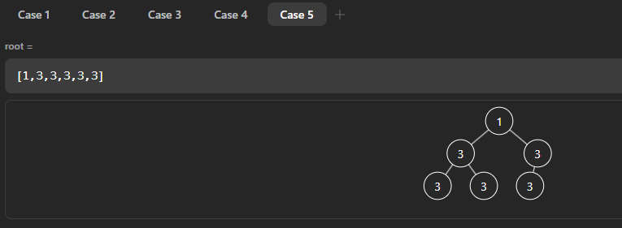

# zuo-algo

跟着左程云学算法

## 二进制

[code](./examples/1-bit.rs)

### 二进制表示数字

每一位（bit）表示`0`和`1`，计算一个二进制数的十进制表示就是从低位*2的0次方累加的到结果

比如`1001`，计算十进制数为`1*2^0+0*2^1+0*2^2+1*2^3=9`

### 二进制表示非负数和负数

一个n位的二进制数表示的无符号数字范围是`2^n`个

一个n位的二进制数表示的有符号数字范围是`-2^(n-1)~2^(n-1)-1`。每个数字的首位表示符号，0为正、1为负

一个正数的二进制数的负数如何计算？

将所有位减1再取反。`5`的二进制表示`0101`，它的负数计算过程为

1. `0101` -> `0100`
2. `1010` -> `1011`

`1001`就是`-5`的二进制表示，相反，根据一个二进制数来判断它是负几，则将整个数取反再加1

1. `1011` -> `0100`
2. `0100` -> `0101`

由于最后的`0101`是5，所以`1011`表示`-5`

### 二进制对正负数的表示原因

这种表示方式可以在负数和非负数以任何出现顺序做加法的同时不需要加分支判断即可进行，例如`-5+2`

1. `1011+0010`
2. `1101`
3. `1101` -> `0010`
4. `0010` -> `0011`

`0100`是3，结果正确

> **计算机不处理数字计算的溢出情况，需要程序员自己保证**

由于没有分支判断，加法的计算速度很快，这样会导致其它的计算`-`/`*`/`/`的计算性能提高，因为这些计算都是基于加法实现的

### 位计算

位计算没有短路计算方式，逻辑计算存在短路计算

#### `|`

当存在一个位为`1`时，计算结果为`1`，否则为`0`

#### `&`

当存在至少一个位为`0`时，计算结果为`0`，否则为`1`

#### `^`

当两个位相同时为`0`，否则为`1`

#### `<</>>/<<</>>>`

带符号左移/右移，无符号左移/右移（即右移用0补位）

对于**非负数**，左移n位等同于`*2^(n)`，右移n位等同于`/2^(n)`

### 取反

`~`是取反符号，每个数的正反都等于对它取反再加1

### 打印二进制数

要打印二进制的某一位，可以将其它位与`0`做`&`操作，要打印的位与`1`做`&`操作，如果剩下的数不为0，那么打印`1`，否则打印`0`

## 三种简单排序

[code](./examples/2-simple-sort.rs)

⚠️注意边界条件，数组元素如果是`0`或`1`个，那么本身有序无需进算法步骤

### 选择排序

一句话总结：将i～n-1位置上的最小值找到，然后与i位置的数交换位置，直到`i==n-1`

### 冒泡排序

一句话总结：在0~n-1位置范围内，通过两两比较将最大值移到n-1位置上，然后缩短范围0～n-2继续

### 插入排序

一句话总结：每次都保证前i位有序，将i+1位认为无序，然后和前i位倒序比较，如果无序则交换顺序

最好情况（数列有序）时间复杂度为`O(N)`

## 对数器

[code](./examples/3-test-method.rs)

对数器是一种验证算法的方法，它的实现步骤大概为

1. 对于一个要解决的问题A
2. 实现一个不考虑复杂度的暴力解法S1，最简单的思路基本都是正确的，要保证这里正确
3. 实现几个考虑复杂度的优雅解法S2、S3...
4. 开始创建测试用例，即利用随机数生成测试数据
5. 使用生成的测试数据对几个解法（方法）进行测试，小数据量测试
6. 如果小数据量没有问题，那么逐渐增加数据，直到暴力解法达到基本无法计算的程度，如果还没有问题则基本确定后续的最优解是正确的
7. 如果过程中出现了问题，那么减少数据量，打印/debug方法，开始找出错误，这个过程可以通过打印原始测试数据，对比不同方法的结果来判断

## 二分搜索

[code](./examples/4-binary-search.rs)

### 有序数列

1. 在有序数列中找到一个指定数字，如果存在返回它的索引，否则返回`-1`
2. 找到一个大于数字`n`的最靠左的数字
3. 找到一个小于数字`n`的最靠右的数字

解决方法：一个长度为n的数列的开头总是`0`，最后一个位置是`n-1`，那么中点是`0+(n-1)/2`，另外一种计算中点的方式是`0+((n-1-0)>>1)`，这样写的作用是防止两个索引位置直接相加之后会超过索引值类型的最大值造成溢出

### 无序数列

峰值问题

前提，一个数列中，峰值的含义是，在位置i上，它的值大于左右两边的值，且相邻数不允许相同，认为在数列左端和右端的数的值为最小

找到数列中任意一个峰值的位置，如果没有则返回`-1`

按照题中的指示，先判断第一个数和最后一个数是否为峰值，如果两个数都不是峰值，那么可以判断峰值一定在中间，此时认为二分搜索的起点为`1`，终点为`n-2`，判断中点是否为峰值，如果不是，如果小于左边的数，那么终点变为左移一位的数继续，否则起点变成右移一位的数继续

启发：如果可以确定问题范围缩小的规律，就可以使用“二分”解决同类问题

### 二分搜索的时间复杂度

二分搜索的时间复杂度是`O(logN)`，N表示数列的长度，因为每一次循环会将搜索范围缩小一半，所以问题的总长度就是2的搜索次数的次方，例如一个长度为`i32.Max`的数列，它的长度为`2^31-1`，所以最慢31次搜索就可以解决问题

## 时间复杂度和空间复杂度

常数操作：常数时间内操作，和操作数大小没有关系。例如数字运算操作，因为位数固定，所以同类型运算消耗的时间差不多。例如数组寻址，由于是计算索引获取数组数值，所以读取任意位置元素时间差不多。哈希函数的访问也是常数操作

非常数操作：例如链表，由于链表在内存中不是连续存放，所以根据节点数量不同，获取不同位置的节点也是不同的

### 时间复杂度

表示运行时间和数据量的关系

使用问题规模来计算，将每一次计算的数据量/规模相加，然后去掉非最高阶的式子，留下的最高阶式子去掉常数项，就是`O(x^n)`的复杂度

常数操作是`O(1)`的时间复杂度

和数据量相关的变量的阶数对于运行时间的意义最大，低阶项和常数项相比都不重要

对于插入排序，如果是最差情况（倒序排列），那么时间复杂度就是`O(n^2)`，但是最好情况时间复杂度变成了`O(n)`，要确定时间复杂度需要用最差情况

严格**固定流程**（没有随机性）的算法必须评估在最差情况下的性能

对于随机流程的算法，即每一个运算单元可能有不确定性的执行次数，那么最差情况就是算法无法执行完成，即随机性无法满足算法向下执行的概率。所以需要使用平均复杂度或者概率上的期望复杂度来评价

### 空间复杂度

额外空间复杂度

入参和出参的空间不占空间复杂度计算项。算法流程中为了支持实现开辟的新的空间就是空间复杂度。如果没有利用额外空间，那么空间复杂度为`O(1)`

### 最优解

各个方法中哪个方法的时间复杂度更低阶就更好，这种方法下使用更低的空间复杂度

### 复杂度的均摊

以动态数组为例，如果动态数组每次扩容都是加倍，那么在向长度为1动态数组插入n个数时，在插入第2*n个数时问题规模变为2*n+1，那么插入8个数，就是`1+1+2+1+4+1+1`，小于`2*8`，推知插入n个数，扩容的时间复杂度也小于2n，那么总的时间复杂度就是说`O(n)`，均摊到n次插入数据，扩容对于插入的时间复杂度就是`O(1)`

均摊时间复杂度主要是为了好估计算法的整体时间复杂度

### 估计复杂度的误区

- ⚠️估计时间复杂度不能简单根据循环的个数/代码结构判断量级
  - 一个循环完成的冒泡排序
  - 两个循环达成的`O(nlogn)`的复杂度，`for i = 0; i < N; i++ {for j = i; j < N; j+=i}`。`1+1/2+1/3+...+1/n`的结果收敛于`O(logn)`（调和级数）

### 时间复杂度比较

`O(1)` `O(logN)` `O(N)` `O(N*logN)` `O(N^2)` `O(N^3)` ... `O(N^k)` `O(2^N)` `O(k^N)` `O(N!)`

## 算法和数据结构分类

- 硬计算类算法：精确求解
- 软计算类算法：最优解，注重逼近解决问题

- （物理）连续结构：在底层是连续存储的，只需要知道首地址和偏移量就能直接查找节点。例如数组、一个单独数字（`i32`）
- （物理）跳转结构：在底层是不连续存储的，需要保存不同节点的地址才能查找。例如链表、树、图

任何一种数据结构都是通过这两种结构组合起来

## 单双链表及其反转，堆栈诠释

[code](./examples/5-linked-list.rs)

### 按值/引用传递参数

Java除了基本类型以外都是按引用传递，但无论是按值还是按引用传递，都是对原类型的拷贝，如果是基本类型就直接拷贝值传递，而引用类型是拷贝了引用（内存地址）本身然后传递。引用类型就是值在堆上保存，栈上只保存内存地址，传递也只用地址传递

### 单链表

内存中定义的结构，一个结构，它包含一个值和指向下一个节点的指针。最后一个节点的下一个节点指向空（`null`）

```rust
struct ListNode {
    val: i32,
    next: Option<Box<ListNode>>,
}
```

### 双链表

和单链表类似，只不过除了指向下一个节点的指针还有指向上一个节点的指针

```rust
struct DoubleListNode {
    val: i32,
    last: Option<Box<DoubleListNode>>,
    next: Option<Box<DoubleListNode>>,
}
```

### 链表的反转

函数签名`fn reverse(head ListNode) -> ListNode`

## 合并两个有序链表

[code](./examples/6-merge-sorted-list.rs)

问题描述：有两个有序链表，合并两个链表为一个有序链表

解法：边界条件是两个链表任意为空则返回另一个链表，然后先找到最小的节点作为最终返回的结果，然后两个遍历节点分别为头节点的下一个和另一个链表的头节点，开始比较两个遍历节点，并使用一个头节点的引用来修改指向下一个节点的指针，等到两个遍历节点任一为空时，将剩余的节点拼到引用的指向下一个节点的指针上即完成算法

⚠️rust中，由于不能在一个节点上同时存在可变引用和不可变引用，所以利用一个dummy节点作为头节点，使用它的一个可变引用来逐次拼接两个链表中的最小值，最终拼接剩余的节点，然后范围dummy节点指向的下一个节点即可完成算法

## 两个链表相加

[code](./examples/7-add-two-list.rs)

问题描述：两个链表表示两个数字，链表头从个位开始，结果是一个新链表

解法：两个遍历指针，如果非空就是本值，否则为0，每次相加，注意保存进位，每次生成一个新节点保存到最终结果中

## 划分链表

[code](./examples/8-divide-list.rs)

问题描述：给定一个链表，再给一个特定值x，将链表重排，小于x在左，大于x在右，但是不能改变原链表元素的相对次序

解法：四个裸指针初始为null，分别表示小于子链表的头尾和大于等于子链表的头尾，然后开始遍历链表，如果当前节点小于x，那么小头赋值为当前节点，小头围指向这一节点，如果非首次则小头尾的下一个指针指向这个节点，更新小头尾节点。对于大头相同逻辑。最后要判断，如果小头头为空，那么直接返回大头头，否则返回小头尾拼接大头头后的小头头

## 队列和栈

[code](./examples/9-queue-stack.rs)

队列和栈是一种逻辑结构，物理实现可以使用链表或者数组

- 队列：先进先出（FIFO），新来元素从尾部进，从头部出
- 栈：后进先出（LIFO）

队列实现

用链表实现，一条单链表就可以实现队列，保持两个指针，头指针总是指向头节点，尾指针指向最近被插入的数据，当移除数据的时候，头指针返回节点前移动到下一个节点

用数组实现，做题过程中元素个数确定，可以初始化一个长度为N的数组，头尾指针初始化为`(0, 0)`，队列的范围是`[0, n)`，当`l < r`时，认为队列非空，否则队列为空

```java
int peek()
int tail()
void offer()
int poll()
int size()
bool empty()
```

栈的实现

用数组实现，一个指针记录栈顶元素即可

```java
bool empty()
void push()
int pop()
int peek()
int size()
```

### 环形队列

数组实现的队列，被释放的元素（位置）可以重复利用，只要同时在队列里的元素不超过整个数组大小，就可以无限利用

不使用头尾指针来控制循环队列，而是使用一个size来控制当前的队列长度

## 栈和队列相互实现

[code](./examples/10-queue-stack-converse.rs)

### 用栈实现一个队列

问题描述：只有标准栈，实现一个队列结构

解法：使用两个栈，一个in栈，一个out栈。当取数时，只有out栈空时，把in栈的内容全部导入out栈，每次导入数据的时候需要将in栈清空

⚠️时间复杂度，对于栈实现的队列，对元素的每个操作的均摊时间复杂度是`O(1)`，因为每个元素在这个数据结构中的生命周期就是in栈的进出和out栈的进出

### 用队列实现栈

问题描述：只有标准队列，实现一个栈结构

解法：每次队列进一个元素，记录当这个元素弹出时，它之前有几个元素需要弹出再插入队列

假设队列为空，先插入1，则为1，然后插入2，那么1要先出再进变为2<-1，对于每个新进的元素，已有的元素都已经是倒序，所以只需要处理当前元素，将其放到开头即可

⚠️时间复杂度，插入元素操作是`O(N)`，其余方法是`O(1)`

## 最小栈

问题描述：设计一个栈，额外提供一个方法`getMin()`来在常数时间内获取栈中的最小值

解法：使用两个栈，数据栈之外提供给一个最小栈，如果新入元素是第一个元素或者是最小的元素，那么在两个栈同步压入元素，否则数据栈压数据，最小栈压栈顶

空间换时间

## 双端队列

定义：在队列两端都可以进出元素，且进出顺序为FIFO

实现：

- 链表实现：使用双向链表可以直接实现双端队列，只需要保证链表的长度为指定的固定值即可
- 数组实现：固定数组实现一个双端队列，头尾索引总是指向头尾元素，使用`size`来确定当前队列的总元素个数，尾部索引是`+1`后移，头部索引是`-1`前移，当达到最大/小值时要回到数组的头/尾索引继续。⚠️两个头尾索引最开始并没有指向某个值，所以插入第一个元素的时候，这两个索引不能变化，即两个索引总是指向头尾元素

⚠️这道题主要问题是对边界条件的处理

另一种解法：还可以从头尾各自插入，这样计算索引可以省去对边界条件的判断，单线程内速度更快（leetcode无区别）

## 二叉树及其三种序的遍历

简单定义：一个节点只有左右两个节点的树

- 先序遍历：中->左->右
- 中序遍历：左->中->右
- 后序遍历：左->右->中

遍历的递归序，可以派生出三种序的遍历顺序

```java
// 递归基本样子，用来理解递归序
public static void f(TreeNode head) {
  if (head == null) {
    return;
  }
  // 1
  f(head.left);
  // 2
  f(head.right);
  // 3
}
```

递归序就是每一个非空节点，在这个函数中都会有`1/2/3`个位置执行当前节点的操作，不同的遍历序就是在不同的位置去打印了节点

## 二叉树的非递归遍历及其时间复杂度

[code](./examples/14-binary-tree-noniter.rs)

用栈实现二叉树的先序遍历：先将头节点压入栈中，然后重复过程，弹出栈顶元素，然后将该节点的右子树压入栈中，再将该节点的左子树压入栈中，这是因为要先弹出左子树，再弹出右子树

用栈实现二叉树中序遍历：先将头节点压入栈中，然后将它的左边界（它自己的左子树节点和后续所有的左子树节点）压入栈中，然后重复过程，弹出一个节点之后，将右子树及其左边界压入栈中。弹出过程就是左中右的中序遍历

用栈实现二叉树后序遍历（两个栈）：由于后序遍历是左右中，所以利用先序遍历改为中右左，然后利用另一个栈保存所有遍历元素，最后再依次弹出就是正确结果

用栈实现二叉树后序遍历（一个栈）：记录当前弹出的节点，也就是下一个要弹出的节点的上一个弹出节点，第一次压入头节点，如果左右子树未处理，那么压入左子树，然后看左子树，如果左右子树为空，那么弹出并且记录此为弹出节点，开始继续查看栈顶节点，因为左子树处理过，所以压入右子树处理

时间复杂度

- 递归做法：由于每个节点在递归过程中会被访问三次，所以是`O(N)`
- 非递归做法：每个节点入栈次数可能是多次（引用），但是属于有限次数，时间复杂度也是`O(N)`

空间复杂度

都是`O(H)`，H是树的高度，因为无论是递归还是非递归（栈），它们的最大占用空间都是树的最高高度，对于递归来说，一条边界递归完成后的空间可以被回收利用，对于栈的空间也是可以在弹出之后循环利用

### Rust实现一个栈的后序遍历二叉树



在上图中的情况，如果使用`Rc::eq()`，会使得值相同的左右叶子节点被认为是同一个节点，所以在比较上一个弹出的节点和当前节点的左右子节点时应该使用`Rc::ptr_eq()`方法

## 算法笔试中的输入输出处理

### 填函数风格

给定一个问题，然后提供方法/类的签名（类名、方法名、参数类型/个数），只需要把解决问题的逻辑代码填充好，提交即可。后台会有两部分（测试数据和答案），它会根据测试数据生成指定类型的参数，然后调用写好的函数，最后对比答案。这种形式比较简单清晰

### ACM风格

判题后台依旧是同样的结构，但是它会要求考生自己从标准输入读取测试数据，并且在代码中讲结果打印到标准输出。这里推荐使用`BufferReader`、`StreamTokenizer`、`PrintWriter`来对标准输入、输出做一层包装，目的是减少IO次数，不同的语言使用对应的API。`StreamTokenizer`可以从一个输入流中一次获取一个非空字符

⚠️除答案以外不要随便往标准输出打印东西

### 临时动态空间和全局静态空间

每个测试用例都需要分配的临时数组，当知道最大的数据规模后，可以只创建一个静态的最大空间（数组），然后每个测试用例都复用这个空间，由于后台只算累积的内存使用量，这种方式可以跳过每次动态创建内存可能会碰到的内存使用量限制

### 按行读

对于一些问题，它不告诉数据规模，只说每一个问题的数据是一行，以x分隔符划分，此时应该一次读取一行，然后自行分隔内容，再组装数据

## 递归和master公式

递归调用图：即表示为一个递归调用树，根节点就是第一次函数调用，然后分解为多次递归函数调用，每个调用可以继续往下分，区别在于它们的参数会变化，当递归函数计算完成会返回给上一层函数，任何复杂递归都可以用这种调用图来表示

系统栈表示：系统栈，函数第一次调用时，在内存上的函数声明（参数）、局部变量会在等待递归函数调用时被压入系统栈，然后开始进行递归调用，如果递归调用会返回，那么返回值会给栈顶元素，此时系统会在内存中重建上下文，并且更新递归调用的返回值进行后续的计算

> 任何递归函数都可以改成非递归函数。自己做一个栈，模拟递归过程

递归改成非递归的必要性

- 工程上一定改，因为系统栈小，代价高，所以可以在内存上自建栈实现同样的逻辑。除非问题规模可以保证无论数据量再多递归深度也不高就可以使用，**同一层的递归空间可以复用**
- 算法题能通过就不用改

### master公式

所有子问题规模相同的递归才能用master公式：`T(N) = a*T(N/b) + O(n^c)`，`a`、`b`、`c`都是常数。其中的时间复杂度是除了递归调用以外的程序的时间复杂度

对于可以用master公式表示的算法可以直接计算时间复杂度

- `logb(a)`如果大于`c`，那么时间复杂度为`O(N^(logb(a)))`
- `logb(a)`如果小于`c`，那么时间复杂度为`O(N^c)`
- `logb(a)`如果等于`c`，那么时间复杂度为`O(N^c*logN)`
- 补充，如果使用master公式表示算法的时间消耗为`T(N) = 2*T(N/2) + O(N*logN)`，那么时间复杂度为`O(N*(logN)^2)`

## 归并排序

[code1](./examples/15-merge-sort.rs)
[code2](./examples/15-merge-sort-lg.rs)

归并排序的基本逻辑是，对于一个无序数组，先对左边一半数据排好序，然后右边一半数据排好序，最后把两个有序子数组按照数据大小进行合并，排序完成

合并（merge），左右有序子数组，谁小拷贝谁，遍历完两侧数组元素，放到辅助数组中，然后将结果更新回原数组

时间复杂度：`O(N*logN)`，空间复杂度：`O(N)`（需要辅助数组）

归并排序时间复杂度低的本质原因是没有浪费比较行为的结果，每次比较/归并都会使数组更有序，而`O(N^2)`的排序方法中有大量的比较结果都被抛弃掉了

⚠️使空间复杂度降低为`O(1)`的归并排序，即不借用辅助数组的方式没必要学习，因为这种方式会让时间复杂度降低为`O(N^2)`

### 递归

### 非递归

利用步长

## 归并分治

[code1](./examples/16-merge.rs)
[code2](./examples/16-merge-minsum.rs)

原理

1. 考虑一个问题在大范围上的答案，是否可以转化为左边的答案和右边的答案和左边跨右边的答案的累加
2. 在计算跨左右的答案是，如果左右部分的答案是有序的，是否可以获取计算的便利性
3. 如果以上两点成立，那么这个问题大概率可以通过归并分治解决
4. 求解答案的过程中要加入归并排序的过程，因为在计算跨左右部分的答案是会用到

### 例题

小和问题：有一列数，小和等于每个数左边小于它的数的和，求这一列数的小和

每一列数的小和等于左半部分的小和+右半部分的小和+左半部分相对于右半部分的小和，所以可以利用归并分治的方法求解。因为每个数在小和出现的次数都取决于它相对于右边的数是更小的次数，所以左半部分的内容需要计算所有小于次数，而右半部分只需要计算自己的次数

如果在计算跨左右部分的小和时左右两部分数组是有序的，那么在`O(N)`的时间复杂度内可以计算完成，使用两个指针指向左右两部分的头部，那么左指针小于右指针一次，就会累加小和右部分的总数次，依次遍历后得到左边部分的跨左右小和结果

在实现过程中只要在每次计算完跨部分小和之后再执行归并排序过程就可以

### 补充

1. 一些用归并分治解决的问题，也可以用树状数组、线段树来解决，时间复杂度也是最优
2. 也可以解决较难的问题，例如空间中任何两点间的最短距离
3. “整块分治”

⚠️数据结构和算法中的思想传统

## 随机快速排序

[code](./examples/17-rand-quick-sort.rs)

### 经典随机快速排序流程

在一个数列中随机选取一个数，然后将整个数列中`<=`这个数的所有数移动到左边，大于这个数的所有数移动到右边，然后将这个数字移动到`<=`这个数的所有数的最右边，此时这个数列中存在一个有序的数（即选中的这个数），然后以这个数的位置为界，对前后两个子数列重复此过程

### 荷兰国旗优化过程

随机选出的某个数字在分组过程中，是可以统一处理的，即`<`这个数的在左，`>`这个数的在右，中间全部都是这个数，那么在一次分组过程中，同样的`O(N)`时间复杂度可以处理完更多的数字

### 快速排序的时间复杂度和空间复杂度

#### 选择固定位置的数字

最差情况：每次只能排好首位或者末位的数字，此时快排时间复杂度退化为`O(N^2)`，因为每个数字都需要和所有其他数字比较一遍，并且问题范围仅缩小一个，空间复杂度为`O(N)`，即递归深度为`N`

最好情况：每次都能选中处于有序数列中点的位置，那么此时可以利用master公式`T(N) = 2*T(N/2) + O(N)`，即时间复杂度为`O(N*logN)`，空间复杂度为`O(logN)`，因为这种情况代表每次递归都可以平分问题范围，即递归深度为`logN`，那么空间复杂度就是利用的栈的深度

#### 使用随机选择的数字

⚠️如[时间复杂度](#时间复杂度)部分的内容，如果一个算法中，随机过程会直接影响算法过程，那么估计时间复杂度应该使用随机的数学期望计算

结论：使用随机数作为分界点的快速排序的时间复杂度为`O(N*logN)`，空间复杂度为`O(logN)`

## 随机选择算法

[code](./examples/18-rand-select.rs)

问题描述：求无序数组中第x大/小的数，要求时间复杂度为`O(N)`，空间复杂度为`O(1)`，还有可能是不选择第x个，而是直接回到那个最大/小值是谁

解题：使用随机快排的荷兰国旗问题，将问题中的求第x大转化为求有序数列的第`len(arr)-x`位置的值即可，那么随机选择数然后划分三个区间，如果区间对则返回这个数，否则从左边或右边重复此过程

时间复杂度：最坏为`O(N^2)`，因为可能永远选择的是最远的数字，此时选一个数要遍历一次全部数组。最好为`O(N)`，即每次要么直接选中这个数，要么选中的是排在中间的数，此时会减少一半问题范围，那么时间复杂度为`N+1/2N+...`，最终收敛于`O(N)`的时间复杂度，`N`是遍历的内容

BFPRT算法可以在`O(N)`时间复杂度和`O(logN)`的空间复杂度实现在无随机选择的前提下完成这个题目

BFPRT算法描述

1. 选择一个常数c，将无序数列划分为N/c组
2. 在每组中找到中位数（由于是常数个数，所以排序时间复杂度为`O(1)`，所有组的和为`O(N)`）
3. 在所有中位数上递归调用BFPRT找中位数（时间复杂度为`T(N/c)`），此时结果为主元（*pivot*）
4. 使用主元将数组分为两部分，如果主元位置对，则返回
5. 或者在较小或较大的部分上递归调用BFPRT算法

时间复杂度为`T(N) = T(N/c) + T((c-2)/N*(c-1)) + O(N)`，计算得到时间复杂度为`O(N)`

## 堆结构和堆排序

### 完全二叉树和数组前缀的对应关系

完全二叉树（简单定义）：每个父节点都有两个子节点，树的每一层子节点满了之后才会在下一层插入节点

完全二叉树和数组前缀的对应关系：从数组的起始位置开始表示树的根节点，有以下计算规则

- 任意节点（数组索引）的父节点位置计算：`P(i) = (i - 1) / 2`
- 任意节点的左孩子位置计算：`LC(i) = 2 * i + 1`
- 任意节点的右孩子位置计算：`LC(i) = 2 * i + 2`

使用一个额外变量`size`来控制二叉树的节点数量，而不是直接使用数组的长度

### 堆结构

堆是一种规定了组织结构的完全二叉树，包括大根堆和小根堆，以下以大根堆为例

大根堆：在树的任意子结构中，根节点都是子结构的最大值

核心API

1. `heap_insert([]int, idx int)`：向堆中插入一个节点，默认在数组尾，需要重复和其父节点比较，如果大于父节点则和父节点交换，直到位置稳定
2. `heapify([]int, idx int, size int)`：改变堆中的一个节点，如果它在以它作为根节点的子结构中不是最大值，则需要和两个孩子节点比较，如果比更大的孩子节点小则需要交换位置，否则不动

#### 时间复杂度计算

堆的两个操作的时间复杂度都是`O(logN)`，因为节点的操作数量只跟树的高度有关，而树的高度和节点数量的关系是`h=logN`，空间复杂度为`O(1)`，因为不需要借助额外空间

### 堆排序

经典堆排序：对于一个无序数组，先将其建立为一个大根堆，然后将数组头和数组尾替换位置，然后堆大小减小，重复这个过程直到数组有序

建立堆的方式

- 从顶到底，即认为堆size为0，然后逐个添加节点，时间复杂度为`O(N*logN)`，因为时间为`log1+2*log2+3*log3+...+N*logN`，最终收敛于`O(N*logN)`
- 从底到顶，即认为堆size为数组长度，从后往前对数执行堆化操作，此时时间复杂度为`O(N)`，因为时间是`1/2*N*1+1/4*N*2+1/8*N*3+...+1/2^h*N*h`，最终收敛于`O(N)`

堆排序在建立好堆之后的排序（堆化）时间复杂度是`O(N*logN)`

#### 常量增倍计算时间复杂度

一般的时间复杂度的结果可以通过计算消耗时间数列的累加和得到，如果不知道计算公式可以使用常量增倍法。因为时间复杂度不会随着问题规模扩大常量倍数改变，所以如果单倍问题规模的时间复杂度上限和多倍规模的时间复杂度下限相同，那么这个上下限就是整个算法的时间复杂度

对于建堆来说，长度为`N`的数列，时间复杂度为`logN+log(N-1)+log`，则它的时间复杂度上限是`N*logN`，如果长度变为`2N`，那么它的时间复杂度至少也是`N*logN`，所以它的时间复杂度为`O(N*logN)`

求一个`n*m`的矩阵中有多少子矩阵，一般分析方法是任取两点可能构成的矩阵数，即`n*m*n*m`。由于两个点构成的矩形至少会重合四次，所以它们的时间复杂度上限为`O(n^2*m^2)`，如果将这个矩阵扩大4倍，则任取两点构成唯一矩形的时间复杂度也是`n*m*n*m`，因为将矩阵等分为四部分，要使矩形唯一，只能任选斜线两部分的点，它们的可能性就是`n*m*n*m`，那么时间复杂度下限就是`O(n^2*m^2)`，此时解决这个问题的时间复杂度就是`O(n^2*m^2)`

## 哈希表、有序表和比较器的用法

### 哈希表

哈希表可以认为是一个集合，**查询/增删改**集合中元素的时间复杂度是`O(1)`，但这是一个大常数时间，Java中以`HashSet`为例，每个元素携带伴随数据就是`HashMap`

哈希表的内元素比较是使用值进行比较而不是内存地址

如果哈希表的**key的范围是固定、可控的**，那么可以使用数组来替代哈希表。此时增删改查的时间复杂度还是`O(1)`

### 有序表

`TreeMap`是有序表的一种实现。底层是红黑树。也可以将它看为一个集合，只是它保存其中的元素是有序的。有序表的操作时间复杂度是`O(logN)`

和哈希表一样，有序表中也不会有重复数据。如果不想去重可以加入更多的比较策略（比较器定制）

### 堆

`PriorityQueue`是Java中对堆的一个实现，即优先级队列，默认构建一个小根堆，并且不会去重

### 比较器定制

比较器默认逻辑是，`o1`和`o2`比较，如果返回负数则`o1`优先级高，如果是正数则`o2`优先级高。构造一个有序表的时候需要提供一个其中元素同类型的比较器

#### 字典序

两个字符串如何比大小？一个字符串总可以看作是一个256进制的数字（ASCII），如果字符串长度相同，则直接比较两个数字，如果长度不同，那么使用`0`（256进制最小的数值）将短的字符串填到和长字符串长度相同，然后再进行比较

## 堆结构常见题

[code1](./examples/20-heap-problems.rs)
[code2](./examples/20-max-repeat.rs)

### 合并K个有序链表

 问题描述：给定一个数组，其中各项分别是有序链表的头节点，需要把这些链表合并为一整个有序链表

 解法一：将所有链表节点找一个容器装起来，然后对这个容器排序，然后再将容器内的元素组合成一个新链表。这种方式的时间复杂度是`O(N)+O(N*logN)+O(N)`，即遍历时间+排序时间+组合新链表时间，需要的空间复杂度是`O(N)`

 解法二：使用一个小根堆，先将每个链表的头节点插入，然后每次弹出一个节点，再将它的后续节点插入堆中，这样每次都可以得到一个新有序链表的节点，直到堆为空算法结束。时间复杂度为`O(N*logK)`因为堆中始终只有原始链表条数（K）个元素，所以堆调整的时间复杂度为`O(logK)`，总共需要调整`N`次。额外的空间复杂度是`O(K)`

### 线段最多重合问题

问题描述：提供一个二维数组`n*2`表示有n条线段，找出最多的线段重叠部分的个数

解法：使用一个小根堆，先将二维数组排序，按照每条线段的开始节点排序，此时每条线段可能出现在重合部分的次数只和之前线段的结束节点有关，如果之前线段结束节点大于这条线段开始节点，那么重叠次数需要累计，否则要移出。那么开始遍历二维数组，先将堆中小于等于当前线段开始节点的元素弹出，因为它们不可能再出现在后续线段的重叠部分中，然后记录弹出后堆的大小为当前这条线段可能出现次数。最后返回最大的出现次数。**每一条线段的次数都会累积到后续的次数计算中**

时间复杂度为`O(N*logN)`，因为排序是`O(N*logN)`，堆的操作是每条线段的结尾节点进出一次，所以也是`O(N*logN)`

### 让数组整体累加和减半

问题描述：对于一个数组，至少经过多少次操作（每次操作可以将其中一个元素减半，并且不丧失精度）可以让整个数组的累加和减少为小于原始累加和的一半

解法：贪心算法，即每次将数组的最大值减半，那么达成目标的次数一定是最少

优化点：由于精度原因，可以将每个元素乘`2^n`次方来变为`int64`类型，即转化精度为整数位数，并不影响问题解答。还可以自己实现堆，在建堆过程中从底向上，时间复杂度为`O(N)`。**使用转化精度的时候记得把操作的元素数据类型改为`int64`**

## 基数排序

[code](./examples/21-radix-sort.rs)

- 基于比较的排序：不关心数据特征，只要能定义元素之间的比较关系就可以执行，很通用
- 不基于比较的排序：和比较无关的排序，但是需要满足特殊的数据特征，不通用

### 计数排序

如果待排序数组的范围是整数，且元素的范围比较小，可以直接使用一个较小范围的辅助数组（桶），然后遍历一遍数组记录词频，然后从桶重新生成排好序的数组

一般来讲，计数排序要求样本是整数，且范围比较窄。因为范围如果很大辅助数组可能会非常大，且性价比很低

### 基数排序实现

对数字的各个位数依次进行计数排序，直到最高位数排好序就结束算法

一般来讲基数排序要求样本是非负数（10进制）

实现的优化项

- 前缀数量分区：每次遍历数组，记录当前位的出现次数（进制大小辅助数组），然后用累计词频覆盖原结果，则每个位置都记录着当前位在辅助数组中最后出现的位置（需要从后往前遍历，这种排序是稳定的）
- 数字提取某一位的技巧：`(num/offset)%BASE`可以取出`BASE`进制数的第`offset`位数字

注意：处理完每个位之后，**前缀数量分区的辅助数组要清空，防止后续重复计数**

时间复杂度`O(N)`，空间复杂度`O(M)`，即多于`n`的辅助数组

注：如果是一个包含负数的数组，可以通过找出数组的最小值，然后数组中每个元素减去这个最小值转化为一个非负数组，再进行排序，最后再加上这个最小值

## 排序总结

| 排序算法 | 时间复杂度  | 空间复杂度 | 稳定性 | 备注                                                 |
| -------- | ----------- | ---------- | ------ | ---------------------------------------------------- |
| 选择排序 | `O(N^2)`    | `O(1)`     | 不稳定 | 每次都需要选择最后一个最小的数放到最前面，所以不稳定 |
| 冒泡排序 | `O(N^2)`    | `O(1)`     | 稳定   | 只要每次相同两个数比较不交换就能保证稳定性           |
| 插入排序 | `O(N^2)`    | `O(1)`     | 稳定   | 只要每次插入时相同的数不插入到前面就能保持稳定性     |
| 归并排序 | `O(N*logN)` | `O(N)`     | 稳定   | 在归并时以左侧为开头进行归并就能保持稳定性           |
| 快速排序 | `O(N*logN)` | `O(logN)`  | 不稳定 | 每次随机选择的数总是在相同数的最后，无法保证稳定性   |
| 堆排序   | `O(N*logN)` | `O(1)`     | 不稳定 | 堆化过程不考虑稳定性                                 |
| 计数排序 | `O(N)`      | `O(M)`     | 稳定   | 入桶出桶严格按照次序，保证稳定性                     |
| 基数排序 | `O(N)`      | `O(M)`     | 稳定   | 入桶出桶严格按照次序，保证稳定性                     |

选择什么排序方法取决于更关心什么？

- 如果数量小，使用**插入排序**，因为它的常数操作时间小
- 数量大，需要性能优异，且可以保证稳定性，不在乎空间占用，可以使用**归并排序**
- 数量大，需要性能优异，有调整空间，可以选择**快排**，因为快排选择随机数的策略可以指定
- 数量大，需要性能优异，不在乎稳定性，且对空间占用有要求，可以使用**堆排序**

⚠️目前不存在时间复杂度是`O(N*logN)`且空间复杂度小于`O(N)`且保持稳定性的算法

### Timsort

[Timsort](https://bugs.python.org/file4451/timsort.txt)

### Shellsort

每次将一个数组划分为`k`部分，然后对每部分的每个值进行插入排序，直到`k=1`

性能和划分的`k`取值有关，这是一个in-place的排序算法

## 异或运算的骚操作

[code](./examples/22-xor.rs)

开头题目：一个袋子中有`a`个白球和`b`和黑球，每次拿出两个球，如果都是白或都是黑球，则放一个白球，否则放一个黑球，那么最终袋子只剩一个球时，这个球是白球或黑球的概率用`a`和`b`如何表示

假设白球是`0`、黑球是`1`，那么每次操作都是一个异或运算，将结果放进袋中，那么问题的结果就是所有球表示的数字的异或和，那么和白球的数量无关，当黑球数量为奇数时，一定会剩一个黑球，否则会剩一个白球。这个问题使用白黑球表示了n个一位二进制数的异或运算结果

### 异或运算的性质

1. 异或运算就是两个数的**无进位相加**
2. 异或运算满足交换律和结合律。在异或运算中，运算顺序不影响结果
3. `0^N=N`和`N^N=0`
4. 一批数字的一部分的异或和为`a`，总异或和为`b`，那么剩下一部分的异或和就是`c=a^b`

⚠️性质1最重要，其余性质可以通过性质1推出。性质4最多考题

### 异或例题

#### 交换两个数

```rust
fn exchange_2_nums(a: &mut i32, b: &mut i32) {
    *a ^= *b;
    *b ^= *a;
    *a ^= *b;
}
```

这种交换方式如果两个数在同一个内存地址，那么第一次异或操作结果就是0，无法进行交换且会将自己改为0，所以在数组中交换位置不推荐用这种方式

#### 不用任何判断和比较语句，返回两个数的最大值

主要是使用符号位转化为两个值相乘的系数`0`和`1`

#### 找到缺失的数字

问题描述：有一个数列长度为`n`，它包含`0~n`中的`n`个数，找到其中缺少的某个数

解答，根据性质4，所有数字的（索引值）的异或和当前数字的异或和做异或就是缺失的数字

> 直接用累加和公式算出总数，减去当前的数就是结果

#### 一个数列中，某个数出现奇数次，其余数出现偶数次，返回出现奇数次的数

给数列做一个异或和，结果就是那个数

#### 一个数列中，两个数出现奇数次，其余数出现偶数次，返回两个出现奇数次的数

**Brian Kernighans算法**，求一个数的二进制形式最右侧位数为1的数，步骤是先对`x`取反，再加1，再与原数做`&`运算，由于取反加一的操作是一个数的相反数，所以形式为`DigitNumber=x & (-x)`

给数列做一个异或和，然后找这个结果最右侧为1的位数，此时只要拿到仅留这个位数的数，由于A、B一定不相同（如果相同就与题目矛盾），所以A、B在那一位一定不一样，所以只要对数列中每个那一位为0的数做异或和，就可以得到A或者B的值，然后就算出了另一个的值

#### 一个数列中，一个数出现少于m次，其余数出现m次，找出出现次数少于m的数

每个数出现m次的含义就是各个位数的0、1出现m次，那么唯一出现次数少于m次的数就会让每一位上的0/1出现次数少于m的倍数，所以只要按位数统计词频，最后每一位对`k`取模就是那个数

## 位运算的骚操作

[code](./examples/23-bit-op.rs)

位运算的执行速度常数时间非常好，仅次于赋值操作

### 如何判断一个数是否为2的幂

因为2的幂表示在这个数的二进制表示中只有一个1（负数不可能是2的幂），所以只需要使用`Brian Kernighans`算法得到数字最右侧的1然后和这个数做对比即可

### 如何判断一个数是否为3的幂

3的幂一定不是不是一个负数，且3的幂一定只包含3这个唯一质数，那么判断这个数是否为3的幂只需要使用整数范围内3幂次最大的数对这个数取模，如果结果为0就是3的幂

### 已知n为非负数（非必要条件），找到大于等于n的最小的2的幂次数

如果n为负数或0，答案就是0。如果n大于0，那么只要把n二进制形式最左侧1的右侧全部改成1，然后加1就是答案，需要处理n本身是2的幂次的情况，所以先进行`n-1`处理

### 在范围`[x,y]`上,`x`和`y`都是非负数，得到所有数的`&`操作的结果

不能直接遍历，因为遍历可能会很慢。所有位上，只要有`0`出现，那么那一位的最终结果就是`0`，所以只要确定哪些位是`0`就可以快速算出结果。如果`x==y`，那么值就是y，否则有`y-1`一定在`[x,y-1]`上，`y`和`y-1`做`&`操作就会让`y`的最后一位1失效，此时就去掉了`y`上的一位1，重复此过程直到`y<=x`

### 逆序一个二进制数⭐️

原理：对一个二进制数进行分组，先每组一个，然后交换，然后每组两个，交换。最后每组16个，交换完成

### 查找一个数的二进制形式中存在几个1⭐️

原理：对一个二进制数分组，将原数字表示为每组一个，记录`1`出现的次数，然后合并，每组两个，记录`1`出现的次数，然后4个、8个、16个、32个，返回结果

⚠️rust实现时的加法要使用`wrapping_add`防止溢出报错，且不影响结果

### 总结

当模版用，不强求处处使用这种做法

## 位图

[code](./examples/24-bitset.rs)

一种集合结构，如果数据范围是**连续**且固定，那么位图可以在常数时间内执行数据的增删改查，并且只使用很少的空间（同等情况下比哈希表少）

用bit数组来存放值，`0`表示存在，`1`表示不存在，取值和存值都是用位运算。因为是用1个bit来表示一个唯一数据，所以可以极大节省空间

```text
// 构建一个位图，保存0~n-1的数字
Bitset(int n)
// 添加一个数
add(Bitset &set, int n)
// 删除一个数
remove(Bitset &set, int n)
// 存在删除，不存在保存
reverse(Bitset &set, int n)
// 查询一个数
query(Bitset &set, int n)
```

两个非负数做除法并向上取整可以使用`(a+b-1)/b`，这个式子表示，如果`a`是`b`的整数倍加一个余数，那么`(a+b-1)`就一定会多一个`b`，所以向上取整，如果`a`只是`b`的整数倍，那么`(a+b-1)`还是不会多一个`b`

## 位运算实现加减乘除

### 加法

两个数相加等同于两个数的无进位相加结果和进位信息结果相加，重复知道进位信息为0。无进位相加等同于`^`操作，进位信息是两个数做`&`操作，然后左移一位

### 减法

`(a+b)`等同于`(a+(-b))`，那么一个数的负数的二进制表示为`!a+1`，再将这个加法使用二进制加法实现，然后再使用二进制加法实现最初的减法`bit_add(a, bit_neg(b))`

### 乘法

和十进制乘法相同，即在`b`二进制上为`1`的位置上`a`需要左移的个数和累加，⚠️`b`右移后左边需要补0

### 除法

对于两个32bit的非负数除法，等同于判断`a`是否含有`b*2^30`这个数，如果包含，则结果的第`30`位就应该是1，然后判断`a-b*2^30`之后的结果是否包含`b*2^29`，直到判断`b*2^0`结束

当判断`a>=b*2^30`时，为了防止`b`左移溢出，可以改为`a/2^30>=b`

对于`i32`整数，输入参数不能是整数最小值，因为取反为`0`

## 链表高频题和必备技巧

[code-链表相交节点](./c/list-intersection.c)
[code](./examples/26-linkedlist-problems.rs)
[code-拷贝带随机指针链表](./c/list-copylist.c)
[code-回文结构](./c/list-palindrome.c)
[code-第一个入环节点](./c/list-cycle.c)
[code-链表排序](./c/list-copylist.c)

注意点

1. 如果题目的空间要求不严格，可以使用容器的方式做，很容易
2. 如果题目的空间要求严格，或者面试官要求**对空间使用做优化**，那么需要实现空间复杂度为`O(1)`的算法
3. 最常用的技巧，快慢指针
4. 链表的算法都比较简单，考察的是coding能力，尽量不使用容器讨巧实现
5. **多写多练**

### 返回两个无环链表的第一个相交节点

问题描述：给定两个链表的头指针，判断是否有相交且返回第一个相交的节点

解法：两个链表如果相交，那么遍历两个链表到结尾非空节点，这两个节点内存地址一定一样，否则不相交。然后计算出哪个链表更长，让那个更长的链表先走`(la-lb)`步，然后再同时遍历两个链表，得到第一个相同节点就是答案

解法2：使用一个哈希表来保存一个链表节点的内存地址，然后遍历第二个链表，判断是否有相同的链表节点存在

### 每k个节点一组翻转链表

问题描述：对一个链表，以k个节点为一组，组内翻转链表，如果结尾剩的节点不够k个，那么留着不动

解法：对每k个节点做链表翻转，组内原尾节点成为组内头节点，组内原头节点成为组内尾节点，并且指向下一组的头节点，最终返回头节点。第一组需要特殊处理，因为第一组原尾节点是修改后整个链表的头节点，后续每个组翻转完，前一个组的尾节点需要指向当前组翻转完的头节点

⚠️Rust实现分组翻转链表可以利用一个senital节点，然后一个可变引用实现，具体参照代码

解法2：使用一个数组保存所有节点，组内翻转数组元素，最后做一个新链表返回

### 复制带随机指针的链表

问题描述：链表节点除了值和指向下一个节点的指针以外还有一个指针，可以指向链表内或其他节点，要在不修改原链表的条件下拷贝整个链表

解法：使用容器，可以利用一个哈希表来存储原链表，每个`key`都是原链表节点的内存地址，存一条顺便新建一个节点，然后遍历哈希表，新节点参考老链表的节点关系去设置，最终返回新链表的头节点

解法1：在原链表上每一个节点后插入一个值相同的节点，然后遍历链表，新链表的随机指针内容就是原链表对应节点的随机指针的值，这里就是利用了链表的逻辑有序来得到原节点的随机指针的值

⚠️C语言实现中，局部变量在栈上分配空间，离开自己的作用域之后栈上的空间可能会被其他部分使用，所以需要在堆上分配内存（`malloc`）并且**必须初始化其中的指针内容**

### 判断链表是否为回文结构

回文结构：从左到右和从右到左遍历结果相同，空字符串是回文

快慢指针：目的是求中点

问题描述：判断一个链表是否为回文

解法：使用容器，可以将链表元素压入一个栈，然后从头遍历链表并和栈中的元素比较，因为出栈是逆序，所以如果两个遍历结果相同即为回文

解法2：使用快慢指针，得到中点，然后翻转中点后的链表，从头尾遍历链表，如果相同则返回。⚠️得到结果后要把链表恢复到原始状态

考研题：`a1->a2->a3->a4->a5->a6->a7->a8`改造为`a1->a8->a2->a7->a3->a6->a4->a5`，同样适用快慢指针，再遍历的时候重组链表结构即可

### 返回一个链表的第一个入环节点

问题描述：给定一个链表，如果无环则返回空，否则返回第一个入环的节点

解法：使用一个`hashset`，遍历链表，将每一个节点的内存地址存入哈希表中，直到碰到重复节点，那么返回

解法2：结论是快慢指针第一次碰到后，慢指针继续走，快指针从头部按慢指针遍历，直到两个指针相遇，返回结果。计算原理如下图


### 在链表上排序，要求时间复杂度`O(N*logN)`，空间复杂度为`O(1)`，且排序稳定

使用归并排序，且不借用额外空间完成排序，可以满足要求

## 数据结构设计高频题

[code-set_all哈希表](./examples/27-ds-setall-hashmap.rs)
[code-lru](./c/list-lru.cpp)
[code-insert/delete/random](./examples/27-ds-ins-del.rs)
[code-median](./examples/27-ds-median.rs)
[code-max-freq-stack](./examples/27-max-freq-stack.rs)
[code-alloone](./c/list-alloone.cpp)

### `set_all`功能的哈希表

对一个哈希表，扩展一个方法`set_all(val)`，该方法可以将当前哈希表所有的值替换为指定值

解法：为哈希表中添加的值附带一个次序（时间）信息，并且多记录一个`set_all`传递的值，那么调用`set_all`的次序之前的值在`get`的时候都返回这个值即可

### 实现LRU结构

Least Recently Used (LRU) cache，在一个有限容器中，实现读写操作`O(1)`且符合当容器满时，总是删除上一次使用时间总是距离当前时间最远的元素

解法：使用哈希表结合双向链表实现。哈希表存储key和对应的节点在链表中的地址，链表总是满足最新访问的地址在链表尾，最早访问的地址在链表头的性质

### 插入、删除和获取随机元素时间复杂度均为`O(1)`的结构 I

题目要求：不允许插入重复元素

解法：保存元素可以使用哈希表，这样在插入和删除时都是`O(1)`复杂度，然后在一个数组中连续保存数字，确保获取随机元素的时间复杂度也是`O(1)`，删除元素时保证数组的连续性即可

### 插入、删除和获取随机元素时间复杂度均为`O(1)`的结构 II

题目要求：允许插入重复元素

解法：哈希表保存重复元素的索引位置，可以使用`hashset`结构来保证删除时的时间复杂度为`O(1)`，在删除的时候，如果元素在哈希表中存在，那么删除一个索引位置，如果这是最后一个索引位置，再把整条记录删除，并且保证数组的连续性

⚠️从`hashset`中随机取出一个元素可以使用迭代器方法

### 从一个流中获取中位数

题目描述：给定一个流，对其包装一个结构体，向外暴露两个接口，分别为消费流中的数字和返回当前的中位数

中位数：将数列从小到大排序，返回中间的数（奇数返回中间的数，偶数则返回中间两数和的一半）

解法：使用两个堆始终将流中消费的数分为较大部分和较小部分，较大部分在小根堆，较小部分在大根堆，如果两个堆的大小差距超过2，那么将多的堆中的堆顶元素给另一个堆，求中位数就是两个堆定元素之和除2，如果是奇数则返回数量更多的那个堆的堆顶元素

### 最大频率栈

题目描述：实现一个栈结构，它的`pop`方法总是返回出现频率最高的元素，如果这个元素有多个，那么返回最靠近栈顶的一个

解法：使用一个哈希表来存储值和词频，在入栈时，先查找它在哪个词频，找到后在二维数组中找到对应的词频数组，把这个数放进去，增加词频。在出栈时，二维数组最后的一个元素（数组）中的最后一个元素返回即可，如果数组长度为0则删除这个数组

实现思路是，将词频组织成了一个栈，那么栈顶永远是词频最高的词，然后每个词频又是一个栈结构，保证了同样词频弹出的依旧是最靠近栈顶的元素，只需要查询时间为`O(1)`（利用哈希表），就可以实现全操作时间复杂度和栈相同`O(1)`

### 实现全操作时间复杂度为`O(1)`的数据结构

题目描述：对于一个保存字符串的数据结构，它有增加、减少、获取最大词频和最小词频的字符串四个方法，每个方法的时间复杂度都需要是`O(1)`

解法：使用一个双向链表保存词频信息，每个节点包含表示词频、该词频下有哪些字符串，增加删除时的检索字符串对应词频需要一个哈希表来保存，由于只需要词频信息，所以链表的每个节点可以是一个`hashset`

⚠️**细心**

## 二叉树高频题目

[code](./examples/28-binary-tree.rs)

### 二叉树层序遍历

二叉树层序遍历就是二叉树的BFS，需要借助队列，基本思路就是将根节点插入队列，然后弹出一个节点，将其两个子节点如果存在就插入队列，直到队列为空，实现可以借助队列和数组，后者**常数时间更好**

题目描述，将每一层作为一个单独链表返回

解法1：可以使用一个哈希表来记录每个节点的层数，通过判断层数是否有对应的子链表来决定是否创建新链表

解法2：使用数组，那么每次插入节点后，记录一个当前队列元素数量，每次只取这个数量的元素，创建一个新的子链表即可

### 二叉树锯齿状层序遍历

题目描述：和层序遍历类似，但是隔一层遍历循序相同，相邻层遍历顺序相反

解法：和普通的二叉树层序遍历相同，只需要在不同层判断是否反序遍历即可，且先遍历后移除节点

### 二叉树的最大宽度

问题描述：二叉树的最大宽度是指，二叉树的每一层最左端的节点到最右端节点（如果存在）的距离

解法：需要利用二叉树的节点的位置，即`n`位置的节点的两个子节点分别在`2*n+1`和`2*n+2`的位置，且最大宽度可以通过两个节点位置`(l2-l1)+1`得到。依旧使用层序遍历的方式，只要将每层的遍历结果的最大宽度计算起来，遍历完成后得到结果即可。在层序遍历节点的时候需要使用另一个同步变化的队列来记录各个节点的索引位置，计算最大宽度用这个队列中的数据记录

### 求二叉树的最大深度和二叉树的最小深度

求最大深度只需要递归求解根节点的左子树深度和右子树深度的最大值，然后结果加1就是最终结果

求最小深度同理，但是需要注意，如果根节点只有一棵子树，那么最小深度就是这棵子树的深度。还可以利用BfS查找第一个叶子节点出现的位置所在的深度

### 二叉树的先序序列化和反序列化

二叉树的先序遍历和后序遍历都可以做树的序列化，但是中序遍历不行，因为中序遍历的序列化结果（字符串）可能表示多个不同的树结构，所以无法反序列化

序列化过程中可以将空节点序列化为`#`符号，每个节点以`,`做分隔。反序列过程就是取一个节点，建立一个节点，然后递归创建左子树和右子树，然后返回这个节点

### 二叉树的层序遍历序列化和反序列化

层序遍历的序列化和层级遍历相同，需要把空节点用`#`表示

序列化过程中，每个节点在进入队列之前，先把自己的值打印到结果字符串内，然后根据自己的左右子节点判断，如果非空，则将值打印到字符串，插入节点，否则将占位符打印到字符串，跳过。**保证序列化字符串中始终只有非空节点，和父节点为非空节点的空节点**

反序列化过程中，从根节点开始，直接创建两个子节点，因为根节点一定存在，所以这一步不会报错，然后如果节点非空，则插入队列，否则创建空间点跳过，使用这两个节点修改当前节点，进入下一次遍历

### 利用先序和中序遍历结果来重构一棵二叉树

题目要求：**所有元素不重复**

解法：对于先序和中序的遍历结果，可以有一个函数`f(pre [i32], pre_i usize, pre_j, usize, mid [i32], mid_i usize, mid_j usize) -> Node`来返回构造的树，因为先序数组的第一个元素一定是根节点，那么找到这个点在中序数组的位置，这个位置之前的所有元素都是根节点的左子树，右侧节点都是右子树

递归遍历不需要中序数组参与，因为中序数组的意义只是在递归过程中传递当前处理的先序遍历数组的元素范围，而这个信息在开始使用map存储每个元素在中序数组中的索引时已经做完，只需要传递这个map即可

### 验证完全二叉树

解法：完全二叉树即所有节点在每一层都是从左到右依次添加形成的二叉树。可以使用层序遍历的方式，每个节点满足完全二叉树的要求有两个

1. 不存在该节点的左孩子为空，右孩子不为空的情况
2. 该节点如果左、右孩子不全，那么该节点后续的所有节点都必须是叶子节点（左右孩子为空）

### 求完全二叉树节点个数

要求：时间复杂度要小于`O(N)`

解法：对于一棵完全二叉树，先计算左子树深度，然后计算右子树的最左节点深度，如果右子树深度等于左子树深度，则左子树是一个完整二叉树，它的节点总数为`2^h-1`个节点，如果小于左子树深度表示右子树是一棵完整二叉树，两种情况下再递归求另一棵不完整二叉树的节点个数即可

时间复杂度为`O(h^2)`，因为每次循环都会选择左子树或右子树进行遍历，且高度减少1，所以序列为`h,h-1,h-2...1`，等差数列累加和时间复杂度为`O(h^2)`，有二叉树的高度为`h=log2(N)`，所以时间复杂度为`O((log2(N))^2)`，远小于`O(N)`的时间复杂度

### 普通二叉树上寻找两个节点的最近公共祖先

题目要求：两个节点不相同，且一定存在于树中

两个节点可能为两种不同情况

1. 包含关系，即两个节点可能在对方节点的子树，这种情况下返回那个父节点即可
2. 分离关系，两个节点在一个根节点的两边，那么返回这个节点

从根节点递归，如果当前节点是两个节点之一，那么这颗子树的最近公共祖先就是当前节点，如果当前节点为空，那么这棵子树没有最近公共祖先（这里相当于递归的base case），如果不是上述情况，先在左子树查找两个节点，再在右子树查找两个节点，如果两个都没找到，则无最近祖先（无关节点），如果两个都找到，那么当前节点就是最近祖先，如果任一找到，那么就是那个节点，递归得到的答案会逐层传递回根节点

### 搜索二叉树上寻找两个节点的最近公共祖先

搜索二叉树需要每个节点的左子树任意值小于当前节点，右子树任意值大于当前节点

解法：对于当前节点，如果小于两节点最小值，那么往右寻找，如果大于两节点最大值，往左寻找，如果等于任意值，则直接返回，如果大于最小值，小于最大值，则返回当前值

### 收集累加和等于aim的所有路径

题目描述：给定一棵二叉树，求出所有节点累加和为`aim`的路径，返回这些路径

解法：需要有一个遍历记录，路径的要求是从根节点到叶子节点，所以如果某个叶子节点满足，则将记录的路径添加到最终结果，每次遍历完当前节点返回时要修改遍历记录的内容，删掉当前节点

### 验证平衡二叉树

平衡二叉树就是任意节点的左子树和右子树的高度相差小于等于1的树

解法：递归遍历二叉树，如果有任意一个节点不满足要求，直接设置结果

### 验证搜索二叉树

解法1：搜索二叉树的中序遍历结果就是一个从小到大的有序数列，所以可以使用迭代方式中序遍历搜索二叉树（栈），遍历过程中如果都是升序则为搜索二叉树，否则不是

解法2：记录左子树的最大最小值，右子树的最大最小值，递归计算当前节点的左节点的最大值和右节点的最小值，然后判断当前节点是否满足大于左子树最大值，和小于右子树最小值，如果不满足则为非搜索二叉树，如果满足，则为搜索二叉树。**对于空节点，它的最大值为整数最小值，最小值为整数最大值**，这样可以满足叶子节点的判断条件

### 修剪搜索二叉树

题目描述：将一颗搜索二叉树修剪为指定范围的一颗新搜索二叉树

解法：递归遍历，如果当前节点在范围内，则保留节点，判断子树，如果当前节点不在范围内，如果小于整个范围，则它本身连同左子树去掉，检查右子树，如果大于整个范围，则它本身连同右子树去掉，检查左子树，最终返回头节点

### 二叉树打家劫舍问题

题目描述：在一颗二叉树上，小偷只能偷不相邻的节点，求解小偷能偷的最大数额是多少

解法：在任意一棵子树上，小偷能偷的最大数额是，小偷偷根节点的数额加上小偷不偷所有子树根节点的结果和小偷不偷根节点结合小偷偷/不偷子树根节点的结果的最大值


这道题和验证搜索二叉树相同，需要记忆之前的运算结果，本章的题目是使用全局变量。可以从叶子节点向上进行分情况讨论

## 常见经典递归过程分析

[code](./examples/29-recursion.rs)

### 查找一个字符串的所有子串

子串是从一个字符串中任意取不同的字符构成的子串（顺序不变），题目要求所有子串**不重复**

解法：对于任意一个子串，都是对所有字符的选择决策树的一条路径的收集，由于每个决策分为包括此字符还是不包括此字符，所以最终所有结果是一颗完全二叉树

时间复杂度为`O(2^N*N)`，因为所有的可能性的总和是`2^N`种，且生成子串的时间平均也是`N`，所以相乘即为整个过程的时间复杂度

### 查找一个数组中的所有不重复的组合子数组

对于一个数组，其中包含的所有子数组和上一题类似，都是对任意一个元素的取舍做决策，最终结果是对二叉树的路径做去重。因为两个重复的子数组只跟各个元素的值出现的次数有关，所以我们可以先对数组排序，然后相同值的节点为一组，那么结果就变成当前组有`0...n`个时，和后面的不同元素的组合关系，这**避免了对全组合的遍历**。因为最差的情况是所有元素不同，所以时间复杂度也是`O(2^N*N)`，这里用到的技巧是**剪枝**而不是去重，后者依旧会全遍历，但是前者是直接减少遍历情况

**剪枝**是在递归过程中直接去掉明知无效的路径，这道题是通过先排序，将可能重复的情况改变为不可能重复的情况，所以结果不需要再去重

### 一个不含重复元素的数组的全排列

解法：一个数组的全排列可以通过在`i`（`i => 0..n`）位置出现任意值，递归求后续序列的全排列来得到最终答案

#### 包含重复元素的数组的不重复的全排列

解法：在交换逻辑中添加去重逻辑

#### 本题总结

可以利用原数组作为记录每个排列的路径容器，每次递归结束后要**将原数组恢复**，因为下一次递归要求不能被上一次递归的结果影响，如果用额外的空间记录路径那么不需要修改原数组，但是空间复杂度高

时间复杂度为`O(N!*N)`，因为`N`个元素的全排列的数量就是`N!`中，生成每个序列的时间为`N`

### 用递归逆序一个栈

解法：利用递归函数本身有独立的内存空间，可以暂时保存栈中的值的特点，写一个子递归函数，作用是将栈底元素重新加入栈顶，然后再写一个递归函数，重复上述过程并重新压栈，这样实现栈的逆序

时间复杂度`O(N^2)`，因为每次逆序一个元素都要移动栈`N..N-1...`，总共移动`N`个元素

### 用递归排序一个栈

解法：所有方法都是递归实现，同样利用递归函数自己的内存空间来暂时保存栈中元素的特性。首先获取栈的深度，然后搜索栈中的最大值，然后查找最大值的数量，然后将这些最大值压入栈底，并且栈深度减去压入的最大值数量，重复这个动作直到栈深度为0

### N层汉诺塔问题

问题描述：有三根杆子，最左有N个盘子，求将这N个盘子从最左移动到最右的最优路径，并且要满足1）一次只能移动杆子最上层的一个盘子，2）大盘子不能压小盘子（初始盘子从小到大放置）

解法：解决N层汉诺塔问题，只需要转化为`N-1`个盘子先移动到中间，再将唯一的盘子移动右边，最后再将中间的盘子移动到右边即可。时间复杂度为`O(2^(N-1))`，因为`f(N)=f(N-1)+1+f(N-1)=2*f(N-1)`，即消耗时间为等比为2的等比数列，根据通项公式`an = a*r^(n-1)`，a是首项，r是等比得到时间复杂度

## 嵌套类问题的递归解题思路

[code](./examples/30-embed-recursion.rs)

嵌套类问题解题套路

1. 定义**全局变量**`let where: usize = 0`
2. 定义函数`f(i)`，表示从`i`位置开始解析，遇到“字符串终止符”或者“嵌套条件终止”就返回结果
3. `f(i)`的返回结果是自己负责的这一段内的结果
4. `f(i)`在返回前要更新全局变量`where`，告诉上游函数知道自己解析到的位置

执行细节

1. 如果`f(i)`遇到“嵌套条件开始”，那么开始调用下级递归去处理嵌套内容，下级递归负责返回嵌套部分的答案
2. `f(i)`下级递归处理完成后，会更新`where`值告诉本级函数该从什么地方开始解析

### 含有嵌套的表达式求值

限制表达式只有`+ | - | * | /`的**合法**表达式

如果表达式不带括号，那么只需要准备两个栈，一个是数字栈，一个是符号栈，开始解析字符串，碰到数字后，将数字及后面的符号插入对应栈中，如果是乘法和除法，那么先进行计算再插入，保证符号栈中只有计算序列无关的加减法，到终止符时再加入一个加法（随意）符号，然后开始使用两个栈计算最终的结果

如果表达式带括号，那么对于括号内的内容，可以使用递归的方式计算，每个递归计算和无括号表达式计算方式相同，但是需要一个全局变量`where`来计算下级递归的计算位置，并报告给上级函数
