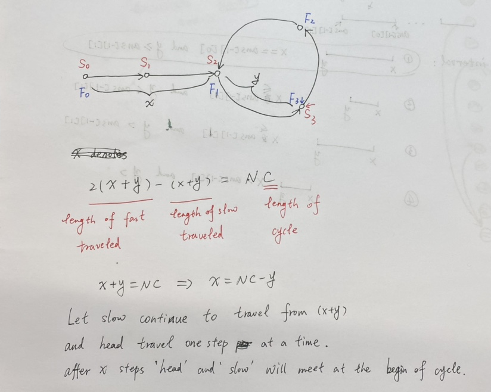
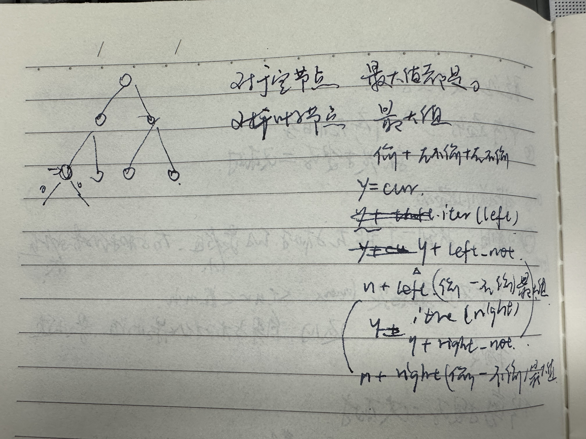

# zuo-algo

跟着左程云学算法，练习使我变强

[课程主页](https://space.bilibili.com/8888480)

[课程笔记](https://xuanlee-healer.github.io/zuo-algo-book/)

## 代码目录

- 二进制 [code](./examples/1-bit.rs)
- 三种简单排序 [code](./examples/2-simple-sort.rs)
- 对数器 [code](./examples/3-test-method.rs)
- 二分搜索 [code](./examples/4-binary-search.rs)
- 单双链表和堆栈以及链表题目讲解
  - [code](./examples/5-linked-list.rs)
  - [code](./examples/6-merge-sorted-list.rs)
  - [code](./examples/7-add-two-list.rs)
  - [code](./examples/8-divide-list.rs)
  - [code](./examples/9-queue-stack.rs)
  - [code](./examples/10-queue-stack-converse.rs)
  - [code](./examples/11-min-stack.rs)
  - [code](./examples/12-deque.rs)
- 二叉树及其三种序的遍历
  - [code](./examples/13-binary-tree-iter.rs)
  - [code](./examples/14-binary-tree-noniter.rs)
- 算法笔试中的输入输出处理
- 递归和master公式
- 归并排序
  - [code1](./examples/15-merge-sort.rs)
  - [code2](./examples/15-merge-sort-lg.rs)
- 归并分治
  - [code1](./examples/16-merge.rs)
  - [code2](./examples/16-merge-minsum.rs)
- 随机快速排序 [code](./examples/17-rand-quick-sort.rs)
- 随机选择算法 [code](./examples/18-rand-select.rs)
- 堆结构和堆排序
  - [code](./examples/19-heap-sort.rs)
  - [code1](./examples/20-heap-problems.rs)
  - [code2](./examples/20-max-repeat.rs)
- 哈希表、有序表和比较器的用法
- 基数排序 [code](./examples/21-radix-sort.rs)

## 异或运算的骚操作

[code](./examples/22-xor.rs)

开头题目：一个袋子中有`a`个白球和`b`和黑球，每次拿出两个球，如果都是白或都是黑球，则放一个白球，否则放一个黑球，那么最终袋子只剩一个球时，这个球是白球或黑球的概率用`a`和`b`如何表示

假设白球是`0`、黑球是`1`，那么每次操作都是一个异或运算，将结果放进袋中，那么问题的结果就是所有球表示的数字的异或和，那么和白球的数量无关，当黑球数量为奇数时，一定会剩一个黑球，否则会剩一个白球。这个问题使用白黑球表示了n个一位二进制数的异或运算结果

### 异或运算的性质

1. 异或运算就是两个数的**无进位相加**
2. 异或运算满足交换律和结合律。在异或运算中，运算顺序不影响结果
3. `0^N=N`和`N^N=0`
4. 一批数字的一部分的异或和为`a`，总异或和为`b`，那么剩下一部分的异或和就是`c=a^b`

⚠️性质1最重要，其余性质可以通过性质1推出。性质4最多考题

### 异或例题

#### 交换两个数

```rust
fn exchange_2_nums(a: &mut i32, b: &mut i32) {
    *a ^= *b;
    *b ^= *a;
    *a ^= *b;
}
```

这种交换方式如果两个数在同一个内存地址，那么第一次异或操作结果就是0，无法进行交换且会将自己改为0，所以在数组中交换位置不推荐用这种方式

#### 不用任何判断和比较语句，返回两个数的最大值

主要是使用符号位转化为两个值相乘的系数`0`和`1`

#### 找到缺失的数字

问题描述：有一个数列长度为`n`，它包含`0~n`中的`n`个数，找到其中缺少的某个数

解答，根据性质4，所有数字的（索引值）的异或和当前数字的异或和做异或就是缺失的数字

> 直接用累加和公式算出总数，减去当前的数就是结果

#### 一个数列中，某个数出现奇数次，其余数出现偶数次，返回出现奇数次的数

给数列做一个异或和，结果就是那个数

#### 一个数列中，两个数出现奇数次，其余数出现偶数次，返回两个出现奇数次的数

**Brian Kernighans算法**，求一个数的二进制形式最右侧位数为1的数，步骤是先对`x`取反，再加1，再与原数做`&`运算，由于取反加一的操作是一个数的相反数，所以形式为`DigitNumber=x & (-x)`

给数列做一个异或和，然后找这个结果最右侧为1的位数，此时只要拿到仅留这个位数的数，由于A、B一定不相同（如果相同就与题目矛盾），所以A、B在那一位一定不一样，所以只要对数列中每个那一位为0的数做异或和，就可以得到A或者B的值，然后就算出了另一个的值

#### 一个数列中，一个数出现少于m次，其余数出现m次，找出出现次数少于m的数

每个数出现m次的含义就是各个位数的0、1出现m次，那么唯一出现次数少于m次的数就会让每一位上的0/1出现次数少于m的倍数，所以只要按位数统计词频，最后每一位对`k`取模就是那个数

## 位运算的骚操作

[code](./examples/23-bit-op.rs)

位运算的执行速度常数时间非常好，仅次于赋值操作

### 如何判断一个数是否为2的幂

因为2的幂表示在这个数的二进制表示中只有一个1（负数不可能是2的幂），所以只需要使用`Brian Kernighans`算法得到数字最右侧的1然后和这个数做对比即可

### 如何判断一个数是否为3的幂

3的幂一定不是不是一个负数，且3的幂一定只包含3这个唯一质数，那么判断这个数是否为3的幂只需要使用整数范围内3幂次最大的数对这个数取模，如果结果为0就是3的幂

### 已知n为非负数（非必要条件），找到大于等于n的最小的2的幂次数

如果n为负数或0，答案就是0。如果n大于0，那么只要把n二进制形式最左侧1的右侧全部改成1，然后加1就是答案，需要处理n本身是2的幂次的情况，所以先进行`n-1`处理

### 在范围`[x,y]`上,`x`和`y`都是非负数，得到所有数的`&`操作的结果

不能直接遍历，因为遍历可能会很慢。所有位上，只要有`0`出现，那么那一位的最终结果就是`0`，所以只要确定哪些位是`0`就可以快速算出结果。如果`x==y`，那么值就是y，否则有`y-1`一定在`[x,y-1]`上，`y`和`y-1`做`&`操作就会让`y`的最后一位1失效，此时就去掉了`y`上的一位1，重复此过程直到`y<=x`

### 逆序一个二进制数⭐️

原理：对一个二进制数进行分组，先每组一个，然后交换，然后每组两个，交换。最后每组16个，交换完成

### 查找一个数的二进制形式中存在几个1⭐️

原理：对一个二进制数分组，将原数字表示为每组一个，记录`1`出现的次数，然后合并，每组两个，记录`1`出现的次数，然后4个、8个、16个、32个，返回结果

⚠️rust实现时的加法要使用`wrapping_add`防止溢出报错，且不影响结果

### 总结

当模版用，不强求处处使用这种做法

## 位图

[code](./examples/24-bitset.rs)

一种集合结构，如果数据范围是**连续**且固定，那么位图可以在常数时间内执行数据的增删改查，并且只使用很少的空间（同等情况下比哈希表少）

用bit数组来存放值，`0`表示存在，`1`表示不存在，取值和存值都是用位运算。因为是用1个bit来表示一个唯一数据，所以可以极大节省空间

```text
// 构建一个位图，保存0~n-1的数字
Bitset(int n)
// 添加一个数
add(Bitset &set, int n)
// 删除一个数
remove(Bitset &set, int n)
// 存在删除，不存在保存
reverse(Bitset &set, int n)
// 查询一个数
query(Bitset &set, int n)
```

两个非负数做除法并向上取整可以使用`(a+b-1)/b`，这个式子表示，如果`a`是`b`的整数倍加一个余数，那么`(a+b-1)`就一定会多一个`b`，所以向上取整，如果`a`只是`b`的整数倍，那么`(a+b-1)`还是不会多一个`b`

## 位运算实现加减乘除

### 加法

两个数相加等同于两个数的无进位相加结果和进位信息结果相加，重复知道进位信息为0。无进位相加等同于`^`操作，进位信息是两个数做`&`操作，然后左移一位

### 减法

`(a+b)`等同于`(a+(-b))`，那么一个数的负数的二进制表示为`!a+1`，再将这个加法使用二进制加法实现，然后再使用二进制加法实现最初的减法`bit_add(a, bit_neg(b))`

### 乘法

和十进制乘法相同，即在`b`二进制上为`1`的位置上`a`需要左移的个数和累加，⚠️`b`右移后左边需要补0

### 除法

对于两个32bit的非负数除法，等同于判断`a`是否含有`b*2^30`这个数，如果包含，则结果的第`30`位就应该是1，然后判断`a-b*2^30`之后的结果是否包含`b*2^29`，直到判断`b*2^0`结束

当判断`a>=b*2^30`时，为了防止`b`左移溢出，可以改为`a/2^30>=b`

对于`i32`整数，输入参数不能是整数最小值，因为取反为`0`

## 链表高频题和必备技巧

[code-链表相交节点](./c/list-intersection.c)

[code](./examples/26-linkedlist-problems.rs)

[code-拷贝带随机指针链表](./c/list-copylist.c)

[code-回文结构](./c/list-palindrome.c)

[code-第一个入环节点](./c/list-cycle.c)

[code-链表排序](./c/list-copylist.c)

注意点

1. 如果题目的空间要求不严格，可以使用容器的方式做，很容易
2. 如果题目的空间要求严格，或者面试官要求**对空间使用做优化**，那么需要实现空间复杂度为`O(1)`的算法
3. 最常用的技巧，快慢指针
4. 链表的算法都比较简单，考察的是coding能力，尽量不使用容器讨巧实现
5. **多写多练**

### 返回两个无环链表的第一个相交节点

问题描述：给定两个链表的头指针，判断是否有相交且返回第一个相交的节点

解法：两个链表如果相交，那么遍历两个链表到结尾非空节点，这两个节点内存地址一定一样，否则不相交。然后计算出哪个链表更长，让那个更长的链表先走`(la-lb)`步，然后再同时遍历两个链表，得到第一个相同节点就是答案

解法2：使用一个哈希表来保存一个链表节点的内存地址，然后遍历第二个链表，判断是否有相同的链表节点存在

### 每k个节点一组翻转链表

问题描述：对一个链表，以k个节点为一组，组内翻转链表，如果结尾剩的节点不够k个，那么留着不动

解法：对每k个节点做链表翻转，组内原尾节点成为组内头节点，组内原头节点成为组内尾节点，并且指向下一组的头节点，最终返回头节点。第一组需要特殊处理，因为第一组原尾节点是修改后整个链表的头节点，后续每个组翻转完，前一个组的尾节点需要指向当前组翻转完的头节点

⚠️Rust实现分组翻转链表可以利用一个senital节点，然后一个可变引用实现，具体参照代码

解法2：使用一个数组保存所有节点，组内翻转数组元素，最后做一个新链表返回

### 复制带随机指针的链表

问题描述：链表节点除了值和指向下一个节点的指针以外还有一个指针，可以指向链表内或其他节点，要在不修改原链表的条件下拷贝整个链表

解法：使用容器，可以利用一个哈希表来存储原链表，每个`key`都是原链表节点的内存地址，存一条顺便新建一个节点，然后遍历哈希表，新节点参考老链表的节点关系去设置，最终返回新链表的头节点

解法1：在原链表上每一个节点后插入一个值相同的节点，然后遍历链表，新链表的随机指针内容就是原链表对应节点的随机指针的值，这里就是利用了链表的逻辑有序来得到原节点的随机指针的值

⚠️C语言实现中，局部变量在栈上分配空间，离开自己的作用域之后栈上的空间可能会被其他部分使用，所以需要在堆上分配内存（`malloc`）并且**必须初始化其中的指针内容**

### 判断链表是否为回文结构

回文结构：从左到右和从右到左遍历结果相同，空字符串是回文

快慢指针：目的是求中点

问题描述：判断一个链表是否为回文

解法：使用容器，可以将链表元素压入一个栈，然后从头遍历链表并和栈中的元素比较，因为出栈是逆序，所以如果两个遍历结果相同即为回文

解法2：使用快慢指针，得到中点，然后翻转中点后的链表，从头尾遍历链表，如果相同则返回。⚠️得到结果后要把链表恢复到原始状态

考研题：`a1->a2->a3->a4->a5->a6->a7->a8`改造为`a1->a8->a2->a7->a3->a6->a4->a5`，同样适用快慢指针，再遍历的时候重组链表结构即可

### 返回一个链表的第一个入环节点

问题描述：给定一个链表，如果无环则返回空，否则返回第一个入环的节点

解法：使用一个`hashset`，遍历链表，将每一个节点的内存地址存入哈希表中，直到碰到重复节点，那么返回

解法2：结论是快慢指针第一次碰到后，慢指针继续走，快指针从头部按慢指针遍历，直到两个指针相遇，返回结果。计算原理如下图



### 在链表上排序，要求时间复杂度`O(N*logN)`，空间复杂度为`O(1)`，且排序稳定

使用归并排序，且不借用额外空间完成排序，可以满足要求

## 数据结构设计高频题

[code-set_all哈希表](./examples/27-ds-setall-hashmap.rs)

[code-lru](./c/list-lru.cpp)

[code-insert/delete/random](./examples/27-ds-ins-del.rs)

[code-median](./examples/27-ds-median.rs)

[code-max-freq-stack](./examples/27-max-freq-stack.rs)

[code-alloone](./c/list-alloone.cpp)

### `set_all`功能的哈希表

对一个哈希表，扩展一个方法`set_all(val)`，该方法可以将当前哈希表所有的值替换为指定值

解法：为哈希表中添加的值附带一个次序（时间）信息，并且多记录一个`set_all`传递的值，那么调用`set_all`的次序之前的值在`get`的时候都返回这个值即可

### 实现LRU结构

Least Recently Used (LRU) cache，在一个有限容器中，实现读写操作`O(1)`且符合当容器满时，总是删除上一次使用时间总是距离当前时间最远的元素

解法：使用哈希表结合双向链表实现。哈希表存储key和对应的节点在链表中的地址，链表总是满足最新访问的地址在链表尾，最早访问的地址在链表头的性质

### 插入、删除和获取随机元素时间复杂度均为`O(1)`的结构 I

题目要求：不允许插入重复元素

解法：保存元素可以使用哈希表，这样在插入和删除时都是`O(1)`复杂度，然后在一个数组中连续保存数字，确保获取随机元素的时间复杂度也是`O(1)`，删除元素时保证数组的连续性即可

### 插入、删除和获取随机元素时间复杂度均为`O(1)`的结构 II

题目要求：允许插入重复元素

解法：哈希表保存重复元素的索引位置，可以使用`hashset`结构来保证删除时的时间复杂度为`O(1)`，在删除的时候，如果元素在哈希表中存在，那么删除一个索引位置，如果这是最后一个索引位置，再把整条记录删除，并且保证数组的连续性

⚠️从`hashset`中随机取出一个元素可以使用迭代器方法

### 从一个流中获取中位数

题目描述：给定一个流，对其包装一个结构体，向外暴露两个接口，分别为消费流中的数字和返回当前的中位数

中位数：将数列从小到大排序，返回中间的数（奇数返回中间的数，偶数则返回中间两数和的一半）

解法：使用两个堆始终将流中消费的数分为较大部分和较小部分，较大部分在小根堆，较小部分在大根堆，如果两个堆的大小差距超过2，那么将多的堆中的堆顶元素给另一个堆，求中位数就是两个堆定元素之和除2，如果是奇数则返回数量更多的那个堆的堆顶元素

### 最大频率栈

题目描述：实现一个栈结构，它的`pop`方法总是返回出现频率最高的元素，如果这个元素有多个，那么返回最靠近栈顶的一个

解法：使用一个哈希表来存储值和词频，在入栈时，先查找它在哪个词频，找到后在二维数组中找到对应的词频数组，把这个数放进去，增加词频。在出栈时，二维数组最后的一个元素（数组）中的最后一个元素返回即可，如果数组长度为0则删除这个数组

实现思路是，将词频组织成了一个栈，那么栈顶永远是词频最高的词，然后每个词频又是一个栈结构，保证了同样词频弹出的依旧是最靠近栈顶的元素，只需要查询时间为`O(1)`（利用哈希表），就可以实现全操作时间复杂度和栈相同`O(1)`

### 实现全操作时间复杂度为`O(1)`的数据结构

题目描述：对于一个保存字符串的数据结构，它有增加、减少、获取最大词频和最小词频的字符串四个方法，每个方法的时间复杂度都需要是`O(1)`

解法：使用一个双向链表保存词频信息，每个节点包含表示词频、该词频下有哪些字符串，增加删除时的检索字符串对应词频需要一个哈希表来保存，由于只需要词频信息，所以链表的每个节点可以是一个`hashset`

⚠️**细心**

## 二叉树高频题目

[code](./examples/28-binary-tree.rs)

### 二叉树层序遍历

二叉树层序遍历就是二叉树的BFS，需要借助队列，基本思路就是将根节点插入队列，然后弹出一个节点，将其两个子节点如果存在就插入队列，直到队列为空，实现可以借助队列和数组，后者**常数时间更好**

题目描述，将每一层作为一个单独链表返回

解法1：可以使用一个哈希表来记录每个节点的层数，通过判断层数是否有对应的子链表来决定是否创建新链表

解法2：使用数组，那么每次插入节点后，记录一个当前队列元素数量，每次只取这个数量的元素，创建一个新的子链表即可

### 二叉树锯齿状层序遍历

题目描述：和层序遍历类似，但是隔一层遍历循序相同，相邻层遍历顺序相反

解法：和普通的二叉树层序遍历相同，只需要在不同层判断是否反序遍历即可，且先遍历后移除节点

### 二叉树的最大宽度

问题描述：二叉树的最大宽度是指，二叉树的每一层最左端的节点到最右端节点（如果存在）的距离

解法：需要利用二叉树的节点的位置，即`n`位置的节点的两个子节点分别在`2*n+1`和`2*n+2`的位置，且最大宽度可以通过两个节点位置`(l2-l1)+1`得到。依旧使用层序遍历的方式，只要将每层的遍历结果的最大宽度计算起来，遍历完成后得到结果即可。在层序遍历节点的时候需要使用另一个同步变化的队列来记录各个节点的索引位置，计算最大宽度用这个队列中的数据记录

### 求二叉树的最大深度和二叉树的最小深度

求最大深度只需要递归求解根节点的左子树深度和右子树深度的最大值，然后结果加1就是最终结果

求最小深度同理，但是需要注意，如果根节点只有一棵子树，那么最小深度就是这棵子树的深度。还可以利用BfS查找第一个叶子节点出现的位置所在的深度

### 二叉树的先序序列化和反序列化

二叉树的先序遍历和后序遍历都可以做树的序列化，但是中序遍历不行，因为中序遍历的序列化结果（字符串）可能表示多个不同的树结构，所以无法反序列化

序列化过程中可以将空节点序列化为`#`符号，每个节点以`,`做分隔。反序列过程就是取一个节点，建立一个节点，然后递归创建左子树和右子树，然后返回这个节点

### 二叉树的层序遍历序列化和反序列化

层序遍历的序列化和层级遍历相同，需要把空节点用`#`表示

序列化过程中，每个节点在进入队列之前，先把自己的值打印到结果字符串内，然后根据自己的左右子节点判断，如果非空，则将值打印到字符串，插入节点，否则将占位符打印到字符串，跳过。**保证序列化字符串中始终只有非空节点，和父节点为非空节点的空节点**

反序列化过程中，从根节点开始，直接创建两个子节点，因为根节点一定存在，所以这一步不会报错，然后如果节点非空，则插入队列，否则创建空间点跳过，使用这两个节点修改当前节点，进入下一次遍历

### 利用先序和中序遍历结果来重构一棵二叉树

题目要求：**所有元素不重复**

解法：对于先序和中序的遍历结果，可以有一个函数`f(pre [i32], pre_i usize, pre_j, usize, mid [i32], mid_i usize, mid_j usize) -> Node`来返回构造的树，因为先序数组的第一个元素一定是根节点，那么找到这个点在中序数组的位置，这个位置之前的所有元素都是根节点的左子树，右侧节点都是右子树

递归遍历不需要中序数组参与，因为中序数组的意义只是在递归过程中传递当前处理的先序遍历数组的元素范围，而这个信息在开始使用map存储每个元素在中序数组中的索引时已经做完，只需要传递这个map即可

### 验证完全二叉树

解法：完全二叉树即所有节点在每一层都是从左到右依次添加形成的二叉树。可以使用层序遍历的方式，每个节点满足完全二叉树的要求有两个

1. 不存在该节点的左孩子为空，右孩子不为空的情况
2. 该节点如果左、右孩子不全，那么该节点后续的所有节点都必须是叶子节点（左右孩子为空）

### 求完全二叉树节点个数

要求：时间复杂度要小于`O(N)`

解法：对于一棵完全二叉树，先计算左子树深度，然后计算右子树的最左节点深度，如果右子树深度等于左子树深度，则左子树是一个完整二叉树，它的节点总数为`2^h-1`个节点，如果小于左子树深度表示右子树是一棵完整二叉树，两种情况下再递归求另一棵不完整二叉树的节点个数即可

时间复杂度为`O(h^2)`，因为每次循环都会选择左子树或右子树进行遍历，且高度减少1，所以序列为`h,h-1,h-2...1`，等差数列累加和时间复杂度为`O(h^2)`，有二叉树的高度为`h=log2(N)`，所以时间复杂度为`O((log2(N))^2)`，远小于`O(N)`的时间复杂度

### 普通二叉树上寻找两个节点的最近公共祖先

题目要求：两个节点不相同，且一定存在于树中

两个节点可能为两种不同情况

1. 包含关系，即两个节点可能在对方节点的子树，这种情况下返回那个父节点即可
2. 分离关系，两个节点在一个根节点的两边，那么返回这个节点

从根节点递归，如果当前节点是两个节点之一，那么这颗子树的最近公共祖先就是当前节点，如果当前节点为空，那么这棵子树没有最近公共祖先（这里相当于递归的base case），如果不是上述情况，先在左子树查找两个节点，再在右子树查找两个节点，如果两个都没找到，则无最近祖先（无关节点），如果两个都找到，那么当前节点就是最近祖先，如果任一找到，那么就是那个节点，递归得到的答案会逐层传递回根节点

### 搜索二叉树上寻找两个节点的最近公共祖先

搜索二叉树需要每个节点的左子树任意值小于当前节点，右子树任意值大于当前节点

解法：对于当前节点，如果小于两节点最小值，那么往右寻找，如果大于两节点最大值，往左寻找，如果等于任意值，则直接返回，如果大于最小值，小于最大值，则返回当前值

### 收集累加和等于aim的所有路径

题目描述：给定一棵二叉树，求出所有节点累加和为`aim`的路径，返回这些路径

解法：需要有一个遍历记录，路径的要求是从根节点到叶子节点，所以如果某个叶子节点满足，则将记录的路径添加到最终结果，每次遍历完当前节点返回时要修改遍历记录的内容，删掉当前节点

### 验证平衡二叉树

平衡二叉树就是任意节点的左子树和右子树的高度相差小于等于1的树

解法：递归遍历二叉树，如果有任意一个节点不满足要求，直接设置结果

### 验证搜索二叉树

解法1：搜索二叉树的中序遍历结果就是一个从小到大的有序数列，所以可以使用迭代方式中序遍历搜索二叉树（栈），遍历过程中如果都是升序则为搜索二叉树，否则不是

解法2：记录左子树的最大最小值，右子树的最大最小值，递归计算当前节点的左节点的最大值和右节点的最小值，然后判断当前节点是否满足大于左子树最大值，和小于右子树最小值，如果不满足则为非搜索二叉树，如果满足，则为搜索二叉树。**对于空节点，它的最大值为整数最小值，最小值为整数最大值**，这样可以满足叶子节点的判断条件

### 修剪搜索二叉树

题目描述：将一颗搜索二叉树修剪为指定范围的一颗新搜索二叉树

解法：递归遍历，如果当前节点在范围内，则保留节点，判断子树，如果当前节点不在范围内，如果小于整个范围，则它本身连同左子树去掉，检查右子树，如果大于整个范围，则它本身连同右子树去掉，检查左子树，最终返回头节点

### 二叉树打家劫舍问题

题目描述：在一颗二叉树上，小偷只能偷不相邻的节点，求解小偷能偷的最大数额是多少

解法：在任意一棵子树上，小偷能偷的最大数额是，小偷偷根节点的数额加上小偷不偷所有子树根节点的结果和小偷不偷根节点结合小偷偷/不偷子树根节点的结果的最大值



这道题和验证搜索二叉树相同，需要记忆之前的运算结果，本章的题目是使用全局变量。可以从叶子节点向上进行分情况讨论

## 常见经典递归过程分析

[code](./examples/29-recursion.rs)

### 查找一个字符串的所有子串

子串是从一个字符串中任意取不同的字符构成的子串（顺序不变），题目要求所有子串**不重复**

解法：对于任意一个子串，都是对所有字符的选择决策树的一条路径的收集，由于每个决策分为包括此字符还是不包括此字符，所以最终所有结果是一颗完全二叉树

时间复杂度为`O(2^N*N)`，因为所有的可能性的总和是`2^N`种，且生成子串的时间平均也是`N`，所以相乘即为整个过程的时间复杂度

### 查找一个数组中的所有不重复的组合子数组

对于一个数组，其中包含的所有子数组和上一题类似，都是对任意一个元素的取舍做决策，最终结果是对二叉树的路径做去重。因为两个重复的子数组只跟各个元素的值出现的次数有关，所以我们可以先对数组排序，然后相同值的节点为一组，那么结果就变成当前组有`0...n`个时，和后面的不同元素的组合关系，这**避免了对全组合的遍历**。因为最差的情况是所有元素不同，所以时间复杂度也是`O(2^N*N)`，这里用到的技巧是**剪枝**而不是去重，后者依旧会全遍历，但是前者是直接减少遍历情况

**剪枝**是在递归过程中直接去掉明知无效的路径，这道题是通过先排序，将可能重复的情况改变为不可能重复的情况，所以结果不需要再去重

### 一个不含重复元素的数组的全排列

解法：一个数组的全排列可以通过在`i`（`i => 0..n`）位置出现任意值，递归求后续序列的全排列来得到最终答案

#### 包含重复元素的数组的不重复的全排列

解法：在交换逻辑中添加去重逻辑

#### 本题总结

可以利用原数组作为记录每个排列的路径容器，每次递归结束后要**将原数组恢复**，因为下一次递归要求不能被上一次递归的结果影响，如果用额外的空间记录路径那么不需要修改原数组，但是空间复杂度高

时间复杂度为`O(N!*N)`，因为`N`个元素的全排列的数量就是`N!`中，生成每个序列的时间为`N`

### 用递归逆序一个栈

解法：利用递归函数本身有独立的内存空间，可以暂时保存栈中的值的特点，写一个子递归函数，作用是将栈底元素重新加入栈顶，然后再写一个递归函数，重复上述过程并重新压栈，这样实现栈的逆序

时间复杂度`O(N^2)`，因为每次逆序一个元素都要移动栈`N..N-1...`，总共移动`N`个元素

### 用递归排序一个栈

解法：所有方法都是递归实现，同样利用递归函数自己的内存空间来暂时保存栈中元素的特性。首先获取栈的深度，然后搜索栈中的最大值，然后查找最大值的数量，然后将这些最大值压入栈底，并且栈深度减去压入的最大值数量，重复这个动作直到栈深度为0

### N层汉诺塔问题

问题描述：有三根杆子，最左有N个盘子，求将这N个盘子从最左移动到最右的最优路径，并且要满足1）一次只能移动杆子最上层的一个盘子，2）大盘子不能压小盘子（初始盘子从小到大放置）

解法：解决N层汉诺塔问题，只需要转化为`N-1`个盘子先移动到中间，再将唯一的盘子移动右边，最后再将中间的盘子移动到右边即可。时间复杂度为`O(2^(N-1))`，因为`f(N)=f(N-1)+1+f(N-1)=2*f(N-1)`，即消耗时间为等比为2的等比数列，根据通项公式`an = a*r^(n-1)`，a是首项，r是等比得到时间复杂度

## 嵌套类问题的递归解题思路

[code](./examples/30-embed-recursion.rs)

嵌套类问题解题套路

1. 定义**全局变量**`let where: usize = 0`
2. 定义函数`f(i)`，表示从`i`位置开始解析，遇到“字符串终止符”或者“嵌套条件终止”就返回结果
3. `f(i)`的返回结果是自己负责的这一段内的结果
4. `f(i)`在返回前要更新全局变量`where`，告诉上游函数知道自己解析到的位置

执行细节

1. 如果`f(i)`遇到“嵌套条件开始”，那么开始调用下级递归去处理嵌套内容，下级递归负责返回嵌套部分的答案
2. `f(i)`下级递归处理完成后，会更新`where`值告诉本级函数该从什么地方开始解析

本节题的时间复杂度都是`O(N)`，因为只是遍历一次数组

### 含有嵌套的表达式求值

限制表达式只有`+ | - | * | /`的**合法**表达式

如果表达式不带括号，那么只需要准备两个栈，一个是数字栈，一个是符号栈，开始解析字符串，碰到数字后，将数字及后面的符号插入对应栈中，如果是乘法和除法，那么先进行计算再插入，保证符号栈中只有计算序列无关的加减法，到终止符时再加入一个加法（随意）符号，然后开始使用两个栈计算最终的结果

如果表达式带括号，那么对于括号内的内容，可以使用递归的方式计算，每个递归计算和无括号表达式计算方式相同，但是需要一个全局变量`where`来计算下级递归的计算位置，并报告给上级函数

### 含有嵌套的字符串解码

题目描述：`aaa2[bb]c`解码为`aaabbbbc`

解法：和上题相同，碰到`[`开始进入递归

### 含有嵌套的分子式求原子数量

题目描述：对于一个分子式`H2O`，根据不同原子出现的数量打印出来`H20`，如果有圆括号，那么后面一定会跟一个数字

解法：原子符号首字母一定是大写，当碰到原子符号或者`(`时，说明历史统计需要被更新到结果中并且历史统计要被清除，对于`(`内部的原子统计使用递归方法，最终将统计表转换为结果。这里使用`TreeMap`来保证输出按字典序打印

## N皇后问题

[code](./examples/31-n-queen.rs)

题目描述：在一个`N*N`的棋盘上，放置一个皇后之后，它的同行、同列，两条对角线不能再摆放其它的皇后，问在棋盘上摆满N个皇后的可能摆法有多少种

解法时间复杂度为`N!`，因为摆放总可能性是`N*(N-1)*(N-2)...1`

### 数组记录摆放路径的方式

1. 每行摆一个皇后
2. 下一行的皇后摆之前根据之前摆的皇后的位置判断当前位置是否可以摆皇后，对角线判断为`|cur_row-last_row|==|cur_col-last_col|`
3. 如果可以摆，则放到下一列继续尝试
4. 将所有的可能次数累加

这种实现方式的常数时间慢，推荐位运算版本实现

### 位运算方式

使用位信息来记录当前已经放置的皇后和当前行不能放置的皇后的限制

- 列限制，如果位上为`1`，表示该列已经放置皇后
- 右上-左下限制，传递给下一行之前，将限制数右移一位，低位表示前`N`列
- 左上-右下限制，传递给下一行之前，将限制数左移一位，高位表示后`N`列

限制列数可以使用`(1<<N)-1`来计算
使用`N&(-N)`的`Brian Kernighans算法`可以获取可能的位置的最后一位
使用`N^lastN`可以将已经尝试选择的那一位抹去

## 最大公约数和同余原理

[code](./examples/32-gcd-lcm.rs)

### 求最大公约数

辗转相除法（欧几里得算法）计算：`gcd(a,b) = b == 0 ? a : gcd(b, a % b)`，其中`a>b`，时间复杂度是`O((loga)^3)`

`Stein`算法在更大的数的计算上更快，还有**裴蜀定理**

### 求最小公倍数

`lcm(a, b) = a / gcd(a, b) * b`

### 经典题目

题目描述：给定两个数字`a,b`，如果一个数可以被`a`整除，也可以被`b`整除，就是一个神奇数字，求第n个神奇数字

这里用到了“二分答案法”和“容斥原理”

首先这个第n个神奇的数字的范围是`1~n*a`范围内，且`b`的存在只会缩短真正第`n`个神奇数字的范围。如果直接遍历，这个数字可能会非常大，因为最终的结果要对`10^9+7`取模，所以可以用二分查找，如果这个范围内的数字个数小于`n`，那么就往右边找，否则往左边找

### 同余原理

对于大数字的计算，如果利用字符串或者`BigInteger`这种类型表示计算，那么对于`k`位数字，加减操作的时间复杂度从`O(1)`升到`O(k)`，而乘除计算从`O(1)`升到`O(k^2)`，其中固定位数的整数类型`i32`/`i64`的加减乘除模运算的时间复杂度可以认为是`O(1)`

同余原理可以将很大数字的运算最终的取模结果分解到各个子式做取模运算，提升效率，直接用最好两个数都是正数，如果有负数，它自己的模要变为正数再运算

- 加法同余原理：两个结果各自对`m`的取模的结果相加再对`m`取模的结果和两个结果相加对`m`取模相同
- 乘法同余原理：和加法相同，但是要避免溢出
- 减法同余原理：两个结果对`m`取模，做减法，结果加`m`再对`m`取模
- 除法同余原理：需要利用乘法的逆元，暂不提

## 对数器打表找规律的技巧

[code](./examples/33-matcher.rs)

使用场景：输入参数是简单类型，输出参数也是简单类型

1. 暴力解法（不关注时间复杂度）将小范围的问题解决
2. 打印出输入和输出
3. 根据输出找规律，将规律变为代码

### 使用规格8和规格6的袋子买苹果

问题描述：有一堆苹果，只能用6规格和8规格袋子装，问装满苹果至少需要几个袋子，如果没法用袋子装完返回-1

解法：先用暴力递归求解答案，然后总结规律

### 轮流吃草

问题描述：有一堆草，两只羊吃，每只羊每次只能吃4的n次方数量的草，谁先吃完谁赢，给定一个数量的草来判断谁能赢

解法：递归求解，总结规律

### 判断一个数字是否是若干数量(数量>1)的连续正整数的和

问题描述：如题所述

解法：暴力解法，从1开始计算累加和，如果超过给定数字就从2继续，直到起始数字为它自己（数量等于1）

### 好串有多少个

好串：在一个字符串中有且仅有1个长度>=2的回文子串，认为这个字符串是好串

问题描述：用r、e、d三种字符拼接字符串，返回长度为n的所有可能的字符串中，好串有多少个

解法：使用全排列方式找好串，然后找到规律重写

## 根据数据量猜解法

[code-kill-monster](./c/kill-monster.cpp)

[code](./examples/34-guess.rs)

基本事实，C/C++运行1s，python/java/go运行1～2s可以执行的常数级别指令数量级在`10^7~10^8`，那么最好不要超过这个量级的指令，比如问题中的数组长度为`10^6`，那么一个`O(N^2)`的算法明显不会满足时间要求

根据数据量猜解法的前提是

1. 各个入参的最大值和范围给定，这在比赛和笔试中都会提供，面试中需要询问面试官
2. 对于自己设计的算法，可以准确地估计出时间复杂度

数据量和时间复杂度的关系，多的不记，这里主要记录两个

1. `N<11`可以使用`N!`时间复杂度的算法，也就是全排列枚举
2. `O(N*√N)`，时间复杂度比`O(N)`差，在“莫队算法”中会涉及

此外入参不一定只有一个，有些复杂度可能是`O(N+M)`或者`O(N*M)`，要根据数据量来使用某种时间复杂度的算法做，只要卡住时间可以提交成功即可

### 最优技能释放顺序

问题描述：现在有一个打怪类型的游戏，这个游戏是这样的，你有`n`个技能，每一个技能会有一个伤害，同时若怪物低于一定的血量，则该技能可能造成双倍伤害，**每一个技能最多只能释放一次**，已知怪物有`m`点血量，现在想问你最少用几个技能能消灭掉他（血量小于等于0），`n`的范围是`[1,10]`，`m`的范围是`[0~10^6]`

解法：因为`n`的范围小于10，那么直接使用全排列的方式将所有的技能组合列出来，然后挨个测试，最终选择使用技能个数最少的情况

### 超级回文数

问题描述：对于一个正整数，如果它和它开根号后的结果都是回文，那么它就是超级回文数。给定两个数字（使用字符串表示），它们的范围在`[1~10^18-1]`，返回它们中间的超级回文数

解法：两个数字的范围都在`i64`范围内，那么最大数开平方的范围就是`10^9`，如果`10^9`这个数量级的数字是回文，那么它可以利用折半的数字拼出来`[1~10^5]`内的数字，即`1`拼接为`11`，`99999`拼接为`9999999999`，奇数长度的拼接数可以作为限制小于最大值`10^9`进行遍历

一个数字扩展为奇数长度回文：这个数字先除10，在依次模10加到原数字*10的值

一个数字扩展为偶数长度回文：这个数字*10依次加模10的结果

⚠️判断一个数字是否是回文可以认为是一个常数操作

#### 判断一个数字是否是回文

问题描述：负数不是回文

解法1：将数字转换为一个字符数组，然后判断

解法2：得到一个和数字等长的`1`开头的数字，然后这个数字除它就是首数字，模10就是尾数字，然后判断头尾是否相等，然后将原数字头尾去掉，**基本数字除100**

## 前缀树原理和代码详解

[code](./examples/35-trie.rs)

[code](./examples/35-trie-obj.rs)

前缀树也叫字典树，英文名*Trie*。前缀树是每个样本都从头节点开始，根据前缀字符或数字建出的一棵树。特征是如果节点不存在就新建，有就复用此节点

前缀树的使用场景：需要根据前缀信息查询的场景

- 优点：根据前缀信息选择树上的分支，大量节省时间
- 缺点：浪费空间（针对数组实现），因为保存的信息和字符的数量、种类有关
- 定制部分：`pass`、`end`信息

可以使用动态结构（类）实现，也可以使用静态数组实现，比赛/做题应该使用静态数组实现，节省空间

```rust
trait Tier {
    // 初始化前缀树
    fn new() -> Self;
    // 插入一个字符串
    fn insert(&mut self, str: &str);
    // 搜索字符串
    fn search(&self, str: &str) -> Self;
    // 搜索指定前缀的字符串的数量
    fn prefix_number(&self, str: &str) -> Self;
    // 删除一个字符串
    fn delete(&mut self, str: &str);
}
```

## 前缀树的相关题目

[code](./examples/36-trie-problem.rs)

### 接头密钥

题目描述：有一个二维数组，其中的每个子数组都是一个数字列表，每个列表都可以生成一个`[i1-i0, i2-i0...in-in-1]`的数组，此时有另外一个二维数组，它也可以生成这样一个数组，然后得到另一个二维数组生成的数组结果在之前的数组中出现的个数，得到一个结果数组

解法：将前一个二维数组中每个子数组生成的数组构建一棵前缀树，因为每个差值都可以转变为字符串`"number#"`的形式，在遍历第二个二维数组，每个数组生成同样形式的字符串，查看作为前缀在前缀树中出现的次数，组成结果数组

⚠️前缀树中的字符种类除了`0~9`以外，还包括`-`和`#`，此题不能使用数字作为路径是因为数字差值可能会非常大，所以数组空间无法确定

时间复杂度是`O(N*M)*2`，`N`是数组的数字个数，`M`是每个子数组中的最大值的位数。空间复杂度是`O(N*M)`这是树上的节点个数

### 查找数组中两个数的最大异或值

题目描述：对于一个数组中全部是大于等于0的整数，求这个数组中任意两个数的异或结果的最大值。允许两个数自己异或

解法一：因为所有数字都是正整数和0，所以最高为都是0，对于任何一个数，都是要在自己每一位尽量找一个让自己在高位异或结果为1的树。先查看最大数字，对前面的0不建树，然后遍历每个数字，找到和它异或的最大值，然后比较这些最大值得到答案

技巧（保留前n位，后面都变成0）：`num >> (32-n) << (32-n)`

解法二：先找最大值，知道从第几位开始处理。原理是从最高位开始，追求结果从最高位开始每一位是否能为1。

时间复杂度：`O(n*logV)`，空间复杂度：`O(n*logV)`，V是数值范围

### 在二维字符数组中搜索可能的单词

题目描述：给定一组单词（不重复），给定一个只有（有效字母）字符的二维数组，从任意一个字符出发，可以上下左右移动，但是在搜索一个单词的过程中路径中不能有重复字符，问这个二维数组中可以收集到多少单词

对于这个题目，由于单词的最大长度限制是`10`，那么单次查找一个单词是`4^10`种可能，且可以从任意起点开始查找，所以本题的时间复杂度为`O(N*M*4^10)`，这个时间复杂度无法降低，所以考察的是**剪枝**能力

使用前缀树和标记可以对搜索过程进行剪枝

1. 移动过的字符可以标记为`0`，并且回到原位置后要置回
2. 在前缀树的节点上携带字符串内容，表示此处是一个完整字符串，搜索完成后置空
3. 使用`pass`信息保存每个节点的经过数，如果搜索完成就将经过数减去搜索到的字符串，这样搜索前如果碰到`pass`为0的可以认为直接跳过

## 构建前缀信息的技巧--解决子数组相关问题

[code](./examples/37-prefix-subarray.rs)

[code-longest-subarray](./examples/37-prefix-subarray-2.rs)

本节中所有问题需要在`O(N)`时间复杂度下解决

### 快速解决子数组范围求和的问题

构建前缀和数组。在任意范围（`[L,R]`）内求和的计算方法是`S[R+1]-S[L]`，前缀和数组从1开始生效

### 无序数组中，累加和为给定值的最长子数组长度

构建前缀和，最早出现的位置

⚠️子数组一定是连续的

解法：要求最长子数组长度，只要在每个位置找到从该位置往前最长的累加和为目标值的长度即可，可以使用`(求值的累加和-当前位置的累加和)`得到在数组中出现的最早位置

需要使用哈希表来保存每个前缀和最早出现的位置。且需要在哈希表中预先录入`(0, -1)`记录，因为前缀和`0`总是存在，且出现的最早位置在真实索引`0`之前

### 无序数组中，累加和为给定值的子数组数量

和上一题是一样的，只是统计的量从位置变为出现次数

### 无序数组中，正数和负数个数相等的最长子数组长度

将问题转化，将正数转变为1，负数转变为0，那么转变后的数组中求正数和负数个数相等的最长子数组就是和为0的最长子数组，和第二题是相同的，也就是目标数字总是0

### 表现良好的最长时间段

问题描述：给定一个数组，每个元素表示当天工作时间，规定超过8小时为劳累，不超过8小时为舒适，当劳累天数大于舒适天数的时间段就是“表现良好时间段”，求最长时间段

解法：对数组进行转化，大于8小时为1，小于8小时为-1，那么最长的子数组就成为，如果某个位置的累加和大于等于1，则当前位置的最长子数组长度为`(i+1)`，如果这个位置的累加和小于1，那么应该寻找最早出现`loc[i]-1`这个累加和的位置

⚠️由于数组的累加和增减幅度都是1，所以找小于于这个数的累加和的最早位置没有意义，因为它也一定是从大数变化来的

### 移除的最短子数组长度，使得剩余元素的累加和能被p整除

在数组任意位置`i`，向前移除尽量少的元素，使得剩余元素的累加和能被p整除。先求出全部元素对p的余数`rem`，如果`0～i`的累加和对p的余数是`mod`，那么移除元素`j~i`之后`0~i`对p的余数应该是，如果`mod > rem`，`i~end`的余数是`(rem+p)-mod`，所以`0~j`的余数是`p-((rem+p)-mod)`，就是`(mod-rem)`，如果`mod < rem`，`i~end`的余数是`rem-mod`，`0~j`的余数就应该是`p-rem+mod`，这两个数都等于`(p-rem+mod)%p`

哈希表要记录累加和余数出现的最晚位置，保证删除最短数组

⚠️求余数使用同余原理（加法），同余原理求累加和的余数，**前面数字对p取余的结果加上当前的数字，结果对p取余等于当前数字累加和对p取余**

### 每个元音字符，返回达标子串最大长度

题目描述：在一个子串中，如果元音字符出现字符都是偶数个，那么这个子串为达标子串

解法：对元音字符的奇偶频率做记录，将`aeiou`出现偶数次编码为`00000`，除了这种情况外的所有情况都不是达标子串。那么在`0~i`位置，如果子串情况是一个数值，那么只要查找`0~j`范围内奇偶频率也是这个值最早出现的位置

关键在于对前缀信息的表示，可能是编码、转化等！

## 一维差分和等差数列差分

[code](./examples/38-difference.rs)

[code-difference-arithmetic-procession](./examples/38-difference-arithmetic-procession.rs)

[code-difference-arithmetic-procession-2](./examples/38-difference-arithmetic-procession-2.rs)

### 一维差分

对于一个一维数组（**所有元素为`0`**），如果有一组对此数组的操作，比如在某个范围上对数组的每个元素加一个值，如果操作数很多，那么我们希望有一种低成本方式将这些操作都应用到数组后，再经过一次统一处理得到答案。这种方法就是一维差分

将所有的操作`[L~R]`上加`v`转化为`arr[L]+=v,arr[R+1]-=v`，最终将每个元素更新为它位置的累加和，完成操作。原理是在范围开始位置加上的值在计算累加和的过程中总是会携带，直到范围结束的位置，把额外加的值减掉即可

### 等差数列差分

和一维差分类似，不同点在于`[L~R]`范围内加上一个`S,E,D`的首项、末项、公差的等差数列而不是相同的值

等差数列的差分数组处理过程如下，依旧是利用前缀和求最终结果，倒推两次得到原始的差分数组处理公式

```rust
/// 在L～R过程中加上S、E、D的等差数列
/// 最终结果 0 0 S S+D S+2D S+3D S+4D(E) 0 0
/// 中间过程 0 0 S D   D    D    D      -E 0 （比之前增量更大的增量）
/// 起始过程 0 0 S D-S 0    0    0      -E-D E  （原始差分数列）
arr[L] += S;
arr[L+1] += D-S;
arr[R+1] -= (E+D);
arr[R+2] += E;
```

在原始的差分数列求两边前缀和就是最终的结果

#### 等差数列差分数组例题

问题描述：有水平面，默认是0，每一个人都有自己的体积V，和水平位置X，当人从X掉入水中时，会形成波纹，向左向右形成波峰，问N个人落水后水平面在所有位置的值

解答：对于每个人落水的情况，都会从左到右生成4个等差数列，所有人落水的情况会叠加，使用等差数列差分数组解决问题

⚠️因为每个人落水位置都有可能接近两边，所以可以使用`OFFSET`方式来避免边界条件判断

## 二维前缀和、二维差分、离散化技巧

[code](./examples/39-two-dimensional-dif.rs)

[code-two-dimensional-mode-newcoder](./examples/39-two-dif-newcoder.rs)

[code-two-dimensional-mode-lg](./examples/39-two-dif-lg.rs)

### 二维前缀和

解决的问题：对于一个二维数组，给定左上角点和右下角点`(a,b)`和`(c,d)`，可以直接得到这个区域的累加和，并且在`O(1)`的时间复杂度实现。所以要对原数组进行处理得到一个结构

构造这个结构的方式，是将每个`(x,y)`点的元素更新成`arr[x,y-1]+arr[x-1,y]-arr[x-1,y-1]+arr[x,y]`，计算方式应用了容斥原理，因为更新顺序是从上到下、从左到右，所以每个元素左边和上边的元素已经表示了从`(0,0)`到该点的累加和，那么加两次会有一个重叠区域，减掉重叠区域就是该点以外元素的累加和

在构造好的结构上求解累加和的公式是`Sum((a,b), (c,d)) = Sum(c,d)-Sum(c,b-1)-Sum(a-1,d)+Sum(a-1,b-1)`，计算方式应用了容斥原理

实际应用中通常会将原数组包裹一层`0`，以避免边界条件判断

#### 二维前缀和例题

边框为1的最大正方形：给一个由若干0、1组成的二维网格grid，找出边界全部由1组成的最大正方形网格，返回该子网格中的元素数量，如果不存在返回0

解法**唯一**：遍历所有的点，在点上构造所有可能的正方形，然后判断这个正方形是否符合条件，它的时间复杂度是`O(N*M*min(N,M))*4`，可以优化的点在于验证过程的时间，从4条边的4次优化为1次，也就是使用前缀和的方式`Sum((a,b), (c,d)) - Sum((a+1,b+1), (c-1,d-1)) == (k-1) << 2`验证，其中还有剪枝的过程，就是如果找到了更大边长的正方形后在其他点不再查找更小边长的正方形

本题直接使用原二维数组构造前缀和数组，节省额外空间使用

### 二维差分

二维差分数组和一维差分数组解决的问题类似，在一个二维数组中，如果多次对范围左上`(a,b)`到右下`(c,d)`中所有的元素加/减一个值，得到最终结果的过程使用多次设置二维数组，最终处理为结果数组的方式

每次在`(a,b)`到`(c,d)`范围内增加一个`v`值时，对`arr[a][b]+=v`，`arr[a][d+1]-=v`，`arr[c+1][b]-=v`，`arr[c+1][d+1]+=v`，最终将二维数组更新为二维前缀和数组

直观理解：当`(a,b)`点加（减等效）一个值后，它对于到最右下位置的范围都有`+v`的影响（因为最终要求前缀和），所以在目标边界的右和下都减去`v`，此时，`(c,d)`到右下位置会被减两次（`a,b`会加一次）`v`，此时在目标边界的右下加上`v`来抵消影响，最终前缀和就会满足要求

#### 二维差分例题

题目描述：有一个二维数组，其中存在`0`和`1`，然后给定一个`h*w`大小的邮票，目标是将邮票贴满二维数组中的`0`元素位置，所有邮票可以重叠，无数量限制，但是不能翻转，问二维数组是否可以贴满

解法：遍历所有的左上角点，判断这个点能不能贴邮票，准备一个差分数组，如果可以贴邮票，就在对应范围`+1`，判断完所有点后，对差分数组求前缀和，然后比对原数组，如果原数组为`0`的位置在差分数组中的值都大于`0`，那么可以贴满邮票。判断能不能贴邮票需要一个前缀和数组来辅助

时间复杂度`O(N*M)`，空间复杂度`2*O(N*M)`

##### 离散化技巧题目

题目描述：给定一组数据`[x,y,side]`表示在`(x,y)`位置为中心，边长为`side`为正方形的范围构成一个力场，在坐标系中有若干力场，当所有力场叠加后找到力场最强位置（点）的力场强度

解法：构建一个差分数组，将所有力场转化为`+1`操作，最终看哪个坐标的值最高返回即可

⚠️离散化指的是将范围很大的多个值转化为连续的点来表示

⚠️本题坐标可能会出现小数，通过`x*2+side/y*2+side`方法可以保证坐标范围不包括小数

时间复杂度为`O(N^2)`，空间复杂度也是`O(N^2)`，`N`是力场的个数，最多有`2N*2N`个坐标，因为最后需要遍历整个差分数组，所以空间复杂度为`O(N^2)`

## 滑动窗口技巧与相关题目

[code](./examples/40-glide-window.rs)

滑动窗口：维持左右边界都不回退的一段范围，求解子数组/子串相关的问题

滑动窗口的关键：找到**范围**和**求解目标**的**单调性关系**

滑动过程：滑动窗口可以用简单变量或者结构来维护信息

求解大流程：求子数组在每个位置开头或结尾情况下的答案

### 累计和大于等于`target`的最短子数组长度

题目描述：在一个全部是**正数**的数组中，求出最短长度的子数组，要求它的和要大于等于`target`

解法：因为所有的元素都是正数，所以对于求解目标来说，子数组（连续）范围的变化是有单调性的，也就是多一个值结果就增加，少一个值结果就减小。可以使用窗口计算从任意一个位置，包括它以及之前元素的最短子数组，最小值就是结果

时间复杂度`O(N)`，因为窗口左右都是不回退的，所以只是遍历数组一次

### 最长无重复字符子串

题目描述：在一个字符串中找到不含重复字符的最长子串

解法：对于以任意一个元素为结尾，向前的最长的不含重复字符的子串，当进入下一个元素时，如果这个元素的上一个出现位置在之前的子串中，那么要更新子串长度`L=max(L, last_idx+1)`

时间复杂度`O(N)`，需要使用一张hash表来记录每个字符最晚出现的位置

### 最小覆盖子串

题目描述：有字符串`a`和`b`，求`a`中包含所有`b`出现的字符的最短的字符串，顺序无关

解法：关键在于`b`中出现的所有字符的记录方式，可以认为初始状态它们在`a`的子串中出现次数为负数，每出现一次就`+1`，直到这些字符出现次数和为`0`，表示子串包含`b`中所有的字符，此时开始移动子串左边界，但是要保持`b`中字符出现次数为`0`，修改完后就是一个求出的子串，之后每个位置都这样处理即可

时间复杂度`O(N)`

### 加油站

题目描述：有`N`个加油站，它们的路线成环，每个加油站有一些油，距离下一个加油站为`L`，问一辆无限制的油罐车是否能从任意一个点走完一圈，行走距离与需要的油为`1:1`

解法：题目给定了两个数组表示每个加油站的油量和该加油站到下一个加油站的距离，可以直接转换为到每个加油站之后还会剩的油量，那么求解内容就成为从任意一点开始到它前一个点时，油罐车的油量需要大于等于`0`

本题需要注意的点是可以扩展数组来避免环的计算。并且只是扩展数组的索引而不是真的需要扩展数组

本题利用了贪心的方式，即一旦从一个点开始无法走一圈，那么这个点开始走的所有路径都舍弃，因为如果之前的路径存储的油到停止点不能再走，那么之前的任意一点开始在停止点都不可能再走

### 替换子串得到平衡字符串

题目描述：有一个字符串，只包含`Q`、`W`、`E`、`R`四种字符，它的长度一定是4的整数倍，一个平衡字符串表示这个字符串中每个字符的出现数量相等，问需要替换最小子串的长度是多少可以让原字符串变为一个平衡字符串，替换的字符串可以这4种字符的任意组合

解法：这道题类比本章第三题，只需要找到被替换的字符串就可以，即多出来的字符所在的最短的子串中，返回这个长度即可

### K个不同整数的子数组

题目描述：在一个数组中找到不同数字种类恰好为`K`的子数组的个数

解法：如果直接找答案不好找，可以将问题转换为求数组中所有不同数字种类`<=K`的子数组的个数，然后再找到`<=K-1`的子数组个数，两个数相减就是答案。因为转换后的问题，它的求解目标和范围是有单调性关系的，即如果范围增大，数字种类更可能变多，减少更可能变少，所以可以利用窗口来解决问题

### 至少出现K个重复字符的最长子串

问题描述：给定一个数组和一个整数`K`，求出每个字符至少出现`K`次的最长子串

> 这道题有限制，字符串内容只包含小写字母，如果没有这个限制，那么可以用动态规划或者其它方法解决

解法：将问题转化为，每次求解当子串中只包含至少出现`K`次的`1~26`种字符，求解26次之后求得最大值，因为如果固定为`N`种，那么求解目标就跟子串范围有了单调性关系，即范围增大，种类会变多，范围变小，种类会变少

★看数据量猜解法

## 双指针技巧与相关题目

[code](./examples/41-double-pointer.rs)

- 有时的双指针，只是代码过程用**双指针的形式**表达出来，没有贪心方面的考虑
- 有时双指针包含**单调性（贪心）**方面的考虑，是现有的思考和优化，最终代码以双指针形式展现
- **分析题目单调性（贪心）**是最重要的

### 按奇偶排序数组II

题目描述：一个数组中只有奇数和偶数，需要将奇数放到奇数位置（索引），偶数放到偶数位置

解法：使用两个指针，一个指向奇数位置，一个指向偶数位置，然后从最后一个位置查看数字，如果是奇数，与奇数位置交换，奇数指针移动，偶数同理，直到奇数/偶数指针超出数组长度

### 寻找重复数

问题描述：给定一个包含`(N+1)`个数的数组，其中的数字范围是`[1~N]`，已知数组中一定有且只有一个重复数，找到这个重复数，要求时间复杂度为`O(N)`且额外空间复杂度为`O(1)`

解法：根据题目条件可知，从任意位置出发，类似于链表跳转，它的下一个位置就是自己存储的元素数值，那么问题转化为寻找链表环的入环点

### 接雨水

问题描述：给定一个数组表示直方图，问这个直方图可以接到多少单位的雨水（一单位就是`(1,1)`一个点）

解法：x轴上每个点可以接的雨水数量取决于它两边所有点的最大值，那么只需要两个辅助数组，记录`[0,N-1]`上从左往右的最大值和从右往左的最大值，每个点的雨水量就是`max(0, min(lmax, rmax)-arr[loc])`。时间复杂度`O(N)`，空间复杂度`O(N)`

优化解法：使用双指针指向`1`和`N-1`，那么它们各自左右的最大值已经确定，就可以直接确定当前它们自己的雨水，每次移动都更新左和右的最大值，空间复杂度为`O(1)`

本题关键在于**单调性**的确定，范围越小，求解目标就越少，双指针在这里只是一个优化手段

> 二维接雨水问题使用宽度优先遍历

### 救生艇问题

问题描述：给定一个数组，表示每个人的体重，问一艘船只能载两人，载重限制为`LIMIT`，每个人的体重都不会超过这个限制，问把这些人同时载走需要多少船

解答：需要先给数组排序，然后根据体重大的人（数组右侧），为他找船的队友（数组左侧），找到就是最优解，没找到就单独坐船，这里体现了**单调性**

扩展：要求船上的载重必须为偶数

扩展解答：因为每条船的偶数+偶数和奇数+奇数才能实现所有船载重都是偶数，所以只要将奇偶体重分开单独计算即可

### 盛最多水的容器

问题描述：给定一个数组，表示在一个坐标轴上`y`的数字。从中任选两条垂线`x`，得到一个长宽为`(x2-x1),min(y1,y2)`的容器，求这个容器的最大容量

解法：从左右开始对比，并且开始记录一个容器面积，然后判断左右哪条边更短就开始向更内侧移动

⭐️证明：思路是上面这种遍历方式不会错过最优解（反证），假设最优解为`(x1,x2)`，按照上面的遍历方式，总会先到达一个`x`点，假设先到达了`x1`点，当前`x2'`在大于`x2`的位置，如果此时`x1`需要右移，说明`x1`是小于`x2'`的，那么此时的容器面积一定是大于`(x2-x1)*y1`的，因为`(x2'-x1)>(x2-x1)`，此时假设最优解不成立，反证出上面的遍历方式一定能找到最优解

正面思考：对于最初的距离最远的左右两点，首先得到一个容量，如果想得到更大的容量，只能尝试抛弃更短的边，所以只能移动短边的位置，这里体现了**单调性**

### 供暖器

问题描述：给定两个数组表示房屋和供暖器在x轴上的位置，问供暖半径（所有供暖器共享）最小是多少可以为所有房屋供暖

解法：先对房屋和供暖器排序，对每个房屋找到距离最短的供暖器（距离就是供暖器的半径），**对每个房屋，如果多个供暖器的距离相同，那么需要不断跳到最后一个供暖器**。因为对于后面的房屋来说，更可能最优的将是后面的供暖器，且如果一个位置有多个供暖器，不跳过相同距离的供暖器会导致后面房屋无法进行最优供暖器的判断

### 第一个没有出现的正整数

问题描述：给定一个无序整数数组，找到第一个没有出现的正整数，要求时间复杂度`O(N)`，空间复杂度`O(1)`

解法：利用数组索引的连续性来转化问题，即`i`位置总是存放`i+1`，那么得到这个要求满足不了的位置`loc`，返回`loc+1`就是答案。这里使用左右两个指针，左指针表示此位置左边都是满足情况，右指针表示从该位置往右都是无效元素，同时表示当前尝试完成的任务收集`[1,R]`的数字。那么从`L`指针开始，如果当前值满足`arr[L]=L+1`，那么`L++`，如果`arr[L]>R`或者`arr[L] <= L`或者`arr[L]==arr[arr[L]-1]`，那么将这个元素移动到`R`区域，`R--`，直到`L`和`R`相遇，表示收集工作完成，返回结果

## 二分答案法与相关题目

[code](./examples/42-binary-problem.rs)

[code-robot](./examples/42-binary-problem-robot.rs)

大流程

1. 估计**最终答案可能的范围**，可以粗略，不影响二分效率
2. 分析**问题的答案**和**给定条件**之间的**单调性**
3. 建立一个`f`函数，答案**固定**（二分的中点）判断给定答案是否满足条件
4. 不断二分搜索，直到找到合适的答案

2、3步是关键点

### 爱吃香蕉的珂珂

问题描述：给定一个数组表示每个位置有一堆香蕉，koko吃香蕉的速度为`k`，在管理员离开的`N`小时中，koko会从0位置开始吃香蕉，在任意位置它吃完香蕉如果还有空余时间（如果只有6个香蕉，`k`为4，也需要2个小时），问koko的可以在管理员离开的时间吃完香蕉的最小速度

解法：最小速度这个答案的范围是可以想到的，即最慢是`0`，如果没有香蕉，那么满足条件，最快是`max(banana)`，因为速度再快，它在一堆香蕉上也至少要待1个小时。所以答案需要在`[0~max(banana)]`上寻找，满足条件判断的函数是在`k'`速度下，吃完所有香蕉的时间，如果时间够，那么记录答案，降低速度，如果时间不够，那么提高速度继续测试

时间复杂度`O(N*log(max(banana)))`，空间复杂度`O(1)`

### 分割数组的最大值（画匠问题）

问题描述：（使用画匠问题描述）有`k`个画家，有`N`幅作品，每个画家可以画连续的`x`幅画（`x>=1`），问如何划分可以让每个画家画的画消耗的染料加起来最少（每幅作品需消耗`y`份染料，`y>=0`）

解法：因为答案要求累加和的最小值，那么累加和的范围可以得到`0<=sum<=sum(paint)`，因为如果每幅作品都不需要染料，那么累加和最小就是`0`，最大也就是1个画家全部画完所需要的染料。在这个范围上，我们一定可以找到最小的累加和是多少，然后看分配的画家是否够给定的`k`，如果够，就记录答案，降低累加和（需要画家更多），如果不够，不记录答案，提高累加和（画家更少）

时间复杂度`O(N*log(sum(N)))`，空间复杂度`O(1)`

### 机器人跳跃问题

问题描述：机器人正在玩一个古老的基于DOS的游戏。游戏中有N+1座建筑——从0到N编号，从左到右排列。编号为0的建筑高度为0个单位，编号为`i`的建筑的高度为`H(i)`个单位。起初，机器人在编号为0的建筑处。每一步，它跳到下一个（右边）建筑。假设机器人在第`k`个建筑，且它现在的能量值是E, 下一步它将跳到第个`k+1`建筑。它将会**得到或者失去**正比于与H(k+1)与E之差的能量。如果`H(k+1) > E`那么机器人就失去`H(k+1) - E`的能量值，否则它将得到`E - H(k+1)`的能量值。游戏目标是到达第个N建筑，在这个过程中，能量值不能为负数个单位。现在的问题是机器人以多少能量值开始游戏，才可以保证成功完成游戏

解法：答案要求的是需要多少能量值才能成功走完所有建筑，那么这个答案的范围是`[0, max(build)]`，因为它自己的能量如果越少，它每经过一个建筑就回扣能量越多，回能量越少，而它能量越多，就会扣能量越少，回能量越多，如果它的初始能量就是建筑高度最大值，它一定能经过所有建筑，所以我们只需要在这个范围内寻找机器人最少需要的初始能量即可

⚠️因为能量累计的速度非常快（`2^N`），所以要注意，如果机器人在某个建筑前它的能量已经达到或者超过建筑最高高度，那么直接返回可以完成游戏即可

时间复杂度`O(N*log(max(height)))`，空间复杂度`O(1)`

### 找出第K小的数对距离

问题描述：给定一个数组，定义数对距离是任意两数差值的绝对值，然后求第K小的数对距离

解法：本题答案求的是数对距离，那么数对距离的范围是`[0, max-min]`，因为是绝对值，所以最小值不可能小于0，最大值也不可能大于`max-min`。在这个范围上，给定一个值，要求一个验证函数返回小于等于这个值有多少个数对，如果这个值大于要求数对数，那么缩小范围，否则增加范围

验证函数的实现需要对数组进行排序，由于数对距离是后数减去前数，那么排序后数组后数减前数一旦超过限制，前数就不需要再进行后续计算，这里使用一个窗口实现

时间复杂度`O(N*log(N) + log(max-min)*N)`，空间复杂度`O(1)`

### 同时运行N台电脑的最长时间

问题描述：给定一个数组表示电池电量，给定一个电脑台数`N`，问这些电池最多能供这些电脑同时最长运行多长时间

解法：最长运行的时间是有范围的，即`[0,sum(battries)]`，那么在这个范围上，给定任意一个时间，需要一个函数来判断电池是否能满足这些电脑同时供电这么长时间，这里有一个“碎片电池”的结论，即如果电池电量小于需供电的分钟数，那么它就是碎片电池，且如果电池数组中全部都是碎片电池的话，如果它们的累加和是大于等于*供电分钟数✖️电脑台数*，那么它们可以完成供电。单调性体现在，如果长的分钟数可以满足，那么短的分钟数一定可以满足（更容易），那么找更长的分钟数即可

优化方案：初始情况下，如果*所有电池的累加和 > 所有电池的最大值✖️电脑台数*，那么可供给的最大时间`t >= max`，这个时间就是`t = sum/num`，因为时间一旦超过最大值，所有电池都成为了碎片电池，有`sum(batteries)=t*num`，否则，可供给的最大时间也不会超过`max`，可以缩减二分范围

### 计算等位时间

> 谷歌面试题

问题描述：给定一个数组，表示`N`个服务员的接待一个客人所需的时间，然后给定`M`个客人，问当M个客人接待完后多长时间开始接待自己。服务员为`10^5`级别，客人为`10^9`次方级别

关键点：虽然服务员的接待效率各不相同，但是因为他们是空了立马接待顾客，所以自己被接待的时间点与之前的客人选哪个服务员进行服务无关

解法1：使用小根堆解决，每个服务员变为`(a,b)`的形式存入堆中，`a`表示自己的服务时间点，`b`表示自己的服务效率，那么只需要遍历完所有的客人，下一个弹出的服务员的服务时间点就是自己接受服务的时间。每次弹出后都是当前时间点更新为服务后的时间点再重新进堆。这种方式的时间复杂度为`O(M*logN)`，并不优秀，适合对数器验证

解法2：答案要求自己何时被接待，那么这个答案的范围是`[0, min(efficacy)*M]`，如果没人或者直接有空闲服务员，那么自己可以直接被接待，如果只有那个效率最高的服务员工作，那么自己在`min(efficacy)*M`之后也可以被接待。除此之外还需要定义一个函数，求给定时间内，M个人是否能被服务完，如果可以，那么记录答案，缩短时间，否则增大时间。这个函数的定义是，给定时间每个服务员的工作效率都是可以接待`t/efficacy+1`，因为可以整除也会再多来一个人。时间复杂度`O(N*logM)`

### 刀砍毒杀怪兽

> 大厂笔试真题

问题描述：一个怪兽有`M`点血量，给定两个数组为两种攻击方式，刀砍为直伤，当前回合收到伤害，毒伤为buff，下回合开始受到无限期累计伤害，问最少多少个回合将怪兽杀死

解法：这道题正面做决策很难，因为每次做决策都没有预期，所以可以先将答案的范围定出来使用二分，答案的范围就是`[1,M+1]`，因为怪兽至少需要一回合杀掉，如果刀砍伤害够即可，或者至少`M+1`回合，只要每回合掉1血，最多也就是`M+1`回合怪兽死。那么只要定义一个函数，判断给定任意回合，是否可以将怪兽打死，如果可以，记录答案减少回合数，如果不可以，增大回合数。判断的方式就是，因为已经给定了回合数，那么只要判断当前回合哪种伤害高就选用哪种攻击方式。时间复杂度为`O(N*log(M+1))`，其中`N`是回合数

## 单调栈

[code](./examples/43-monotonic-stack-problem.rs)

[code-monotonic-stack](./examples/43-monotonic-stack.rs)

[code-monotonic-stack-lg](./examples/43-monotonic-stack-lg.rs)

[code-eat-fish](./c/eat-fish.c)

使用数组实现的栈的操作的常数时间比语言（标准库）中实现的常数时间更好

### 单调栈经典用法解决的问题

在一个**无重复元素**的数组中找到任意位置元素它左右两边的小于/大于该元素且离它最近的元素，正常遍历的时间复杂度是`O(N^2)`，使用单调栈可以在`O(N)`复杂度完成

构造单调栈的流程（数组中无重复值，且以寻找左右两边小于值并且距离最近为例）：

1. 创建一个栈，规定栈顶元素一定大于栈底元素
2. 遍历原数组，插入第一个元素（进栈的是索引）
3. 从第二个元素开始，如果这个元素值比栈顶元素大则直接入栈
4. 如果元素值比栈顶元素小，那么栈顶元素的左右两端值可以计算
   1. 弹出元素，比它小且在左边离它最近的是下一个栈顶元素（索引）
   2. 比它小且右边离它最近的是准备入栈的元素
5. 重复3-4过程直到遍历完成原数组
6. 清空栈，过程中栈顶元素的左边离它最近且小于它的元素是下一个栈顶元素，如果没有为`-1`，右边离它最短且比它小的元素不存在记为`-1`

如果要寻找左右两边大于值且距离最近只要制作一个栈顶元素比栈底元素小的栈即可

简单证明过程：

1. 左边距离当前栈顶元素最短且小于它的值一定是下一个栈顶元素
   1. 对于`a->b`，如果中间还存在元素，它的取值范围有三个
   2. 如果`x<a`，那么`x`一定不存在，因为`x`会使得`a`已经被弹出
   3. 如果`x>b`，那么`b`会让`x`弹出，`x`不会存在
   4. 如果`a<x<b`，那么`x`这个数一定存在于栈中，也不可能
2. 综上`b`的下一个栈顶元素`a`就是距离它最近且小于它的元素
3. 右边距离当前栈顶元素最短且大于它的值一定是待入栈元素
   1. 栈顶元素被弹出的唯一可能就是碰到比它小的元素，所以当栈顶元素要被弹出时，待入栈元素一定是右边第一个比它小的元素

求解过程中，单调栈所有调整的总代价为`O(N)`，单次操作均摊为`O(1)`，因为原数组所有元素均只出入栈1次

如果数组中存在重复元素，寻找左右**严格大于/小于**任意位置元素，构建单调栈的流程：

和无重复元素的构建栈方式类似，只是当待入栈元素和栈顶元素的值相同时，需要弹出栈顶元素，并且弹出的栈顶元素的右边距离它最近且小于它的数暂时记为待入栈元素，然后将待入栈元素入栈

在处理完所有元素之后（包括清空栈的过程），逆序遍历结果数组，如果每个位置元素的右边距离它最近的小于它的数等于自己，那么根据记录的这个元素的位置去结果中找到对应结果更新到自己的结果中

#### 单调栈模版题

把逻辑实现一遍

⚠️问题可能会出现在值的比较和索引与值的映射关系上，细心为主

#### 每日温度

问题描述：给定一个数组表示每天的温度，问在每天最少隔多少天温度升高，如果不升高就是`0`

解法：构造一个求距离最短的大值的小压大的单调栈。这道题对于相等元素可以直接进栈，因为它只关心右边的值。可以省略清算阶段，因为最后剩下的温度都是右边没有更大值的，默认为`0`即可

#### 子数组的最小值之和

问题描述：给定一个数组，求每个子数组的最小值的和

解法：如果直接把所有的子数组得到找最小值再相加时间复杂度会爆炸。因为题目要求每个子数组的最小值，那么可以求任意位置，以该位置为基点，两边距离最近的最小值，这样就得到了一个`[left-cur-right]`的范围，其中的`cur`是最小值，并且`(cur-left)*(right-cur)`个子数组的最小值都是`cur`，计算当前结果即可。对于相等的数可以弹出栈，虽然被弹出的元素可能会少算右边比它小的部分，但是当后面的相同元素被弹出的时候，这部分计算都会被修正

题目要求数据量很大，要使用**同余原理**！！

#### 柱状图中最大的矩形

问题描述：给定一个数组，每个元素表示在坐标轴上的一条垂线，问可以组成的最大矩形面积是多少

解法：对于任意一点，包含它的最大矩形面积是找到两边距离最短比它小的值，那么中间部分就是它的面积。本题中对于相同高度的元素，也可以直接弹出栈顶元素，因为栈顶元素少算的部分（当前元素之后可能的较小的值）在弹出最后一个相同值元素的时候一样会算到，最终计算结果会被修正

#### 最大矩形

问题描述：给定一个二维数组，其中的元素值只为`0`和`1`，问只包含1的最大矩形的面积是多少

解法：需要掌握一个**数组压缩技巧**，对于任意一行，以它为底的矩形面积是可以通过类似上一道题的直方图面积求出来，当到达下一行，只需要把上一行的非`0`数累加下来，继续计算即可

对于`N*M`大小的二维数组，时间复杂度是`O(N*M)`

### 单调性更宽泛的用法

在很多问题中单调栈还可以**维持求解答案的可能性**

1. 单调栈的对象按照**固定好的单调性**来组织
2. 当某个对象进入单调栈时，会从栈顶依次**淘汰对后续求解答案没有帮助的对象**
3. 每个对象从栈顶弹出时，**结算当前对象参与的答案**，随后这个对象不再参与后续求解答案的过程
4. 实际上是**先分析题目**，**发现单调性**，再**利用单调栈的特征**来实现

#### 最大宽度坡

问题描述：给定一个数组表示当前位置高度，对于任意两个不同位置`(i, j)`，如果`h[j] >= h[i]`就认为这两个位置构成一个坡，求最大的坡的宽度

解法：所有可能的答案的左边界以从大到小的顺序入栈（需要维护所有答案的可能性），然后从右到左遍历数组，如果当前位置高度大于等于栈顶元素，那么弹出栈顶元素并结算其答案，因为这种情况一定是栈顶元素可能构成的坡的最大宽度，以后它也不用再参与计算

#### 去除重复字符的最小字典序

问题描述：给定一个字符数组，问如何去除重复字符（每种字符至少保留一个）之后得到的字符串的字典序最小

解法：答案要求字典序最小，所以栈底的字符应该更小（栈的顺序是大压小，方便最后直接返回），那么当新的字符进栈的时候，如果它大于栈顶字符可以直接进栈，如果等于栈顶字符可以直接忽略（替换无意义，其实只要栈里存在此字符就可以忽略，因为即便它入栈，也还是会替换到同一个字符在栈中的位置，且还需要把之前所有的字符弹出，所以还需要一个记录字符是否入栈的表），如果小于栈顶元素，那么要判断判定元素能不能被移除，这里就需要一个词频表来记录每种字符后面还剩多少个，如果值为`0`，那么不能移除，当前字符入栈，否则可以移除后再入栈当前字符，因为被移除的字符后面还可能再进栈

#### 大鱼吃小鱼

> b站笔试题

问题描述：给定一个数组表示鱼的重量，并且规定每条鱼可以吃它右边重量比它小的最近的鱼，问几轮后鱼的数量会稳定。一条鱼可以被重复吃，且每一轮所有的吃鱼行为是同时进行的

解法：从右往左遍历鱼的重量，入栈时如果是第一条或者比栈顶鱼的重量小，那么以`(weigh, turns=0)`入栈，这里的`turns`表示当自己被吃的时候，还需要几轮才能把自己的吃鱼过程走完。那么当自己比栈顶鱼的重量大时，栈顶鱼出栈，吃栈顶鱼要1轮，栈顶鱼自己的工作时间`x`轮，那么入栈的鱼的轮数就是`max(0+1,x)`，直到没有鱼可吃，最终栈顶鱼的轮数就是答案，因为此时鱼的数量稳定。**每条鱼的工作轮数（吃其它鱼）都会累积**，所以统计的是同时进行的吃鱼行为的轮次

#### ⭐️全是1的矩形个数

问题描述：给定一个二维数组，其中只包含`0`或`1`，求仅包含`1`的矩形的个数

解法：和上面求最大矩形面积类似，这道题也可以通过求一维数组（直方图）来扩展求二维数组的情况。如果只是求一个直方图中所有的矩形个数，可以利用上面的解答方式，对于任意位置，找到它左右两边距离最短的最小值，然后只需要计算出它当前位置在两个最小值的最大值之上部分构成的矩形数量，这里注意，低于这个值的矩形个数是不需要计算的，因为在更低的位置，会计算这些矩形，计算矩形个数的公式有（以`x`为底且高为`h`的矩形有几个矩形）`x*(x+1)/2`，这个公式表示的是高固定后，底边长度的可能范围。如果碰到相等高度的位置，那么弹出的位置不计算，因为弹出部分涉及到的矩形在最后一个相同位置一定会被计算。对于二维数组的计算方式，只要以每一行做底求出所有的矩形个数即可

这道题的单调性是任意位置的高计算它包含的矩形只需要找到左右距离它最近且最短的高的两个位置，并且更低的位置不需要在当前位置计算，当前位置只需要计算和它关系唯一的矩形即可

时间复杂度`O(N*M)`

## 单调队列

[code](./examples/44-monotonic-queue-problem.rs)

[code](./examples/44-flowerpot.rs)

### 单调队列经典用法解决的问题

单调队列是用来维持窗口中的**最大值/最小值**，具体流程如下（以最大值为例）

1. 准备一个双端队列，窗口从`[0, 0)`开始
2. 窗口右边进入新元素时，该元素从队列尾部进入，此时窗口`r++`，队列头部开始维持窗口最大值
3. 如果新元素比队尾元素小，那么将小于（等于）新元素的所有队尾元素全部从尾部出队，然后尾部入队新元素
4. 如果窗口左边弹出元素`l++`，如果弹出元素是队头元素，那么弹出队头元素，否则不动

原理：单调队列中总是存储所有可能成为窗口的最大值，因为队列在增加元素的时候，如果后面的更大值进去，那么前面的更早过期的更小值不可能成为窗口的最大值，所以都出队，左边弹出的时候，如果不是更靠前的最大值被弹出队列就不变更，所以队列中永远都是在窗口滑动过程中最大值的可能性，并且这个值是**队头元素**

如果是最小值，那么队列应该是从小到大排列，新增元素如果小于队尾元素就弹出所有大于（等于）该元素的队尾元素弹出

总的时间复杂度是`O(N)`，均摊时间复杂度（队列）是`O(1)`，因为所有元素进出队列都只有一次

#### 单调队列模版题

问题描述：给定一个数组，有一个`k`长度的窗口从头开始滑动，一次移动一个单位，把所有的窗口最大值返回

解法：利用单调队列的基本实现可以得到答案。注意索引的对应，以及答案数组的长度`len-k+1`

#### 绝对差不超过限制的最长连续子数组

问题描述：给定一个数组，给定一个限制，问在数组中所有子数组中最大值和最小值的差不超过限制的最长子数组的长度是多长

解法：首先确定答案的单调性，对于任意一个子数组，它的最大值和最小值之差在右边进入新值时，只可能扩大不可能减小，因为最大值和最小值只可能更大和更小（如果新数的值在中间不会影响原来的最大最小值），所以从任意位置开始，到绝对值超过限制（单调增加）的位置为止，就是该位置开头的满足条件的最长子数组，此时将最左边的值移出窗口。对于窗口的最大最小值使用两个单调队列维护，窗口左指针遍历完原数组即得到答案

#### 接取落水的最小花盆

问题描述：给定N滴水的坐标`(x,y)`，表示水滴落下在`x`轴的位置和它的高度。水滴每秒下降1单位，问有一个花盆要放在`x`轴上，使得这个范围的水滴最早落下和最晚落下的时间差**至少**为D的话，花盆最小需要的宽度，如果不存在返回`-1`

解法：和上一道题一样，需要注意的是利用离散化技巧，将所有水滴按照`x`轴位置排序，而不是维护所有`x`的位置。之后只需要从起始位置找出所有的花盆位置以及长度，即可得到答案

### 单调队列更宽泛的用法

和单调栈类似，单调队列可以**维持求解答案的可能性**

1. 单调队列的元素按照某种单调性组织
2. 当某个元素从队尾进入队列时，会从队首或队尾**移除对后续求解答案没有帮助的元素**
3. 每个一旦从单调队列弹出，可以结算有此元素参与的答案，随后这个元素不再参与后续求解过程
4. 仍然是**先对题目进行分析**，继而发现**单调性**，随后用**单调队列的特征**去实现

#### 和至少为K的最短子数组

问题描述：给定一个数组，问所有累加和至少为`K`的子数组的最短长度是多少

解法：利用[构建前缀信息](#构建前缀信息的技巧--解决子数组相关问题)的方式，构建一个前缀和数组表示各个位置的累加和，那么在任意位置，只要可以得到向左扩展最短距离就能满足限制的子数组就是该位置的答案。比如`i`位置前缀和`Sum(i)`，它之前的累加和至少需要小于等于`Sum(i)-k`，那个位置才能满足限制。如果有一个单调队列（从小到大），在前缀和在尾部入队的时候，如果队首元素满足条件，那么应该弹出并记录答案，直到不满足条件，然后判断队尾元素是否小于此元素，因为如果大于该元素，后面的答案到该元素位置如果不符合条件，那么到队尾元素（更靠前且前缀和更大）就更不可能符合条件，所以要将队尾大于该元素的元素都弹出，随后该元素入队

需要注意的是`(0,0)`在0个元素的情况下前缀和为0的元素要入队，可以方便计算，因为在队列空的情况下，如果只有一个元素那么直接入队，就不会被计算了

#### 满足不等式的最大值

问题描述：给定一个数组包含二维平面上的点，根据它们的`x`值排序，给定一个值`k`，返回`yi+yj+|xi-xj|`的最大值且`|xi-xj| <= k`

解法：要求最大值的公式实际上是`yj+xj+(yi-xi)`，那么在任意一点上，往前只需要找`yi-xi`的最大值即可，此时可以使用从大到小的单调队列维护这个值，且新值进入队列的时候如果队首元素过期（`x`的差值超出了范围），那么直接弹出队首元素

#### 你可以安排的最多任务数

问题描述：有一个任务数组，表示每一个任务需要的能力，还有一个工人数组，表示每个工人具有的能力，工人要做任务要求工人能力大于等于任务所需能力，每个工人只能做1个任务。并且额外给了`pills`颗药丸，每颗药丸可以增强1个工人`s`能力，且一颗药丸只能用一次。问在这个条件下最多能完成多少任务

解法：这道题关键在于任务如何做，需要利用贪心分析，即用能力最高的工人去做能力需求最低的工作能做完多少。先将任务和工人数组排序，然后使用一个双端队列，从能力最小的工人开始，查看他能做多少任务，任务进队列，如果队列不为空，那么做一个任务，开始找下一个工人，如果队列为空，那么用一颗药丸，继续让任务入队，此时为了**让药丸物尽其用**，如果队列不为空，这个工人要做能力需求最高的任务，直到工人在任何条件下都做不了任务结束

注意：**这道题直接在整个范围用贪心不行！**因为在尝试过程中很可能前面能力低的工人直接把整个过程停掉，导致后面能力高的工人无法尝试，所以在大问题上应该使用[二分答案法](#二分答案法与相关题目)的方式来寻找可能的任务最大完成数

## 并查集

[code](./examples/45-union-find-problem.rs)

[code](./examples/45-union-find.rs)

[code](./examples/45-union-find-lg.rs)

> 带权并查集，大厂笔试/面试冷门
>
> 可持久并查集、可撤销并查集，比赛级别

并查集是一种数据结构，它由一些小的集合组成，并且提供以下操作接口

```rust
/// 查找ele元素所在集合的代表元素
fn find(ele: &Element) -> Element;
/// 判断ele1和ele2是否属于同一个集合
fn is_same_set(ele1: &Element, ele2: &Element) -> bool;
/// 将ele1和ele2所在的集合联合起来
fn union(ele1: &Element, ele2: &Element);
```

并查集的性质：提供的操作的时间复杂度均摊之后为`O(1)`

每个集合都是一个单链表，尾节点会指向自己

1. `find`：从参数指定的元素遍历查找，直到尾元素，最终返回尾元素
2. `is_same_set`：从两个参数指定的元素遍历查找，如果它们的尾元素相同，则属于同一个集合，否则不属于
3. `union`：将长度更短的链表的尾节点指向更长的链表的尾节点

实现方式

使用两个数组`fathers`和`size`，表示初始情况下每个元素属于只包含自己的集合和集合大小，对于`union`方法，相同大小的集合默认前一个集合连接到后一个集合，即将前一个元素的尾元素（`fathers`数组中`i`位置的元素）改为后一个集合的代表位置（`j`位置），然后修改后一个集合的`size`大小，此时前一个集合的`size`成为脏数据，不再使用

优化点，都在`find`过程中进行

1. 总是长度小的集合往长度大的集合上连接（可以不做，论文中的秩的概念）
2. 在`find`的过程中，如果寻找链路很长，查找到之后需要把链路上元素的指向全部更新为指向最终的尾元素。即“扁平化优化”（必须做）

时间复杂度的理解，感性理解所有的操作时间复杂度都是`O(1)`，因为即便合并出一个很长的集合链，在查找时，更长时间也只需要一次，因为有路径合并的优化，后续就会缩短为`O(1)`。实际上时间复杂度为`a(N)`，阿克曼函数，当`N`足够大（10^80），返回值不超过6

小挂大的优化粗略想，我们认为长度更长的集合链高度会更高，长度短的集合链高度更低，所以小挂大是为了尽量不再增长集合链的高度

### 情侣座位分配问题

问题描述：已知有`N`对情侣，它们会随机坐在一个数组中，如果要让所有的情侣都坐在一起（相邻），至少需要移动几次（每次移动一对人）

解法：有一个前提是，如果在一组情侣中，有`K`对情侣，他们不坐在一起，那么调整好需要`K-1`步，那么解题只需要遍历一遍情侣，如果他们属于一对情侣，则不做处理，否则将他们所属的情侣对数合并，最终查看有几个组，每个组减1相加就是结果

优化点：因为结果是`Sum(GroupN-1)`，且`Sum(Group)`就是总情侣对数，则答案直接使用总情侣对数减去组合出的组数

时间复杂度`O(N)`，只需要遍历一次情侣数组

### 相似字符串

问题描述：给定一个字符串数组，里面都是相同字母的异序词（anagram），即相同数量的字符排列构成的字符串。如果两个字符串只需要调整两个（不同）字符的位置就完全一样，那么认为这两个字符串相似，而相似的字符串应该放到一组中，并且相似有传递性，那么最终会分几组

解法：这道题将总的组数构造成一个并查集，然后遍历所有字符串的组合，判断是否相似，如果相似就分组，最后将组数返回即可。判断两个字符串是否相似的函数，只需要判断两个字符串相同位置的不同字符数量不超过2即可

时间复杂度`O(N^2*M)`，因为需要遍历任意两个的字符串的组合，判断是否相似需要遍历字符串本身（长度为`M`）

### 岛屿数量

问题描述：给定一个二维数组，只包含`0`和`1`，已知任意一点的上下左右包括自己都是`1`，那么可以组成岛屿，问这个数组可以组成几个岛屿

解法：本章使用并查集的方式解题。即遍历所有点，将每个点并入它上下左右为`1`的点的集合，直接忽略所有的`0`点，最后查看有多少个集合。这里需要对二维数组中的点编码成线形点，即`[x,y]`处的点转化为`x*col+y`

优化点：每个点只需要遍历上方和左边即可，因为下方和右边的点在后续遍历中会处理

时间复杂度为`O(N*M)`，遍历完所有的点即可

### 移除最多的同行或同列石头

问题描述：给定一个石头数组，表示每个石头的二维坐标，如果两块石头属于同一行或者同一列，那么可以移除一块石头，问最多可以移除多少块石头

解法：这道题中有一个结论，即同行同列的所有石头集合中，通过从边缘到中心的消除顺序，最终一定只会剩下1个石头。那么只需要把所有的石头集合找出来，然后用总石头数减去集合数量就是要被移除的石头数。因为整个坐标系比较大，而石头比较小，在合并集合的时候可以利用两个哈希表来保存石头的`x`和`y`坐标，如果每个`x`或`y`坐标出现了其它的石头，那么就进行合并

时间复杂度为`O(N)`

### 找出知晓秘密的所有专家

问题描述：初始状态下有`N`名专家，其中第`0`名专家知晓一个秘密，并且最开始会将这个秘密告诉一个指定专家，之后每个时间点会开`groupm`场会议，如果会议有知道秘密的专家参与，那么参加会议的另一个专家也会知道。每个专家同一时间可以参加无限场会议，如果某个时间点开完会议后，专家不知道秘密，那么之后仍旧不知道秘密，如果知道秘密，之后就一直知道秘密，问最终有多少专家知道秘密

#### 经典并查集的扩展用法

类似于小挂大时使用的`size`数组，可以保存每个集合的大小，还可以定义其它类似的标签数组来表示某个集合携带的额外信息，这个信息一般在`union`过程中需要被更新

本题解法：先对会议根据时间排序，每次处理一个时间点上的多个会议，参与会议的两名专家需要合并成一个集合，并且如果任意一名专家知道秘密，应该更新两名专家都知道秘密。处理完会议后，所有不知道秘密的专家需要将自己的所属集合撤销，即自己为单一集合。最终统计所有知道秘密的专家即可

时间复杂度为`O(M*logM + M + N)`

⚠️最终统计哪些专家知道秘密的时候，应该用`find`查找专家所属集合的代表专家是否知晓，而不能直接统计秘密数组，因为秘密数组里有大量的**脏数据**，这种标签信息数组都是类似的

### 好路径的数目

问题描述：给定一棵树，每个节点都有一个值，定义好路径的概念，即任意两点如果它们的值相同，且它们之间的节点全部都是小于等于两个端点的值，则这条路径为好路径。每个点本身都是一条好路径。问一棵树总共多少条好路径

解法：最关键的点在于对边处理顺序的排序，每条边的值取决于它两个端点的值的最大值，然后按从小到大顺序对边进行排序，排序后每条边的处理方式是，如果两个点各自所在的集合的最大值相等，那么两个点各自集合最大值的个数相乘就是生成的好路径的条数，然后合并两个集合，且**最大值小的要挂到最大值大的上面**，直到所有的边处理完，再加上节点个数就是答案

因为先处理的是值比较小的边，所以到后面处理最大值较大的边时就不需要考虑这些值更小的边，而值小的边也会被中间值更大的边隔开而不会算重复

时间复杂度为`O(N)`

### 尽量减少恶意软件的传播II

问题描述：给定一个图（使用邻接矩阵的方式表示）和一些被感染的点的位置，问去掉哪个感染点可以拯救更多的普通点，题目中是一个无向图，即一个点可以感染整个图，可能会有额外的点

解法：这道题的前提是，如果一组普通点构成的图外接了两个感染点，那么这个子图一定不可能被拯救

1. 将所有的普通点合并成子图，并且需要记录每个子图的外接感染点和集合大小（当前步骤不设置），这是并查集的标签信息
2. 遍历所有感染点，每个感染点找接触的普通点子图，并更新子图的外接感染点信息
   1. 初始感染点为`-1`
   2. 如果之前没有感染过，设置感染点为当前值
   3. 如果感染过，判断是否与当前值相同（因为一个普通子图集可能有多个点跟感染点接触）
      1. 如果相同，忽略
      2. 如果不相同，设置为`-2`，即这个子图外接超过1个感染点
   4. 如果感染过，且已经为`-2`，那么直接忽略
3. 将所有感染点去掉可能拯救的节点数统计起来
4. 排序感染节点，并开始遍历，返回索引更小且拯救节点更多的感染节点

时间复杂度为`O(N*N)`，即遍历图的时间

## 洪水填充

[code](./examples/46-flood-fill.rs)

洪水填充是一个简单的技巧，设置路径信息进行**剪枝**和**统计**，类似感染过程

**路径信息**不撤销，保证每一片感染区域可以被区分

虽然是暴力递归，但是洪水填充的时间复杂度很优秀，遍历次数和样本数量规模一致

### 岛屿问题

问题描述：跟[岛屿问题（并查集）](#岛屿数量)相同

解法：对于任意一个可能成为岛屿的点，使用一个函数去查看它的上下左右点，在查看前将它本身设置为其它数值并且统计岛屿数，直到所有点遍历一遍

时间复杂度依旧是`O(N*M)`，因为遍历每个点需要单位时间，且每个点最多被查看函数访问4次（上下左右），即每个点的遍历次数跟问题规模无关，所以不影响整个时间复杂度

### 被围绕的区域

问题描述：整个区域包括`X`和`O`两种格子，如果`O`是被`X`包围的格子（上下左右），那么可以被改为`X`，问改完之后的区域是什么情况

解法：如果`O`构成的区域没有被`X`包围，那么表示在区域边缘一定有一个`O`，所以可以从边缘的`O`开始将所有连接的`O`感染成其它字符（例如`F`），那么剩下的`O`就都是被`X`包围的`O`，将它们全部修改，最后再把未被包围的`F`修改为`O`即可

时间复杂度是`O(N*M)`

### 最大人工岛

问题描述：给定一个二维矩阵只包含`0`和`1`，相互连接的`1`（上下左右）构成岛屿，问将哪个`0`修改为`1`之后整片区域的最大面积的岛屿最大，最后返回最大面积

解法：这道题最后还是要遍历所有的海水区域，所以要先将岛屿分区编号，然后看每个海水格的上下左右是哪几个区块，统计每个海水格构成的最大岛屿，最终返回最大值。编号过程使用洪水填充，记录新的岛屿ID

时间复杂度是`O(N*M) + O(N*M) + O(N*M)`

### 打砖块

问题描述：给定一个二维数组，其中包含`0`和`1`，`1`表示砖块，本题的设定是第一行的砖块是稳定的，或者某个砖块的四个方向（上下左右）是稳定砖块，它也是稳定砖块。然后给定一个打击序列，每次打掉一个砖块（如果有），当这个砖块消失后有`x`块砖块掉落，求每次打击掉落的砖块数量

解法：首先假设所有的打击点的砖块都消失，然后从天花板开始洪水填充，此时从后往前复原（时光倒流技巧，最后的变更先处理，之前的被打掉的砖块的影响会被累积，且之前被打掉的砖块不会被计算）被打击的砖块，并统计当此打击影响的掉落砖块。统计过程也是一个洪水填充，即如果打击砖块存在，且它或者是天花板的砖块或者它的附近有稳定砖块，那么需要开始填充

应用所有的打击更新后，天花板洪水填充会将当前所有的稳定砖块标记出来。此时从后往前恢复打击效果不会出现统计错误的情况，因为从前往后计算会导致后面打击的砖块会将之前被击碎的砖块计算进来（因为每次恢复会将当前的砖块恢复，然而到下一次其实这个砖块已经被击碎），恢复完打击效果前的砖块状态，填充的意义在于它如果作为稳定砖块（或者是天花板砖块或者周围有稳定砖块）可以影响多少非稳定砖块，也就是答案

## 建图、链式前向星、拓扑排序

[code](./examples/47-graph.rs)

[code](./examples/47-topo-problem.rs)

[code](./examples/47-topo-dyn-newcoder.rs)

[code](./examples/47-topo-static-newcoder.rs)

[code](./examples/47-topo-lg.rs)

[code](./examples/47-topo-progeny-lg.rs)

图分为有向图 vs 无向图，带权图 vs 不带权图

### 建图

#### 邻接矩阵建图

给定点的位置（索引），如果点的数量为`N`，那么构建一个`N*N`的二维矩阵，每行表示每个点与其它点的连接关系，在不带权图中，`1`表示连通，`0`表示不连通。如果是带权图，那么`1`的位置修改为边的权值

如果权值为0的话，无连接需要用`∞`表示

缺点是点的个数不能太多，在2000左右还可以（笔试）。因为点的个数多了邻接矩阵占用空间太大

⚠️无向图的邻接矩阵的所有连接点相对于矩阵对角线对称

#### 邻接表建图

不带权有向图：使用类似`Vec<Vec<usize>>`的形式，每个点创建一个空的动态数组，碰到一条边，就在起始点索引的动态数组里添加它的终点索引

带权有向图：使用`Vec<Vec<(usize, i32)>>`，其中的元组表示终点索引和权值

无向图的处理：无向图可以认为是特殊的有向图，即每条边都表示了两条有向边（邻接矩阵也一样）

#### 链式前向星

因为邻接表属于动态结构，因为每个点的边的数量未知，所以空间占用无法预估，在空间要求严苛的情况下会超出限制。而链式前向星可以在固定空间大小下表示任意数量的边

实现关键概念

- `cnt`：表示正在处理的边的编号，从1开始
- `head`：索引表示点，值表示它指向的头（链表）号边的编号，默认为0
- `next`：索引表示边，值表示它的下一条边，即`head`上的值
- `to`：索引表示边，值表示边指向的值
- `weight`：如果是带权图，它表示每条边的权值

添加一条边的时候，`cnt`加1（后面操作使用加1前的值），这条边的起始点指向这条边`cnt`，然后`next`中`cnt`边指向`head`中起始点的旧值，然后`to`中修改这条边的指向点，如果有权值也更新这条边的权值

> 如果是无向图，`next`/`to`/`weight`的长度都应该是两倍，因为边的长度会翻倍

### 拓扑排序

拓扑排序要求被排序的是**有向无环图**，所以拓扑排序也可以用来判断图中是否有环

拓扑排序的结果是图中所有节点按照每个点之前出现的点一定都是它的前置节点的规则进行排列，所以拓扑排序的结果不一定唯一。拓扑排序可以用来对项目流程做排序，在处理程序编译顺序中也有应用

拓扑排序的过程

1. 准备一个长度为节点数量的队列（数组实现）
2. 将所有入度（有向边指向本节点则本节点入度加1，本节点指向外部节点则出度加1）为0的点进入队列
3. 移除所有队列中的节点，并且对移除的节点所影响的其它节点的入度做修改，如果修改后入度也成为0那么将那个节点入队
4. 直到队列为空

需要统计出队的节点数量，如果数量等于节点数则返回拓扑排序结果，否则表示图有环，无法排序

时间复杂度是`O(N+M)`，`N`是点的数量，`M`是边的数量

#### 带字典序的拓扑排序

解法：使用小根堆代替队列

时间复杂度是`O(N+M) + O(N*logN)`，因为每个点都需要进出小根堆一次

#### 火星词典

问题描述

给定一个字符串列表，作为这门语言的词典，其中的字符串已经按这门新语言的字母顺序进行了排序。请你根据该词典还原出此语言中已知的字母顺序，并按字母递增顺序排列。若不存在合法字母顺序，返回空字符串。若存在多种可能的合法字母顺序，返回其中任意一种顺序即可

字符串`s`字典顺序小于字符串`t`有两种情况：

1. 第一个不同字母处，如果`s`中的字母在这门外星语言的字母顺序中位于`t`中字母之前，那么`s`的字典顺序小于`t`
2. 如果前面`min(s.length, t.length)`字母都相同，那么`s.length < t.length`时，`s`的字典顺序也小于`t`

解法

对于任意两个字符串，从头开始比较，碰到第一对不同的字符，就得到一条边`a->b`，因为最终答案要求按升序排列，所以边的关系是小指大。要特别注意，如果所有的字符都相等，但是前一个字符串的长度比后一个长，那么给定的字典顺序也是不对的，直接返回空字符串

对得到的图进行拓扑排序，因为入度数组不一定包括所有的字符，所以首先初始化为`-1`，要遍历所有的字符串，如果点存在，就事先加1来更新入度数组。并且不需要特判，因为每个字符本身是入度为1的点

时间复杂度是`O(N*M)`，`N`是单词数量，`M`是单词长度

#### 戳印序列

问题描述：给定一个印章字符串和一个目标字符串，假设初始状态目标字符串所有字符为空，印章必须完全在目标字符串范围内盖，每次盖章都可以用印章字符更新目标字符串，要求在`10*target.len()`次盖章内得到目标字符串，如果超过这个次数，则返回空数组，否则返回每次盖章的初始索引数组

解法：印章可能的开始位置是目标字符串前`M-N+1`个（`M`是目标字符串长度，`N`是印章长度），每个位置盖一次印章相对于最后的结果来说会错`x`个位置，这个值可以作为每个点的入度（点就是印章的有效开始索引），如果有入度为0的点，那么它一定是最后一次盖章的位置，而每次盖章都可能修正其它点的入度，这里就是等效为一个拓扑排序，直到所有点的入度为0，最后将排序结果倒序就是题目答案。构建图使用的边是遍历印章所有的可能位置时，如果任意字符对不上，则添加一个错误字符位置指向当前印章索引的边，表示这个位置印章需要其它位置来减少它的入度，每个位置离开队列的时候，从印章开头到印章结尾均是被移除的点，更新一次入度表，且这些点之后都不能再次被更新（**重复更新是错误的，因为每个点只能被修正一次**，因为每个点只能在某一次被处理）

每个印章可以盖的位置只能盖一次，它可以修正印章个数的字符，所以最后一次盖章的位置是全部正确，即最后一组的盖章点无入度，并且其中的所有点对于其它盖章位置的组的入度影响要应用一次，此时如果还有入度为0的盖章点，那么需要在该位置盖章，而这一次盖章对后续的影响只能是它正确的点，其它错误的点不是它影响的，所以不能对那个点影响的其它组的入度减1，**所以要设置一个被影响的点的记录数组**

这道题只是应用了拓扑排序，图只是辅助应用排序的，入度计算是节点（组）中所有单独点对于其它组的有影响的点

时间复杂度是`O(N*M)`，`N`是印章字符串长度，`M`是目标字符串长度

## 拓扑排序的扩展技巧

[code](./examples/48-topo-extend.rs)

[code](./examples/48-foodline.rs)

重要技巧：利用拓扑排序的过程，将一些信息从上游节点推送到下游节点

### 最大食物链计数

问题描述：给定N个点表示动物，边表示动物间的捕食关系，问整个图中有几条低端到顶端的食物链

解法：对给定数据做图后，以每个动物为顶端捕食者的食物链是它可以捕食的下端动物以各自为顶端捕食者的食物链的和。那么可以初始对于低端捕食者设置为1，然后在拓扑排序的过程中，当前动物如果有捕食者，那么将自己的食物链条数加到捕食者身上，如果没有则统计食物链条数即可

注意答案需要取模，可以利用同余原理，在每一步相加时操作都取模

### 喧闹和富有

问题描述：给定一个数组表示每个人的安静程度，然后给定任意两个人的富有关系，`[a,b]`表示`a`比`b`更富有，前提是富有关系不会矛盾。求每个人比他更富有且包括他自己的人中最安静的人是谁

解法：最终要的是初始化答案数组的时候，先让每个人的答案是他自己，然后在拓扑排序的过程中修改自己的答案，并且当自己被排序完成的时候更新比自己穷的人的答案，也是信息传递，因为最富有的人中最安静的就是自己，到更穷的人只需要拿自己的值依次比较，最终留下最小的安静值即可

### 并行课程III

问题描述：给定一些课程的关系`[a,b]`，要完成`b`必须先做完成`a`。然后给定每门课程的完成时间，最后返回完成所有课程的最短时间。课程可以并行上

解法：建图之后可以发现，每个课程完成的最快时间取决于它之前要完成的所有课程时间的最小值，那么需要一个辅助数组表示每节课完成的最短时间。对图进行拓扑排序的时候，这节课要先加上自己的时间，然后和它的下一节课所需的最短时间比较，并且用较大值更新下节课的时间，然后判断自己跟完成当前所有课程最短时间的时间比较，将较大值更新，拓扑排序完成即可得到答案

### 参加会议的最多员工数

问题描述：总共有`N`名员工，每名员工都有自己喜欢的一名员工，且不能喜欢自己。有一张会议桌可以坐无限人，如果员工必须和自己喜欢的员工坐在一起才会开会，问如何安排能让最多的员工一起开会

解法：这道题给定的每名员工喜欢的员工的数组就是一张图，每个点的出度都为1。最终图中会有多个环，**并且必须有环才能开会**。如果环的大小为2（小环），那么这个环中的员工和各自的最长链可以被安排进会议，此时不影响后续安排，所以所有的小环容纳的人数都加起来是一种情况，如果环的大小大于2（大环），那么只有仅将环中的人安排到会议桌才能开会，且后续不再能安排其它人开会，这种情况应该统计大环的最大长度，最终将两种情况的最大人数取最大值就是结果

遍历环的时候可以将点的入度减1，因为每个环只需要统计一次，统计过的点不参与后面的统计

## 最小生成树

[code](./examples/49-minimum-tree-problem.rs)

[code-kruskal](./examples/49-kruskal-lg.rs)

[code-prim](./examples/49-prim-lg.rs)

[code-prim-pro](./examples/49-prim-pro-lg.rs)

[code-busy-city](./examples/49-busy-city-lg.rs)

在无向带权图中选择一些边，在保证**所有点**的连通性的情况下得到的总权值最小

`N`个点至少需要`N-1`条边来保证连通性。最小生成树的方案不止一种。最小生成树的算法设计都是基于贪心制定的遍历策略，以下算法证明略

> 最小生成树一定是最小瓶颈树

### Kruskal算法

1. 所有边按照权值排序，从小到大
2. 如果选择当前边不会连成环，就选择
3. 如果选择当前边会连成环，就不选择
4. 当选择的边数达到了`N-1`，选择完成

使用并查集来判断正在处理的边是否会造成环，开始每个节点是一个集合，连接的节点会并入同一个集合，如果后续处理边的时候两个节点已经在一个集合，那么表示当前这条边会成环，不处理即可

时间复杂度是`O(M*logM) + O(N) + O(M)`，是对边的排序复杂度加上构建并查集的时间加上最终遍历边的时间

### Prim算法

1. 建图，因为是无向图，所以一条边要转化成两条有向边
2. 创建解锁的点的哈希表（数组/`HashSet`）和解锁的边（小根堆，按照边的权值排序）
3. 从任意点开始，点进入哈希表，然后将它的指向边全部进入堆
4. 从堆中弹出边
   1. 如果这条边的指向点已经在集合中，跳过
   2. 如果这条边的指向点不在集合中，**记录此权值**，将它的指向边进入堆，然后自己进入集合，重复4
5. 直到堆为空，算法结束
6. 如果集合点的个数为总个数，那么返回最小生成树的权值

时间复杂度是`O(N+M) + O(M*logM)`

### Prim算法的优化

1. 选取一个点，将它去往的所有节点和花费（权重）进入小根堆
2. 从小根堆中弹出一个点，记录花费，**判断这个点去往的其它点**
   1. 如果这个点在堆中，那么比较当前的花费和堆中记录的花费
      1. 如果当前花费大，那么忽略
      2. 如果当前花费小，那么更新堆中该点的花费
   2. 如果这个点已经弹出过，那么忽略这个点
   3. 如果这个点没有进入过堆（初始状态），将它和花费加入堆中
3. 直到堆中没有元素，如果记录节点数为节点总数，那么返回结果

时间复杂度是`O(N+M) + O((N+M)*logN)`，前面是建图的时间复杂度，堆中始终保持节点数，即全部节点会进堆一次、出堆一次，然后每个点的边都需要遍历一次并且根据情况会调整边，所以后面的时间复杂度跟堆与点的个数有关

这里对于小根堆的值更新后重新调整堆需要提供一个反向索引，即根据堆中节点的内容来找到节点在堆中的位置

⚠️在第一个节点弹出的时候一定也要对其节点进行判断，因为数据可能会包含两个节点中有多条不同权值的线

### 水资源分配优化

问题描述：有N个村庄，每个村庄打一口井的需要`X`花费，任意两个村庄修路需要`Y`花费，如果一个村庄有水，那么任意和它相连的村庄就也有水，问所有村庄都有水所需要的最少花费是多少

解法：这道题的关键在于将村庄打一口井的花费转化为该村庄到一个**虚拟水源**修路的花费，此时所有的村庄和虚拟水源就构成了一个无向图，通过求一颗最小生成树的权值即为答案

### 检查边长度限制的路径是否存在

问题描述：给定一些边，并且给定一些问题，每个问题包含两个点和一个权值，问这两点之间是否存在每条边都小于这个值的路径，如果有则返回`true`，否则返回`false`

解法：这道题需要将解题转化为在最小生成树的过程中，先对问题根据判断值从小到大排序，然后遍历问题，开始执行最小生成树的生成过程，如果当前的边小于问题值就继续加边，直到边大于这个值，判断这个问题的两个点是否在树中，如果在则该问题是`true`，否则是`false`

### 繁忙的都市

问题描述：城市中有`N`个交叉路口，有些交叉路口之间有道路相连，两个交叉路口之间最多有一条道路相连接，这些道路是双向的，且把所有的交叉路口直接或间接的连接起来了，每条道路都有一个分值，分值越小表示这个道路越繁忙，越需要进行改造。但是市政府的资金有限，市长希望进行改造的道路越少越好，于是他提出下面的要求：

1. 改造的那些道路能够把所有的交叉路口直接或间接的连通起来
2. 在满足要求1的情况下，改造的道路尽量少
3. 在满足要求1、2的情况下，改造的那些道路中分值最大的道路分值尽量小

作为市规划局的你，应当作出最佳的决策，选择哪些道路应当被修建，返回选出了几条道路以及分值最大的那条道路的分值是多少

解法：每个交叉路口就是一个点，连接交叉路口的道路就是边，题目要求改造的道路要能把所有交叉路口直接或间接联通起来，然后改造的道路要尽量少（无意义，因为要连接所有交叉路口至少需要`N-1`条道路），最后要求分值最大的道路分分值尽量少。本质是求一颗最小瓶颈树（最小瓶颈树就是在所有点都连通的情况下（连通图）包含满足条件的权值最小的边），最小生成树就是最小瓶颈树（⚠️最小瓶颈树不一定是最小生成树），所以只要求出最小生成树，然后在求的过程中返回权值最大的边即可

## 宽度优先遍历及其扩展

[code](./examples/50-bfs-problem.rs)

- bfs的特点是逐层扩散，从源头点到目标点扩散了几层，最短路就是几
- bfs可以使用的特征是，任意两个节点的**相互距离**相同（无向图），即任意两点的边双向距离是一样的
- bfs开始可以是单源，也可以是多源。多源就是多个起始点一起开始遍历，但是同样要保证进过队列的节点被标记，不能重复进入队列
- bfs频繁使用队列，可以是**单点弹出**或者**整层弹出**
  - 对于单点弹出，进入队列的节点需要携带层数标记，即`(node, layer)`的元组
  - 对于整层弹出，需要记录当前层数，当前队列节点数，每次只进行当前节点数次弹出操作，然后更新前两个值
- bfs进入队列的节点需要**标记状态**，防止同一个节点重复进入队列
- bfs进行时可能会包含**剪枝策略**的设计

难点在于**节点如何找到路**，路的展开以及剪枝设计

### 地图分析

> 曼哈顿距离，`(a0, b0)`到`(a1, b1)`的距离是`|a0-a1| + |b0-b1|`

问题描述：给定一个二维数组，`1`表示陆地，`0`表示海洋，找到一个海洋位置，距离它最近的陆地的距离是所有海洋中最长的。如果全部是海洋或者全部是陆地，返回`-1`。题目的距离是曼哈顿距离，即两个点的位置只能通过上下左右移动得到

解法：可以以所有的陆地点为起始点向外寻找海洋，找到最远的海洋点就是答案。这是一个多源bfs

时间复杂度是`O(N*M)`

### 贴纸拼词

问题描述：给定一个字符串，并且给了一些贴纸，贴纸上是一些单词，每个贴纸都有无限张，贴纸也可以任意裁剪，求解使用最少的贴纸拼成目标字符串的贴纸数量

> 这道题也可以使用动态规划求解

解法：每次可以选择任意一张贴纸来减少目标字符串的长度，这样构成一个起点为目标字符串，目标为空字符串的决策树，可以利用bfs来求解空字符串的层高。先对目标字符串和每张贴纸进行排序，不影响结果。这道题的剪枝过程是每一层都按顺序进行遍历，即每一层只处理当前目标字符串的最开头字符，直到处理完成

### 0-1bfs

0-1bfs应用于权值只有`0`和`1`两种情况的图的bfs遍历，求解从起始点到目标点的最短距离

这种图之所以不能用普通的bfs是因为每隔一层并不代表两个点的距离加1，如果用普通bfs就需要先对所有边的权值排序，保证每个点距离（权值）为0要先进入队列，这样时间复杂度就达不到`O(N+M)`，会带一个`M*log(M)`的时间复杂度

实现流程：

1. 准备一个`distance`数组，表示每个位置距离起始点的最短距离，默认为∞
2. 准备一个双端队列，首先头部入队起始点，起始点的最短距离为0
3. **头部节点**出队
   1. 如果节点是目标节点，那么返回`distance[head]`的值即可
   2. 遍历它的下一个节点，它的距离是`distance[head]+w`，如果该距离小于当前距离，处理这条边，否则不处理
      1. 如果`w`是0，将这个点从头部入队
      2. 如果`w`是1，将这个点从尾部入队
4. 直到队列为空

正确性证明：

任何时间，队列中的所有点距离当前弹出的点的距离都不会大于1，由于后续如果相同的点，如果它能让这个距离更小，它会从队头入队，此时会覆盖掉原先可能距离更大的点，而导致距离更大的相同的点永远不可能再进队，因为距离已经被更新了，只能变得更小而不会更大

在实现过程中`distance`数组替代了`visited`的功能，即最短距离只会被更短的更新一次，且是否允许更新本身也阻止了同一个点重复进入队列，一个点最多进出入队列两次

时间复杂度为`O(N+M)`

#### 01bfs模版题

问题描述：给定一个二维数组，每个点只能是`0`和`1`，`0`表示自由行动的空间，`1`表示障碍。问从`(0, 0)`走到`(N-1, M-1)`位置最少需要打破几个障碍

解法：这道题可以等效为从`(0, 0)`节点到`(N-1, M-1)`节点的最短路径的权值，到自由行动空间权值为0，到障碍权值为1，应用01bfs即可

#### 网格图至少有一条有效路径的最小代价

问题描述：给定一个二维数组，每个点上都有上下左右四个方向，表示可以从指定方向移动，每个点的方向可以改变为任意其它方向一次，改变一次代价要加1，问从`(0, 0)`点到`(N-1, M-1)`点所需要的最小代价是多少

解法：这道题也是一个01bfs的模版题，因为每个点对于其它点的边的权值判断，当它自己的方向是对应的下一个点时权值为0，否则权值为1，当从起始点到目标点的最短距离求到，就是最终需要花费的代价

### 宽度优先遍历和优先级队列的结合

#### 二维接雨水

问题描述：有一个二维数组，每个点的值表示柱子的高度，问这个二维数组构成的池子最多能接多少单位的水

解法：和一维接雨水问题相同，每个二维点位置能接的雨水数量取决于它的上下左右柱子的高度，这里使用宽度优先遍历加上优先级队列（小根堆）来处理每个点，开始将最外圈的点按照它们的高度进入优先级队列，并且需要有一个标记二维数组来表示哪些点被遍历过，然后开始弹出点，每次弹出的点都可以结算接的雨水数`height[p]-grid[p]`，然后将它的上下左右点拿到，如果没有进过堆，就将`(nx,ny,max(p, np))`进入堆，之所以使用最大值，是因为这个点如果高度更低，则可以继承将它带进来的点的高度，如果它高度更高，则自己不可能存水，但是有可能帮助其它点存水。堆中所有点遍历完成即可得到答案

时间复杂度是`O(N*M*log(N*M))`

### 宽度优先遍历和深度优先遍历的结合

#### 单词接龙II

问题描述：给定一个单词，给定一堆待选单词，给定一个目标单词，每次可以修改给定单词的一个字符，使其转换为待选单词中的一个，直到转换成目标单词，问所有的最短转换路径有哪些

解法：单词转换过程使用bfs处理，即初始字符串每次将所有可能转换成的下一轮字符串作为下一次遍历的对象，如果这些对象中包括目标字符串，那么遍历结束，收集答案。每次得到下一轮字符串都要建一个反向图来保存路径，即`a-> b,c,d`表示从`b,c,d`都可以转化为`a`，最后在这个图上应用dfs来收集答案

这道题中的一个技巧是，如果给定字符串很多，每次判断当前字符串可以转化成哪些字符串的时间复杂度会跟给定字符串的数量有关，因为题目中单词只包含小写英文字母，所以转换为每位只有26种可能的排列，可以减少时间

⚠️这道题在每层变化字符串的时候，要将本层的所有字符串都从待选单词中去掉，否则会造成循环，且也不可能是最短路径

## 双向广搜

[code](./examples/51-two-side-bfs.rs)

[code](./examples/51-two-side-bfs-lg-newcoder.rs)

### 常见用途1：bfs的小优化

剪枝优化，因为bfs应用于两点相互距离一样的无向图，那么从起始点到目标点和从目标点到起始点所经过的路程是一样的，如果总是从扩展出更少节点的一次开始遍历直到目标点，所用时间相比总是从一侧遍历节点（可能这一侧节点更多）所用的时间会更短

#### 单词接龙I

问题描述：和[单词接龙II](#单词接龙ii)的问题描述一样，区别是只要返回最短路径长度即可

解法：使用双向广搜，从起始单词和目标单词一起搜索，哪边扩展出来的节点少，下一次就从哪边开始扩展，如果扩展出的几点在另一侧中存在，那么直接返回结果即可

### 重要用途2

对于一些必须对所有可能全展开的问题，例如在一个长度为40的数组中，每个元素都有选择/不选择两种可能性，那么所有的情况数量就是`2^40`，这个时间复杂度不可能接受，但是如果可以将数组划分为两部分，对各自展开后，结果可以通过`O(2^(N/2))`的时间复杂度的**整合策略**得到结果，那么时间复杂度可以维持在`3*10^6`级别，问题变得可解

类似数据量的情况，用动态规划的方式也是无法求解的，因为空间不允许

#### 零食问题 & 世界冰球锦标赛

问题描述：以零食问题为例，有一个背包容量为`K`，给定一组零食，每个零食都有自己的体积，问在不超过背包容量的情况下有多少种放零食的方式

解法：题目要求的数据量零食最多40包，但是零食体积和背包体积非常大，所以不能使用动态规划求解。可以将零食分为两个子数组，然后对左右数组各自全展开，在过程中筛选掉在子数组展开过程中就超过背包体积的可能性，然后对各自的结果排序。在两个结果数组上使用双指针判断，左边固定，看右边有几种可能性，累加结果，直到左右指针碰到，返回结果

#### 最接近目标值的子序列和

问题描述：给定一个数组和一个目标值，可以选取一个子序列（不要求连续）的累加和与目标值的差的绝对值最小，求这个最小值

解法：这道题的数据量依然是数组有40个元素，每个元素的值都很大。可以用双向广搜的方法先分为两组，做选择的全展开，然后双指针左头右尾开始遍历，直到找到最小的绝对值

常数优化1：因为数组长度很小，找出整个数组的最大值（所有非负数）和整个数组的最小值（所有负数），如果目标值大于最大值或者目标值小于最小值，那么直接返回最大值和最小值与目标的差的绝对值即可

常数优化2：在递归收集所有展开结果的时候，可以通过事先对数组进行排序，每个选择展开按照组来进行，即每组的元素值相同，可以分为`0~k`种可能，这样会压缩选择树的高度，减少递归层数

## Dijkstra算法、分层图最短路

[code](./examples/52-dj-problem.rs)

[code](./examples/52-dijkstra-tmpl-lg.rs)

[code](./examples/52-dijkstra-flight-lg.rs)

[code](./examples/45-union-find-problem.rs)

### Dijkstra算法

目标：给定一个源点，求解它到所有点的最短路径长度。单源最短路径算法

适用范围：有向图（无向图也可以），**边的权值不能有负数**

暴力遍历实现的Dijkstra算法时间复杂度是`O(N^2)`，不使用

普通堆实现的Dijkstra算法（常规实现）

1. 准备一个距离数组表示源点到其他点的最短距离和一个`visited`数组表示某个点是否从小根堆弹出过
2. 准备一个长度和边数相等的小根堆
3. 假设源点是`a`，设置距离`distance[a]=0`，将`(a, distance[a])`入堆
4. 堆弹出一个节点
   1. 如果`visited[a] == true`，那么不处理
   2. 否则，设置`visited[a] = true`，⚠️弹出的节点距离源点的最短距离这里就已经确定了
      1. 查看它指向的所有边，假设它指向`u`，边的权重为`w`，如果`distance[a] + w < distance[u]`，那么更新`distance[u] = distance[a] + w`，并且将`(u, distance[u])`插入堆中
      2. 否则不处理这条边
5. 重复4直到堆中没有元素

时间复杂度为`O(M*logM)`，处理M条边，堆中最多可能将所有边的记录插入

反向索引堆实现的Dijkstra算法（最快）

1. 反向索引堆需要实现的功能
   1. 插入记录（和普通堆类似）
   2. 更新记录（需要同步更新索引）
   3. 弹出记录（和普通堆类似）
   4. 索引额外记录节点是否弹出过堆的状态（节点不在堆中的两种可能性）
      1. 节点没有进过堆，使用`-1`
      2. 节点已经出堆，使用`-2`
2. 准备一个反向索引堆，大小为节点个数，初始将`(a, distance[a])`入堆
3. 从堆中弹出节点，确定弹出节点到源点的最短距离，处理它的边
   1. 如果边指向的节点已经出过堆，那么不处理
   2. 如果边指向节点没有进过堆，那么将记录入堆，更新距离
   3. 如果边指向节点在堆中，那么判断`distance[a]+w < distance[u]`，如果成立则更新堆该节点的记录
4. 重复3直到堆中节点为空

时间复杂度`O(M*logN)`，依旧需要遍历所有边，但是堆的大小仅跟节点有关

#### 最小体力消耗路径

问题描述：给定一个二维数组，每个点表示高度，问从`(0, 0)`到`(N-1, M-1)`位置，最小体力消耗的路径的消耗是多少，每条路径的消耗是任意两个点的高度差绝对值的最大值

解法：直接应用Dijkstra算法即可。两点之间的权值是路径上所有边的最大值

时间复杂度是`O(N*M*log(N*M))`，因为每个点的边是固定的，所以是点的规模

#### 水位上升的泳池中游泳

问题描述：给定一个二维数组表示每个泳池的深度，在`t`时间，每个泳池会达到`t`深度水，仅当当前泳池水的深度四周都达到`t`，才能开始往四周游，问从`(0, 0)`到`(N-1, M-1)`最少需要多长时间

解法1：Dijkstra算法，每个点开始能游所需要的时间是自己的深度，可以游到其他位置的时间是两者的最大值，和上一题类似，求到右下节点即可。时间复杂度是`O(N*M*log(N*M))`

解法2：使用并查集，初始集合需要将二维点压缩成一维点（压缩方法见[二维点转换为一维点](#岛屿数量)），因为题目中水的深度为`N*N`，可以用二分答案法，每次使用一个并查集来判断头尾节点是否相连（dfs遍历）且在一个集合中，直到找到答案

⚠️二分答案法的rust实现中，如果`m`为0，且修改`r`时要直接退出循环，否则会索引计算溢出无限循环

### 分层图最短路

又叫扩点最短路

不把实际的位置作为点，而是把实际位置和某些状态信息结合作为点，进行bfs或者Dijkstra算法，扩点就是所谓分层。**如何扩点、如何到达以及如何算距离**是重点

#### 获取所有钥匙的最短路径

所谓分层是因为，每个点都携带了状态信息，类似于每一套点在不同的状态都是一个图，就像有很多层的图，每层的图都在做遍历

问题描述：给定一个二维数组，每个元素有5种字符，解释如下。从起始点开始移动，只有对应钥匙可以打开对应锁，返回获取到所有钥匙的最短路径长度，如果无法取得所有钥匙返回-1

- `.`：空房间
- `@`：起始点
- `#`：墙
- lowerletter：钥匙
- upperletter：锁

解法：每个点是`(i, j, key)`，`key`是持有钥匙的状态，即遍历的过程中，当得到钥匙之后，进入该钥匙状态的图继续进行bfs，判断一个点是否存在也需要使用此状态。时间复杂度为`O(N*M*2^MaxKey)`，可以用位信息表示某个钥匙是否持有，`(0011) => (dcba)`表示持有`a`和`b`钥匙

#### 电动车游城市

问题描述：小明的电动车电量充满时可行驶距离为`cnt`，每行驶1单位距离消耗1单位电量，且花费1单位时间。小明想选择电动车作为代步工具。地图上共有`N`个景点，景点编号为`0 ~ N-1`。他将地图信息以`[城市A编号, 城市B编号, 两城市间距离]`格式整理在在二维数组`paths`，表示城市A、B间存在**双向通路**。初始状态，电动车电量为0。每个城市都设有充电桩，`charge[i]`表示第`i`个城市每充1单位电量需要花费的单位时间。请返回小明最少需要花费多少单位时间从起点城市抵达终点城市

解法：电动车从任意城市移动时，电量最多可能有`cnt`种状态，所以每个点就扩展成为`(p, battery)`，所以初始点进入堆后，要判断它下次有哪些状态，一种就是充一格电（没必要尝试多充，因为这个点会扩展出去），另一种就是不充电移动到下一个地点，在遍历过程中如果碰到终点就可以返回花费的时间

时间复杂度为`O(N+M) + O(M*logM)`

#### 飞行路线

问题描述：Alice和Bob现在要乘飞机旅行，他们选择了一家相对便宜的航空公司。该航空公司一共在`N`个城市设有业务，设这些城市分别标记为`0 ~ N-1`，一共有`M`种航线，每种航线连接两个城市，并且航线有一定的价格。Alice和 Bob现在要从一个城市沿着航线到达另一个城市，途中可以进行转机。航空公司对他们这次旅行也推出优惠，他们可以**免费**在最多`K`种航线上搭乘飞机。那么Alice和Bob这次出行最少花费多少

解法：和上一道题一样，状态改为还剩余的免费次数，注意这里是一张无向图，使用常见剪枝碰到终点就直接返回

## A星、Floyd、Bellman-Ford与SPFA

[code](./examples/53-bf-problem.rs)

[code-A*](./examples/53-astar.rs)

[code-floyd](./examples/53-floyd-lg.rs)

[code-Bellman-Ford-SPFA](./examples/53-bf-spfa-lg.rs)

### A*

A*算法解决的问题是，给定源点，求它到**目标点**的最短距离

A*和Dijkstra的区别在于小根堆是依据`distance[p] + predict(p, t)`而不仅仅根据该点到源点的距离进行排序的

`predict(p, t)`是该点到目标点的距离的预估值，这个预估值要**小于等于该点到目标点实际所需要的距离**

预估函数可以看成是一种吸引力，即预估函数计算值越接近最大的预估上限，求解就会越快，但是如果预估函数超过了实际所需距离，即小根堆的排序中吸引力成为了影响排序的主要因素，就会产生错误的答案

Dijkstra算法可以认为是吸引力为0的A*算法

⚠️一般在二维表格中预估函数比较好写，在普通的有向图中不好设计预估函数

常用的预估函数包括

1. 曼哈顿距：`|d[i1] - d[i2]| + |d[j1] - d[j2]|`
2. 对角线距离: `max(|d[i1] - d[i2]|, d[j1] - d[j2])`
3. 欧式距离: `sqrt(|d[i1] - d[i2]|^2 + |d[j1] - d[j2]|)`

> 实验结果：如果是一个起点到终点没有通路的二维数组，那么加上预估函数的速度基本都不如纯Dijkstra快，毕竟是多了一次计算步骤，在进入堆中的点数量不变的情况下，预估函数的cost会影响速度

### Floyd

Floyd算法解决的问题是求解图中任意两点的最短距离。可以是有向图/无向图，边的权值可以是正负，唯一的限制是图中不能出现负环（环中所有边的权值和为负数），因为如果负环存在，两点之间的最短距离可能是无穷小

Floyd的时间复杂度为`O(N^3)`，空间复杂度为`O(N^2)`，因为算法主流程就是以任意点作为**跳板点**来更新其余两点的最小距离，所以需要三层遍历，且**第一层遍历必须是跳板点**。需要一个距离二维数组来作为结果表做更新操作

实现过程：对于每一个点作为跳板点，遍历任意两个点的距离是否能通过这个跳板点变短，如果变短则更新，遍历完所有跳板点后结果完成，遍历顺序不影响算法正确性

## Bellman-Ford

Bellman-Ford解决的问题是单源最短路径，并且要求图中不能出现负环

松弛操作：假设源点为A，它去往某个点F的最短距离为`distance[F]`。那么对于一个点P，它去往另一个点S的距离为W，如果`distance[P] + W < distance[S]`，那么P出发的这条边就对点S进行了松弛操作

实现过程：遍历所有边，在一轮遍历中如果没有出现松弛操作，证明所有最短路径都被求出

时间复杂度为`O(M*N)`，首先每一轮遍历都需要遍历所有边，其次遍历的总轮数一定小于等于`N-1`，因为对于任意一个源点，如果存在它能到达最远的点的最短路，那么中间最多有`N-1`条边，而Bellman-Ford每轮遍历的一个松弛操作相当于增加了该点的最短路的一条边，那么至多`N-1`轮，所有点的最短路都可以得到

重要推论：Bellman-Ford算法可以验证一个图中任意源点开始是否存在负环，如果该点出发第`N`轮仍然出现松弛操作，说明图中存在负环

### k站中转内最便宜的航班

> 使用Dijkstra也可以做，每轮弹出所有点，在k轮遍历后，如果该点到目标点距离不为正无穷，就是答案

问题描述：有一些航班，问从起始航班到终点航班，最多可以经过`k`站，花费最便宜的路线的花费是多少，如果没有返回-1

解法：因为Bellman-Ford的边遍历顺序是随机的，有可能一次性更新多个点的最短路，要让遍历的轮数和每次增加的站点数同步，所以在每次更新时，都用旧的记录来计算`distance[P] + W`，和新记录中的`distance[S]`比较，将新的距离更新到新记录中，遍历最后交换两个记录，重复k次获得答案。这种比较方式表示每一次遍历都是从源点往外更新一轮离它最近的点的最短路，这样就和中转站对应上了

### SPFA（shortest path faster algorithm）

优化点：Bellman-Ford每轮循环都需要遍历所有的边，这是没有必要的，因为只有上一轮被松弛的点所连接的边在这一轮才有可能继续进行松弛操作，所以准备一个队列来接收所有的进行松弛操作的点，再用一个数组来标记某个点是否在队列中，如果在队列中就不再进队。每次弹出一个节点，将它的所有边尝试松弛操作，并把进行了松弛操作的边对应的节点插入到队列中。队列中只包含让源点距离变短的点

时间复杂度还是`O(N*M)`，如果没有负权边还是用Dijkstra使用

适用范围：

1. 小图
2. 解决负边（没有负环）的图的单源最短路径问题
3. 可以判断从某个点出发是否存在负环（通过增加一个虚拟源点可以判断图中是否存在负环）
4. 有并行计算的优势（Bellman-Ford+SPFA中每次遍历下的各点的松弛操作是独立的，所以可以使用多线程加速算法）

#### 是否存在负环

问题描述：给一个包含`N`个点的有向图，判断是否从`1`出发是否存在负环

解法：模版题

解法2：使用Floyd算法求解一次任意两点的最短距离，然后再遍历一遍所有跳板点，如果源点到任意点距离还可以缩小，那么存在负环

## 从递归入手一维动态规划

[code](./examples/54-uni-dp-problem.rs)

动态规划：用空间替代重复计算，包含一整套**原理**和**技巧**的总和

知道怎么算的算法 vs 知道怎么试的算法。知道怎么算就是算法流程固定，例如Dijkstra算法，知道怎么试就是要求某个问题的结果，知道可以通过哪些其他计算（重复过程）来得到这个结果，动态规划类算法属于此类

有些递归在展开计算时，总是重复调用同一个子问题的解，这种重复调用的递归变成动态规划很有收益。如果每次展开都是不同的解（例如带路径的递归）或者重复调用的现象很少，那么没有该动态规划的必要

任何动态规划问题都一定对应着一个有重复调用行为的递归。所以任何动态规划题目都一定可以从递归入手，逐渐实现动态规划方法

**暴力递归中尝试的部分就是在动态规划中的状态转移方程**，过程是相同的

从递归/写尝试函数入手解决问题，要比直接使用动态规划填格子的修改成本更低，如果思路错了改动更容器，当所有条件判断/分支都正确后，写动态规划代码只是添加一个额外空间存储中间计算结果而已

💥在看到动态规划的解法后，题目的暴力尝试->优化结果的过程，要能理解，分析出来，尝试借鉴其他人的优化过程

### 动态规划过程总结

想出设计优良的递归尝试（方法、经验、固定套路），尝试展开顺序包括

- 记忆化搜索（自顶向下的动态规划），如果每个状态的计算枚举代价很低，到这一步就可以了
- 严格位置依赖的动态规划（自底向上），为了进一步优化做准备的阶段
- 优化空间（空间压缩），不需要维护整个的dp表，一维、二维以及多维的动态规划都存在这种优化
- 进一步优化枚举（优化时间），之后大量内容涉及

对子项的求解定义可能不同，则展开顺序、计算顺序可能不一样，但是不影响解决问题

解决一个问题可能有很多尝试方法。众多的尝试方法中可能若干尝试方法有重复调用的情况，可以转换成动态规划，可以转换成动态规划的方法中也有优劣之分。判断优劣的依据是来自题目具体参数的数据量。最优的动态规划方法实现后，后续还有一整套优化技巧

### 斐波那契数列

问题描述：写一个函数返回斐波那契数列的任意项

解法：斐波那契数列的通项公式：`F(N) = F(N-1) + F(N-2)`，第一项是`0`，第二项是`1`，最简单的实现就是暴力递归。时间复杂度`O(2^N)`

优化1：暴力递归中很多子项是重复计算的，可以使用一个表格来记录算出来的子项答案，这样的话后续计算子项时如果已经有答案可以直接用。这样整个计算树就简化为最左的一条路径，计算次数就是行高，而后续的子项计算全部不需要展开（最多再有`O(N)`的时间复杂度），所以时间复杂度优化为`O(N)`。这种方法是自顶向下的动态规划，也叫**记忆化搜索**

优化2：因为斐波那契数列的任意项都是前两项之和，所以可以直接从头开始计算推出后续所有的项，这叫做自底向上的动态规划，省去递归函数调用的开销

优化3：空间使用优化，因为每个子项的计算只和前两项有关，所以只需要两个变量即可推出任意一项，不需要长度为`N+1`的查询表

### 最低票价

问题描述：给定一个数组表示一年内出游的日期，元素值的范围和长度都是`[1~356]`。火车票有三种售卖方式，分别为1、7、30天内免费出行，票价固定，问完成所有旅行需要的最低票价是多少

解法：使用暴力递归的方式，每个日期都可以买三种火车票去试，满足当前日期购买的火车票之后，**尽可能多得覆盖其他日期，**，每个日期要旅行至少买一张票即可，如果它覆盖了后面的日期就延后，剩下的日期再去重复此过程，然后得到火车票的花费最小值就是答案，时间复杂度`O(3^N)`

优化1：使用一个dp数组来保存计算过的内容，即自顶向下（记忆化搜索）的动态规划，这样可以省去重复计算的部分。虽然非计算出的子项也有一个遍历过程，即三种票价和每种火车票的当前日期尝试次数需要遍历，但是只有最长持续30天然后用持续1天的去遍历，所以可以看成`O(1)`的复杂度，即这样可以将时间复杂度优化到`O(N)`的级别

优化2：自底向上，因为开头的选择什么价位的车票是取决于最后选择车票倒推回来，所以可以利用这个关系，从最后的日期开始填dp数组，最后返回`dp[0]`即可

### 解码方法

问题描述：给定一串密钥，需要根据`1-A~26-Z`的范围和关系解码，同一串密钥有很多中解密方式，且有可能无法解密，如果整个字符串无法解密，返回0。本题结果的范围一定在32位整数范围内

解法：考虑暴力递归尝试解题。从`i`位置开始，有两种可能性，如果`sec[i] == 0`，那么从这个位置没有任何一种解码方式，直接返回0，否则可以分为两种情况，一种是取一位，从下一位开始继续求解可能性，另一种就是`i`和`i+1`解码（如果两位范围在`1~26`之间）之后，从`i+2`位开始继续尝试，直到位数到达密码的总长度，即递归出口返回1，表示找到一种解码可能性

改进1：改造为记忆化搜索形式，加一个dp数组来保存子项的计算结果

改进2：自底向上的动态规划，每个位置的可能性只跟它后面的一个或者两个位置的结果相关，所以从后往前递推

改进3：因为只和后面两个位置有关系，所以只需要两个变量来循环保存结果即可

### 解码方法II

问题描述：题目设定和上一题一样。但是引入了`*`字符，它可以表示`1~9`中任意数字。结果需要和`10^9+7`取模

解法：除了条件判断比上一题更多以外，唯一需要注意的是结果取模需要应用同余原理，即每次返回的结果都要跟给定的数字取模

条件判断划分为以下部分，在`i`位置

- 如果这个位置是`0`，那么返回0，构不成任何有效解码方式
- 取`i`单个字符
  - 如果是数字，那么结果是`f(i+1)`种可能性
  - 如果是`*`，那么结果是`9*f(i+1)`种可能性
- 取`i`和`i+1`两个字符
  - 数字+`*`
    - 数字是`1`或者`2`，那么结果是`9*f(i+2)`
    - 数字不是`1`或者`2`，那么结果是0
  - `*`+数字
    - 结果是`1`的1种和`2`可能存在的1种之和乘`f(i+2)`
  - 数字+数字：1种或0种
  - `*`+`*`：`1`开头的9种和`2`开头的6种，总共`15*f(i+2)`

⚠️改动态规划写法的时候一定要注意把条件判断全部保留下来，包括异常状况，例如这道题当中的`s[i] == '0'`的情况，如果改写后答案错误大概率是因为条件判断缺失的原因

### 丑数II

问题描述：分解完只包含质因数2、3、5的数叫做丑数，丑数的第一项是1，问第N项的丑数是什么

解法：暴力解法，写一个验证丑数的函数，然后从1开始往后遍历去寻找丑数，这种方式查找第N项丑数可能会涉及到非常多的数字尝试

优化1：尝试去写出每一项的丑数，根据观察可知，每一项丑数都是由之前任意项`prev * 2/3/5`中的最小值且比上一项大的值，但是这样有很多重复的计算（尝试）

优化2：在每一项上保留三个指针表示`* 2/3/5`，求解下一项的时候，将三个乘法求解结果的最小值放到这一项，然后之前三个结果任一与最后结果相同的指针后移

⚠️这道题中，从优化1到优化2的改进在于减少尝试可能性，因为之前项的某一个乘法结果如果被选中，这个数字就不可能再出现在后面，所以这种可能性也不需要再尝试

### 最长有效括号

问题描述：给定一个只包含`(`和`)`的字符串，找出最长有效的括号子串的长度。子串是连续的，最基本的有效子串为`()`，可以通过并列和嵌套关系来扩展长度

解法：在给定子串的任意位置，以此位置结尾的有效子串长度是和之前的各位置结尾的有效子串长度有关系的，关系是，如果当前位置是`(`，那么以当前子串为结尾构成的有效子串长度为`0`，如果是`)`，那么需要查看`i-1`位置的值，这个值表示之前位置已经构成的有效子串可以被当前位置扩展的距离，那么把这个距离减掉得到`i - dp[i-1]`，然后查看这个位置是`(`还是`)`，如果是前者，则长度加2,再加`dp[i-1]`（嵌套关系）并且要加上`i - dp[i-1] -1`位置的值（并列关系），如果是后者，则无法和当前位置构成有效子串，此位置长度为0。因为起始点无法构成有效子串，所以dp表中的值为0

### 环绕字符串中唯一的子字符串

问题描述：有一个无限长的字符串`base`，有无数个`a-z`字符串拼接而成，给定一个字符串`s`，问`s`中有多少个非空且不同的子串在`base`中也出现

解法：这道题不以常规的思路，即求以`s`中任意位置结尾的子串在`base`中出现的长度去求最终结果，因为这样做需要去重，且`s`字符串长度很长。转换思路后可以求`s`字符串中以`a-z`结尾的子串的最长长度，最终累加所有结果就是答案。要求最长长度，只需要遍历`s`字符串，如果此字符和之前的字符在`base`中是相邻的，那么连续长度（单独设置变量）加1并且更新dp表，否则更新连续长度为1更新dp表，遍历完之后返回dp表的累加和即可。本题中任意位置的前一个位置的最长长度是决定当前位置（字符）的最长长度的因素，如果连续，则当前位置字符结尾长度就是之前的字符的长度加1

### 不同的子序列II

问题描述：给定一个字符串，返回所有不同子序列的个数，不包括空字符串

解法：如果字符串中所有字符不同，那么全部子序列的个数为`2^N`，`N`是字符串长度。当字符串中有重复字符的情况下，考察以`a-z`为结尾字符的子序列的个数，最终累加起来之后，减去空集就是答案。首先记录未遍历字符串时的子序列，个数为1（空集），当来到一个新字符的时候，已有子序列全部拼接上这个新字符，去掉重复子序列数得到这次全新的子序列数量`all - dp[c]`，这里`dp[c]`就是之前计算过的以字符`c`结尾的子序列个数，因为之前的子序列个数去掉`c`之后，拼接上当前这个`c`就是重复的子序列，所以如此计算去重数。之后更新`all = all + all - dp[c]`，更新`dp[c] = dp[c] + all - dp[c]`，遍历完所有字符后得到答案

## 从递归入手二维动态规划

[code](./examples/54-two-dm-dp-problem.rs)

[code-nm-tree](./examples/54-n-m-tree-newcoder.rs)

尝试函数有1个可变参数可以**完全**决定返回值，进而可以改出一维动态规划表的实现。同理当尝试函数有2个可变参数可以**完全**决定返回值，就可以改出二维动态规划表的实现

一维、二维或者多维的动态规划问题大体过程都是

1. 尝试递归
2. 记忆化搜索（从顶到底）
3. 严格位置依赖的动态规划（从底到顶）
4. 更多时间、空间上的优化

动态规划表的大小估计：每个可变参数的可能性数量相乘

动态规划方法的时间复杂度估计：动态规划表大小 * 每个格子的枚举代价（计算出每个格子的代价）

二维动态规划依然需要整理动态规划表的格子之间的依赖关系。找寻依赖关系往往*通过画图来建立空间感*，依然是从简单格子填写到复杂格子的过程，即严格位置依赖的动态规划

二维动态规划的空间压缩原理不难。但*不同的题目中的依赖关系不一样*，需要画图来整理依赖关系

能改为动态规划的递归，统一特征是：**决定返回值的可变参数类型往往比较简单**，通常不会比`int`更复杂。具体原因见[题目2](#单词搜索)，也解释了带路径的递归不适合/无必要改成动态规划解法

⚠️不管是几维动态规划，依据递归的定义，可以避免很多边界条件讨论

### 最小路径和问题

问题描述：给定一个`N*M`的二维网格，每个元素上有一个值，沿途只能从右和下行动，从左上角点出发求一条路径到右下角点的累加和最小

解法：暴力递归做法，从左上角点`(0, 0)`开始到任意点的最小路径和有四种情况，如果该点就是左上角点，那么值为`grid[0][0]`，否则如果它上面有点、左边没点，或者上面没点、左边有点，该点的值都是存在点的结果加上当前点的值，最后就是两个点都存在，用它们的最小值加上当前点的值

优化1：记忆化搜索，构建dp表，大小和原二维数组相同，保存中间计算结果

优化2：严格按照位置依赖关系的动态规划，因为第一行和第一列的值容易计算，是一行或一列的累加和，所以先设置好，然后剩余的点都是依赖上方和左边的dp表的值求该点的值

优化3：空间优化，二维dp表压缩为一维dp表，因为每个点自身可以表示它之上的点，所以每一行预先求出最左边的点即可

### 单词搜索

问题描述：给定一个二维网格，里面是一些字符，给定一个字符串，问二维网格是否存在一条路径可以匹配给定的字符串。网格不能重复经过

解法：在网格任意一个位置开始，开始尝试从4个方向开始匹配字符串的起始位置之后的字符，遍历过的字符需要临时标记，之后要恢复现场

这道题也能看出，带路径的递归就是鼓励暴力递归写法，数据量也不大

### 最长公共子序列

问题描述：给定两个字符串，返回这两个字符串的最长公共子序列的长度，子序列是从左往右依次选取任意长度的字符构成的序列，不要求连续

解法：暴力递归，在两个字符串的任意位置可以得到的最长公共子序列的长度，分情况讨论

- 如果任意字符串位置（索引）已经小于`0`，那么返回0，不可能构成最长公共子序列
- 如果不保留当前位置字符，那么结果是两个字符串的剩余子串的结果
- 保留A字符串最后字符，和B删除最后字符的剩余字符计算结果
- 保留B字符串最后字符，和A删除最后字符的剩余字符计算结果
- 保留最后字符，如果字符相同，则剩余子串加1就是结果，如果不相同就退回第一种情况

优化1：为了转化动态规划时减少边界条件的判断，可以将索引改变为字符串长度，并且分情况讨论也可以简化为3种

- 如果两个字符串任意长度为`0`，那么结果是0
- 如果要舍弃任意字符串的最后一个字符，那么它们的结果一定比都舍弃好，因为多一个字符，保留了长度更长的可能性
- 如果不舍弃字符，那么当最后一个字符相等时，它们的结果一定是剩余子串结果加1，因为直接匹配最后一个剩余的子串一定是剩余子串的公共最长子序列，如果不匹配最后的字符只会减少可能性

优化2：记忆化搜索，带dp表缓存

优化3：严格位置依赖的动态规划，填dp表

优化4：空间优化，二维dp表转一维，并且使用一个变量在遍历过程中记录左上角的值。dp表开始表示第一行的结果，在求解下一行时，某个变量先记录`dp[0]`为左上角值，

### 最长回文子序列

问题描述：给定一个字符串，查找这个字符串中最长的回文子序列长度（注意不是回文子串）

解法1：这道题可以等效为原字符和逆序字符串查找最长的公共子序列的长度，根据回文定义可知正确性

解法2：定义查找回文子序列的方式，即在`[l..=r]`区间上求最长的回文子序列，然后根据两端字符可以分情况讨论

- 如果`l == r`，那么结果为1
- 如果`l+1 == r`，那么如果`s[l] == s[r]`，结果为2，否则为1（任意一个字符本身也是一个回文子序列）
- 如果两端字符相同，那么返回`s[l+1..r-1]`的结果加2，否则返回左右任意舍弃一个字符后的结果的最大值

优化1：记忆化搜索

优化2：严格位置依赖的动态规划。本题中`l`和`r`有固定关系`l <= r`，所以之需要填写一半（带对角线）的dp表即可，并且当`l == r`或者`l + 1 == r`时，无需依赖其他格子即可求值，剩余的普通各自依赖自己下方、左边和左下方格子的值，所以可以按照从下往上、从左往右的填写方法

优化3：空间优化，和上题相似，压缩为一维dp表后，需要使用一个变量记录左下方格子的值

### 节点数为N高度不大于M的二叉树个数

问题描述：给定节点数`N`，给定限制树高`M`，问可以生成多少种树结构

解法：暴力递归的定义就是给定节点数和树高，返回树的结构个数。分情况讨论

- 如果节点数为0，那么返回1，因为空树作为一个结构可以在任意树高限制中存在
- 否则，如果树高为0，那么返回0，因为除了空树不可能存在其他结构
- 当根节点占据一个位置之后，左树和右树结合起来有`P(0..k) * P(k..0)`种可能性

优化1：记忆化搜索

优化2：严格按照位置依赖的递归。第一行和第一列按照固定答案填满，每个格子只需要`dp[0..N-1][M-1]`的数据，所以仍然可以从左到右填格子

优化3：空间压缩，👍使用一个长度为N的一维数组，从底向上填格子，这样没有被填的正好是前一列所需要的数据

这道题的时间复杂度是`O(M*N^2)`，最好的空间复杂度是`O(N)`，因为填每个格子的平均枚举时间和`N`有关

### 矩阵中的最长递增路径

问题描述：给定一个二维网格，找出其中的最长递增路径，只能从上下左右四个方向移动，因为是严格递增，所以不能重复走格子

解法：暴力递归，定义从任意点出发，从上下左右四个方向出发能达到的最长递增路径，得到的最大结果加1就是最终结果

优化1：记忆化搜索

因为每个点的枚举都依赖它的上下左右四个方向的结果，所以不好整理依赖关系，由于它的枚举次数最多只有4，所以在记忆化搜索就结束优化过程

## 更多二维动态规划题目

[code](./examples/55-two-dm-dp-pro-problem.rs)

### 不同子序列

问题描述：给定两个字符串`s`和`t`，返回`s`中有多少种子序列可以构成`t`

解法：这个问题可以转化为，求`s`的前`i`个位置的子串中有多少种子序列可以构成`t`的前`j`个字符构成的子串。那么在任意`i`和`j`位置，它的答案就是两种情况的和，一种是舍弃`s`的第`i`个位置字符仍旧匹配`t`的前`j`个字符的子串，另一种就是**仅当**`s[i] == t[j]`时，可以计算`s`的前`i-1`子串有多少子序列构成`t`的前`j-1`个字符的子串。这道题的基本case是，如果`t`的长度为0，那么任意`s`长度的结果都是1，因为空串一定是一个答案，否则如果`s`的长度为0，那么结果都是0，因为`t`的长度大于0

优化1：空间压缩的遍历顺序应该从右往左，因为每个格子仅依赖它左上和上面的格子

### 编辑距离

问题描述：给定两个字符串，对字符串支持三种操作：插入、删除、修改一个字符，问将A字符串修改为B字符串所需要的最少操作代价是多少

> 原题目三种操作的代价相等，但更通用的情况是每个操作不同代价，解法讨论考虑更通用的情况

解法：dp表定义为选取前`i`个字符的A子串转化为取前`j`个字符的B子串所需要的最小代价，假设两个字符串的长度为`N`和`M`，那么最终的结果就是`dp[N][M]`。分情况讨论如下

- A字符串`i-1`位置字符参与转换
  - 如果`A[i-1] == B[i-1]`：`dp[i-1][j-1]`
  - 如果`A[i-1] != B[i-1]`
    - `i-1`字符参与前`j-1`长度B子串匹配：`dp[i][j-1] + insert_cost`
    - `i-1`字符直接更新：`dp[i-1][j-1] + update_cost`
- A字符串`i-1`位置字符不参与转换：`dp[i-1][j] + delete_cost`

基本情况填充：如果A字符串为空，那么转换为B字符串只需要计算插入代价。如果B字符串为空，那么只需要计算删除代价

枚举过程可以根据情况优化，如果两个字符串（子串）的最后一个字符相等，那么最小代价一定是`dp[i-1][j-1]`，因为如果舍弃这种情况，一定有额外的代价处理`i-1`位置的字符，否则是剩下三种情况取最小值

空间压缩优化：参考[最长公共子序列](#最长公共子序列)的方式，一模一样

### 交错字符串

问题描述：给定三个字符串，判断A字符串和B字符串通过洗牌（不改变各自字符的相对次序进行组合）是否能组成C字符串

⚠️通过三指针遍历的方式验证是错误的，因为如果A、B字符串在某个位置字符是相同的，那么无法保证哪个字符串的下一个字符是正确的

解法：dp表定义是从A字符串中选取`i`个字符和B字符串中选取`j`个字符，是否可以组成C字符串中的`i+j`个字符。特判是如果A、B字符串的长度和与C字符串长度不相同就直接返回`false`。那么对于特定点的分情况讨论如下

- 如果使用A字符串的`i-1`位置字符匹配C字符串的`i+j-1`位置字符，那么结果就是`A[i-1] == C[i+j-1] && dp[i-1][j]`
- 如果使用B字符串的`j-1`位置字符匹配C字符串的`i+j-1`位置字符，那么结果就是`B[i-1] == C[i+j-1] && dp[i][j-1]`

上述两种情况任意满足则该点满足，如果都不满足则该点不满足

空间压缩优化：每个点依赖左边和上面的结果

### 有效涂色问题

> 大厂真题

问题描述：给定N、M两个参数，表示一共有N个格子，每个格子可以涂上一种颜色，颜色在M种里选。当涂满N个格子，并且M种颜色都使用了，叫一种有效方法。求一共有多少种有效的涂色方法，测试数据范围`1 <= N,M <= 5000`。结果要对`1e9+7`取模之后返回

解法：dp定义为总共`i`个格子使用了`j`种颜色的有效涂色方法，分情况讨论如下

- 如果第`i-1`个格子之前的所有格子已经填满了`j`种颜色，那么这个格子的涂色方法就是`dp[i-1][j]*j`种方法，**这里要注意不是有`M`种可能，因为在当前求解问题中，总共只有`j`种颜色**
- 如果第`i-1`个格子之前只涂了`j-1`种颜色，那么这个格子的涂色方法就是`dp[i-1][j-1]*(M-j+1)`种方法，因为总共有M种颜色，到最后一个格子可能还可以涂`(M-(j-1))`种颜色

结果就是两种情况下的可能性相加

基本情况：如果没有格子或者没有颜色，那么可能性都是0，如果`i`个格子需要填满`1`种颜色，那么结果都是`M`，如果`i`个格子要填`>i`种颜色，则为0种可能

空间压缩：依赖左上和上面的结果

对数器验证的暴力解法：带路径的递归，将所有的可能性都填出来，判读有多少种填法满足要求

### 删除至少几个字符可以变成另一个字符串的子串

问题描述：给定两个字符串A和B，问至少删除几个A字符串的字符可以得到B字符串的子串（连续）

解法：dp表定义为在A字符串的前`i`个字符组成的子串中至少删除几个字符可以得到B字符串的前`j`个字符组成的子串的后缀子串（**包括空串**），分情况讨论如下

- 如果A字符串的`i-1`位置字符等于B字符串的`j-1`位置字符，那么要保留这个字符，因为如果不保留则往前依旧要匹配这个字符，且删除次数会增加，即`dp[i-1][j-1]`
- 如果A字符串的`i-1`位置字符不等于B字符串的`j-1`位置字符，那么这个字符要删掉，结果为`1 + dp[i-1][j]`

这道题的答案需要在所有A字符串至少删除多少个可以组成B删除任意多个结尾字符后的子串的后缀子串中选取一个最小值

基本情况：如果A字符串长度为0，那么至少需要删除0个能组成B字符串的后缀子串（空串），否则如果B字符串长度为0，那么至少删除所有长度的A字符串

空间压缩：每个格子依赖自己的上边和左上格子的值

对数器验证：A字符串的所有子序列，找到最长的构成的子串且在B字符串中出现，那么用B字符串的长度减去这个子序列长度就是结果

## 从递归入手三维动态规划

[code](./examples/56-triple-dm-dp-problem.rs)

尝试函数有3个可变参数可以**完全决定**返回值，那么可以改进三维动态规划的实现

优化点和其它的动态规划是一样的，严格位置依赖和空间压缩

### 一和零

> 属于多维费用背包问题，因为1和0是两种费用，所以属于二维费用背包问题

问题描述：给定一个二进制字符串数组，其中每个字符串只包含0和1，还有两个整数`m`和`n`。求数组的最大子集满足最多不超过`m`个0和`n`个1的长度

解法：暴力递归尝试，尝试方法定义为选取`i`位置之后的所有字符串的最长子集来满足不超过`j`个0和`k`个1。分情况讨论如下

- 不选择当前字符串，那么结果是从下个字符串开始选择`dp[i+1][j][k]`
- 选择当前字符串，那么判断当前字符串包含多少0和1，如果已经超过当前限制，则结果为0，否则结果为`1 + dp[i+1][j-z][k-o]`

每次都返回两种情况的最大值。特殊情况是当`i`为数组长度时，已经没有字符串可以选择，所有结果都是0

优化点1：记忆化搜索，带一个三维dp表当缓存

优化点2：严格位置依赖的动态规划，因为每个格子的位置仅跟`i+1`（可以看作z轴）的格子有关系，所以`i`从数组长度开始往下计算，每一层的格子计算顺序任意安排

优化点3：空间压缩，用一张二维dp表来求解，并且由于选取字符串的顺序不重要，所以直接遍历字符串即可，每次遍历都按照从右往左，从下往上的顺序进行填格子，因为每个格子只有当当前的0、1数量满足限制才会有另外一种情况，所以判断时仅需`j`和`k`小于等于当前字符串的0、1值时更新格子，否则就仍为上一层的结果

### 盈利计划

问题描述：总共有`N`个工人，给定一个数组表示每个工作所需要的工人，另一个数组表示每个任务产生多少利润。如果一个工人参与了一个任务，那么它不能参与其它任务。给定一个最小利润，定义盈利计划为工人和任务的组合，要求参与工人不超过`N`个且总盈利不小于最小利润，问总共有多少个计划。结果需要对`1e9+7`取模

> 和上一题类似，也是多维01背包问题，每个任务选或不选，代价是使用工人和产生利润

解法：暴力递归尝试，定义参数`i`、`j`、`k`分别表示到第`i`个任务，要使用不超过`j`个工人，产生不超过`k`的利润的最小值，分情况讨论如下

- 不选择第`i`个任务，直接从下一个任务做尝试
- 选择第`i`个任务，如果当前任务所需人数超过限制，那么结果为0，否则扣掉工人和利润后，进行下一个任务的尝试。⚠️即使利润已经满足要求，由于工人和任务还有剩余，那么选择工人继续做任务也有有效计划，为了在严格位置依赖的动态规划中不出现无效索引，利润的变化使用`(k - profit[task]).max(0)`

两种情况构成的任务数相加就是该任务处构成的所有盈利计划的数量

特殊情况是当工人数量为0，如果剩余待完成利润小于等于0，那么返回1，否则如果任务数已经为0，那么判断待完成利润是否小于等于0，如果是返回1，否则为0

优化：严格位置依赖的动态规划结合空间压缩优化，基本上和上一题一样，每一层都依赖它上一层的格子

### 骑士在棋盘上存活的概率

问题描述：给定一个`N*N`的二维数组表示棋盘，骑士在棋盘上指定位置开始行动，它可以从8个方向走“日”字形，问在行走`K`次后，骑士能存活的概率是多少，只要骑士在走完`K`步后还在棋盘上就算存活

解法：定义问题为骑士在`(i, j)`位置上还剩`k`步要走的情况下的存活概率是多少，那么答案就是`dp[row][col][k]`，分情况讨论如下

- 如果骑士当前在非法位置，那么存活概率为0
- 否则如果骑士还有0步需要走，则返回1，否则计算它的下一步的所有可能性并除8就是结果

优化：空间优化是高层格子依赖底层格子，但是同一层格子的依赖是8个方向，所以可以使用两个dp表来交替更新，从底向上填充dp表

### 矩阵中和能被K整除的路径

问题描述：在一个二维矩阵中，从`(0, 0)`位置到`(N-1, M-1)`位置有多少条路径，它们的路径和可以被`K`整除，结果需要对`1e9+7`取模

解法：定义问题为在`(i, j)`位置上，它到右下角的所有路径的路径和对`K`取模的结果需要为`k`，这里有一个公式，当前位置对`K`取模的结果和剩余路径和对`K`取模的结果的关系是`remain = (K + k - (cur % K)) % K`，也可以分情况讨论，如果当前值模`K`的结果小于等于目标结果，那么剩余路径和模`K`的结果就是`K-cur`，否则是`k+K-cur`。分情况讨论如下

- 如果下一步走右边，那么计算右边的新模结果
- 如果下一步走下边，那么计算下边的新模结果

两种情况相加再模`1e9+7`即为该点结果

优化：由于纵轴固定长度为`K`，所以严格路径依赖的动态规划需要在基本情况一次性填满纵轴，如果已经到达右下角，那么当该点值模`K`为想要的结果时返回1，否则都是0，然后对最后一行和最后一列进行填充，最后再从下到上、从右到左依次填充。空间压缩意义不大，只能将每个格子中纵轴结果为0的省略掉

### 扰乱字符串

问题描述：对于任意字符串有如下扰乱规则：可以在字符串任意位置将分割为两部分（每部分都不能为空），然后对于各自部分依旧可以应用此扰乱规则，最终一个字符串根据扰乱规则构成的所有字符串都是它的扰乱串。问给定两个字符串A和B，判断B是否为A的扰乱串

⚠️本题不能利用贪心思路，比如看到扰乱规则觉得只要两个字符串的字符种类和数量相同就是扰乱串关系，因为它们第一级只能被划分为两部分，所以有些字符串一定满足不了某些字符的相对位置关系，例如`cadb`

解法：暴力递归使用的子问题定义是，在第一次分割字符串的情况下考虑，即A字符串的左边`ia`个字符构成的子串和B字符串的左边`ia`个字符构成的子串是否可以通过扰乱得到，且两个字符串剩余的子串能否通过扰乱得到，或者A字符串的左边`ia`个字符构成的子串和B字符串的右边`ia`个字符构成子串可以通过扰乱得到，且剩余两个字符串的子串可以通过扰乱得到，在两种大情况下，满足任意一种情况则表示两个字符串可以通过扰乱得到。基本情况是当两个字符串各自只有一个字符时，结果是直接比较两个字符是否相同

优化1：原始变量为4个，但是由于每次比较两个字符串的子串长度相等，那么将参数减少为两个字符串的起始位置和字符串长度即可

优化2：记忆化搜索，因为dp表需要表示任意点是否可以建立扰流关系的状态，还要判断该点是否访问过的状态，所以可以使用`0/1/-1`分别表示是否访问过、可以建立扰乱关系、不可以建立扰乱关系

优化3：严格位置依赖的动态规划，长度变量的范围最多不超过字符串长度，且每一层的格子仅依赖下层格子，所以直接从长度为1开始填格子即可。要注意填格子过程中，如果递归尝试不会访问的参数填格子时也不需要填，否则会导致访问数组元素越界。不能应用空间压缩优化，因为每层格子会依赖多层格子的值，需要全部保存

这道题的时间复杂度是`O(N^4)`，因为每个格子的枚举代价也是`O(N)`

## 子数组最大累加和与扩展

[code](./examples/57-subarr-maxsum.rs)

子数组最大累加和是一个经典问题，也比较简单，解法就是一维动态规划的应用。**但是扩展问题很多，在笔试、面试中很常见**

### 子数组最大累加和

问题描述：给定一个数组，求其中的任意子数组的最大累加和

解法：定义基本问题为以`i`位置结尾向前能构成的最大累加和，那么在任意位置的分情况讨论如下

- 如果选择加上`i-1`位置的最大累加和，那么答案是`arr[i] + dp[i-1]`
- 如果不加`i-1`位置的最大累加和，那么答案是`arr[i]`

两者取最大值即为任意位置的答案，基本情况是当`i == 0`，答案是`arr[i]`

#### 子数组最大累加和的扩展问题

问题描述：在求解子数组最大累加和过程中，需要返回累加和最大的子数组的最左、最右和累加和

解法：在计算过程中，每个位置如果前一位的答案大于等于0，则加上前一位的答案，不更新最左索引，如果前一位答案小于0，则不加前一位答案，更新最左索引，在计算过程中如果碰到更大的子数组累加和，那么更新最终的答案。这里要注意最开始的累加和设置为`i32::MIN`，这样在第一位的计算中一定不会和前一位答案相加，可以直接更新左索引记录

### 不能选相邻元素的最大累加和问题

问题描述：给定一个数组，可以任意选取元素，要求不能选取相邻元素，求最大的累加和

解法：定义基本问题为从`[0..=i]`范围上任意选取元素组成的**子序列**的最大累加和，在`i`位置上分情况讨论如下

- 如果选取`i`位置元素，那么结果是`(dp[i-2] + arr[i]).max(arr[i])`
- 如果不选择`i`位置元素，那么结果是`dp[i-1]`

选择两种情况的最大值即为该位置的答案

### 环形数组的子数组最大累加和问题

问题描述：与普通数组的子数组最大累加和问题相同，区别是数组的头尾相连

解法：这道题关键在于理清可能性的种类，对于环形数组，可能构成最大累加和的子数组有两种情况

- 子数组没有被隔断，即不同时包括头尾元素，那么求解方式和普通数组相同
- 子数组被隔断，即包括头尾元素，但是中间缺失，这种情况下应选择让缺失部分子数组的累加和最小，由于这部分是一个普通数组，所以可以直接计算，最后用整体累加和减去这部分的值就是答案

上述两种情况取最大值就是答案，有一个特殊情况是当所有元素都为负数，那么最小累加和的子数组就是原始数组，由于题目不允许选择的子数组为空，所以此时答案只取第一种情况，第二种情况的结果一定是0

### 环形数组中不能选相邻元素的最大累加和

问题描述：与普通数组的不能选相邻元素的最大累加和问题相同，区别是数组的头尾相连

解法：唯一需要考虑的地方是第一个位置的元素，分情况讨论如下

- 如果选择第一位的元素，那么剩余范围就是`arr[2..=n-2]`，在这个子数组使用计算普通数组的不能选相邻元素的最大累加和方法即可
- 如果不选择第一位元素，那么剩余范围就是`arr[1..=n-1]`，计算方法同上

上述两种情况取最大值就是答案

⚠️这道题和上一道题都是需要将环形数组计算过程等效为非环形数组的计算过程加上特例判断，基本思路是要将答案怎么尝试（可能性）列出来

### 打家劫舍IV

问题描述：打家劫舍问题的基本描述就是不能选相邻元素求子数组最大累加和，这道题给了小偷一个“偷窃能力”的定义，即小偷只能偷金钱小于等于他能力的房屋，问最少给多少能力他能偷到至少`k`座房屋

解法：能力的范围是有限制的，即所有房屋中的最少金钱数到最多金钱数`[min_money..=max_money]`，超出这个范围对于解题没有意义。因此可以利用[二分答案法](#二分答案法与相关题目)来构建外层结构，子问题是给定一个能力值，判断小偷最多可以偷多少家，如果这个值大于等于`k`，那么记录答案往左找，如果小于`k`，直接往右找，最终返回答案

优化点：子问题可以使用动态规划求解，类似普通的打家劫舍问题，但这里需要注意求的是房屋数量而不是金钱数。也可以使用贪心求解，因为给定能力值后，对任意位置房屋，小偷只要能偷就偷，最终一定可以偷到最多的房子，因为对于任意两个房子，如果都满足能力条件，偷前一家会比偷后一家给之后偷窃行为留下更大的可选范围

时间复杂度是`log(max_money - min_money + 1) * N`

### 子矩阵最大累加和问题

问题描述：给定一个二维矩阵，求其中累加和最大的子矩阵的位置，返回左上角和右下角点的位置

解法：暴力解法就是将所有可能的子矩阵全部遍历一遍，时间复杂度为`O(N*M*N*M)`。求子矩阵累加和可以转化为从每行开始，先求本行的累加和，然后和依次和下一行累加再计算累加和，遍历完每一行之后，中间出现过的最大的累加和就是答案，因为任意子矩阵也一定是选择任意两行作为头尾组成的，它们合并完后的数组的子数组最大累加和就是这两行构成的子矩阵的最大累加和

时间复杂度为`O(N^2*M)`，空间复杂度为辅助数组长度`O(M)`

### 乘积最大子数组

> 原题数据类型为整数，以下讨论也同样支持浮点数类型

问题描述：给定一个数组，求数组中乘积最大的非空子数组，并返回这个最大的乘积

解法：定义问题为求解以任意位置`i`结尾向前能构成的乘积最大的子数组的乘积，首先`i`位置的元素一定要保留，因为题目要求的是非空子数组，分情况讨论如下

- 如果仅保留`i`位置，那么结果就是`dp[i]`
- 如果`i`位置是负数，那么希望使用以前一个元素结尾得到的最小乘积（正收益）
- 如果`i`位置是正数，那么希望使用以前一个元素结尾得到的最大乘积（正收益）

最终结果取上述三种情况的最大值。基本情况是当数组只有1个元素，最大最小值都是它自己

### 子序列累加和必须被7整除的最大累加和

问题描述：给定一个非负数组，可以选择任意元素组成子序列，要求子序列必须能被7整除，问子序列的最大累加和是多少

解法：定义问题为数组前`i`个元素中对7取模的结果为`j`的子序列的最大累加和，分情况讨论如下

- 如果不选择`i-1`位置的元素，那么`dp[i][j] = dp[i-1][j]`
- 如果选择`i-1`位置的元素，那么`dp[i][j] = dp[i-1][(j+7-(arr[i]%7))%7] + arr[i-1]`，这里需要确保后面的情况存在，即dp表的值不为`-1`

最终结果是上述两种情况的最大值。基本情况是当`i`为0时，对7取模只能为0，`-1`表示不存在累加和模7为`j`的子序列

时间复杂度为`O(N)`，因为取模部分是常数。空间压缩可以使用两个一维数组交替计算

暴力解法验证：将所有子序列中累加和能被7整除的最大值得到即可

### 魔法卷轴

问题描述：给定一个数组，其中有正数、负数和0，并且有两个魔法卷轴，效果是可以将任意子数组全部变成0，问在最多使用两个卷轴的情况下可以得到的数组最大的累加和是多少

解法：根据卷轴的使用次数分情况讨论如下

- 不使用卷轴，那么计算数组累加和就是结果
- 使用一次卷轴，定义问题为在`arr[0..=i]`上只使用一次卷轴能得到的最大累加和，分情况讨论如下
  - 如果`i`位置元素不参与卷轴效果，那么结果是`dp[i-1] + arr[i]`
  - 如果`i`位置元素参与卷轴效果，那么结果是遍历过程中的最大累加和。**这里要注意特殊情况，如果之前的最大累加和比0都小，那么之前的所有元素都要参与卷轴效果**
- 使用两次卷轴，这种情况可以保证两个卷轴的效果一定不重叠，因为如果重叠就表示可以等效为只用了一次卷轴的效果，所以可以遍历数组，每个点都作为分割点，得到`[0..=i]`和`[i+1..=N-1]`两个范围上用一次卷轴得到的最大累加和的和

最终结果是上述三种情况的最大值。对于第三种情况，可以提前计算出从`[i+1..=N-1]`位置上如果必须使用一次卷轴可以得到的数组最大累加和，这样在分界点遍历的时候可以直接查表，计算方式按照之前的计算方式倒序计算

时间复杂度为`O(N)`，因为每个操作都是遍历一次数组，相加还是`O(N)`的时间复杂度

暴力解法验证：已任意节点分割数组，对两个子数组进行卷轴使用组合，将所有结果的最大值返回
